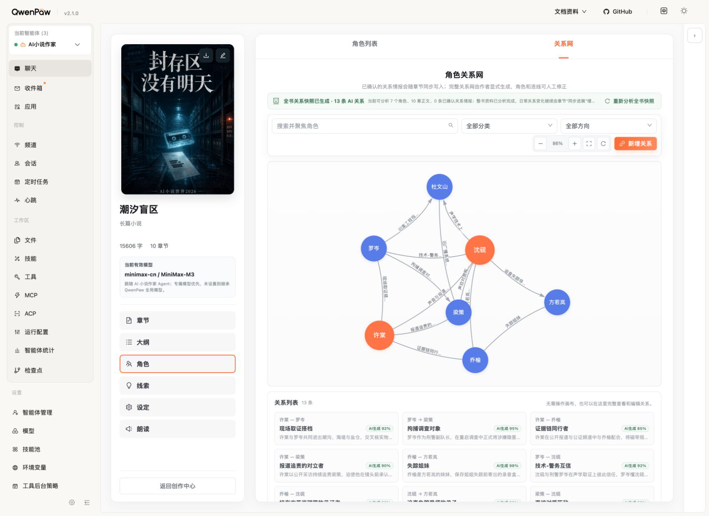
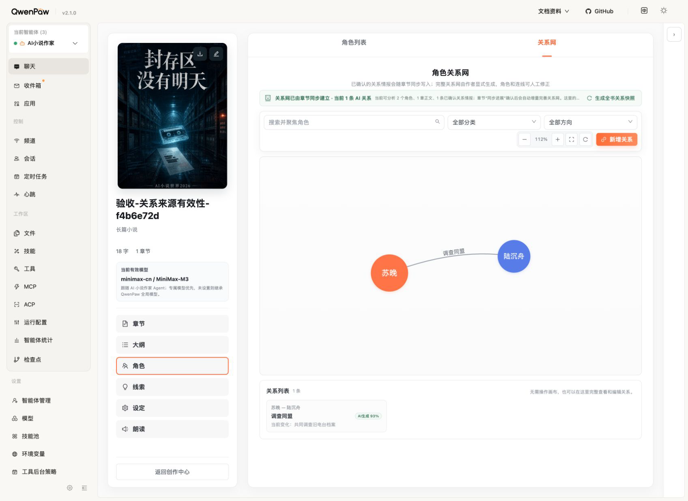
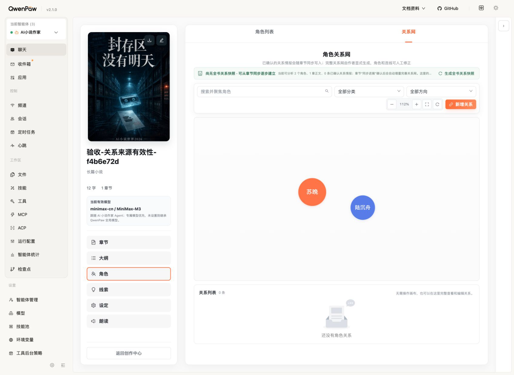

# 章节同步关系网第二轮复查

日期：2026-08-31（Asia/Shanghai）

结论：第二轮复查发现并修复两处来源 revision 一致性缺口。章节同步创建的 AI 关系现在只在至少一条当前有效关系事实支持时进入默认关系列表、关系图和 AI 关系计数；来源正式 revision 失效后隐藏，恢复同内容历史 revision 后重新出现。恢复后的 `source_restored` 关系事实也重新进入整书关系快照与页面“已确认关系情报”计数。人工关系、整书快照关系和审计读取不受该显隐规则影响。

## 1. 审计范围

- 当前桌面浏览器中的《潮汐盲区》关系网只读基线。
- 章节同步新建关系 → 修改工作稿 → 建立新检查点 → 恢复旧 revision 的完整来源有效性链。
- 默认关系列表、图连线、空态、AI 关系数、已确认关系事实数和历史审计读取的一致性。
- 人工提升后的关系不会因来源失效而被隐藏（自动化验证）。
- 按用户要求，本轮不把移动端尺寸作为验收范围；未宣称完整 WCAG 合规。

## 2. 用户目标与可访问性目标

作者不需要手工清理已经被正式正文改写否定的 AI 关系；当历史正文恢复时，也不需要重新同步才能看到原关系。图形画布和下方关系列表必须给出相同数量与状态，空态仍保留两个人物节点，避免把“关系暂时无效”误解为人物丢失。

## 3. 已确认优点

- 《潮汐盲区》当前 13 条整书 AI 关系保持不变，页面布局、筛选、缩放、列表镜像和桌面信息层级正常。
- 合成小说在来源有效时同时显示 1 条连线、1 张关系卡、1 条 AI 关系和 1 条已确认关系情报。
- 来源失效时只隐藏关系，人物节点仍在；关系列表明确显示 0 条和“还没有角色关系”。
- 恢复历史 revision 后，连线、卡片、AI 关系数和关系事实数同步恢复为 1。
- `include_archived=true` 始终可读取保留的关系定义根，满足审计和后续复用；默认 UI 不暴露失效边。

## 4. 本轮发现并修复的风险

1. 关系事实被标记为 `source_superseded` 后，章节同步新建的 AI 关系根仍会进入默认列表和图，导致正文证据已经失效但旧边继续显示。
2. 恢复历史正文会把事实标记为 `source_restored`，但整书快照仍按旧 `source_revision_id == 当前新 revision id` 排除它，导致页面同时显示“1 条 AI 关系”和“0 条已确认关系情报”。

修复后，默认关系查询以当前有效 StoryFact 状态过滤仅由章节同步建立的 AI 根；整书快照允许 `source_restored` 事实参与当前摘要，同时继续要求普通 `active` 事实来自当前 revision 链。

## 5. 浏览器流程证据

1. 《潮汐盲区》只读基线：13 条整书 AI 关系，未写入正文、人物或故事账本。

   

2. 合成小说来源 revision 当前有效：1 条“调查同盟”连线和关系卡，页面显示 1 条 AI 关系与 1 条已确认关系情报。

   

3. 只修改工作稿时，正式 revision 尚未变化，关系仍保留；建立新检查点后旧事实变为 `source_superseded`，图与列表归零，但历史关系根仍为 1。

   

4. 恢复原历史正文后，事实变为 `source_restored`，图、列表、AI 关系数和已确认关系情报数都恢复为 1。

   

## 6. 自动化与运行态证据

- 新增回归覆盖：来源当前有效、脏工作稿未正式化、建立新检查点后失效、`include_archived` 审计读取、恢复后回显、人工提升后永久保留、恢复后快照事实计数。
- `tests/test_domain_integration.py`：33 项通过。
- `.venv/bin/python -m pytest -q`：最终源码退出码 0；仅有既有 Starlette 弃用警告。
- `pnpm test`：118 个测试文件、1003 项通过。
- `pnpm typecheck`、`pnpm build`、`.venv/bin/python scripts/package_plugin.py`：通过。
- QwenPaw 公开热安装：成功，未修改宿主核心。
- 合成小说 `8ef17fed-99a6-4c76-964a-ee744f053741` 与一次失败前创建的审计孤儿小说均按精确 ID 和标题删除；最终审计前缀小说列表为空。
- 浏览器已返回《潮汐盲区》关系网页；《潮汐盲区》保持只读。

## 7. 证据限制与剩余风险

- 本轮用确定性合成候选验证状态链，没有调用真实模型；模型抽取质量仍由上一轮候选契约和真实模型专项验收负责。
- 本轮验证桌面 1696×1237 视口；按用户明确要求未做移动端尺寸验收。
- `include_archived=true` 是审计读取能力，当前普通作者 UI 不提供失效来源关系的历史浏览入口；这不影响默认关系网正确性，但未来若提供“来源历史”面板，可复用保留的关系根与 StoryFact 状态。
