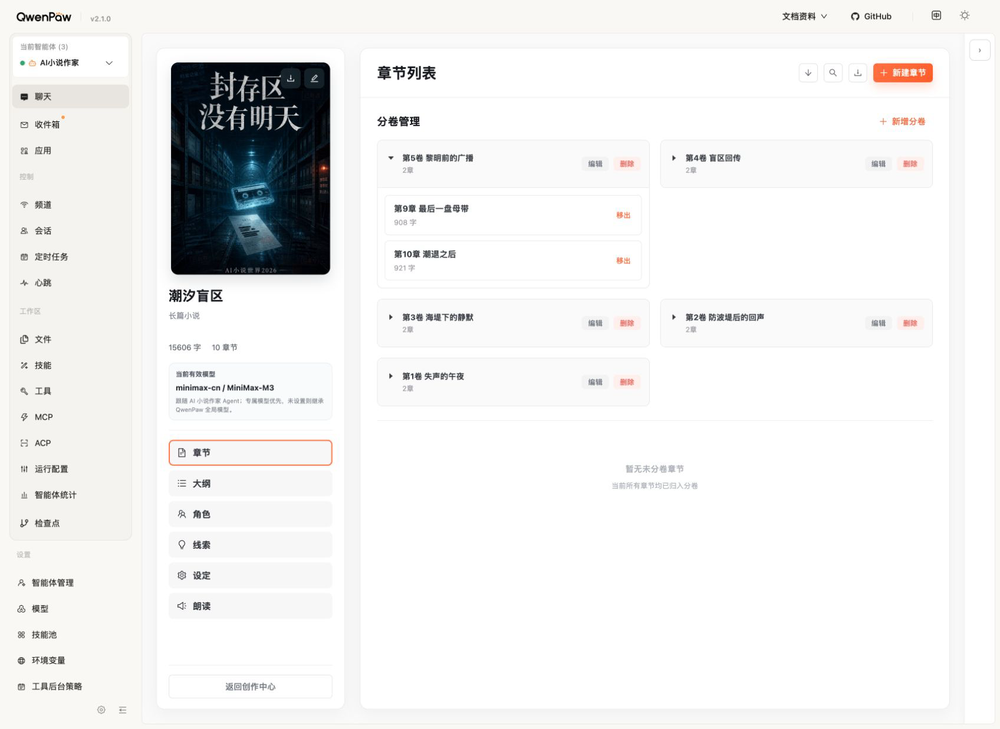
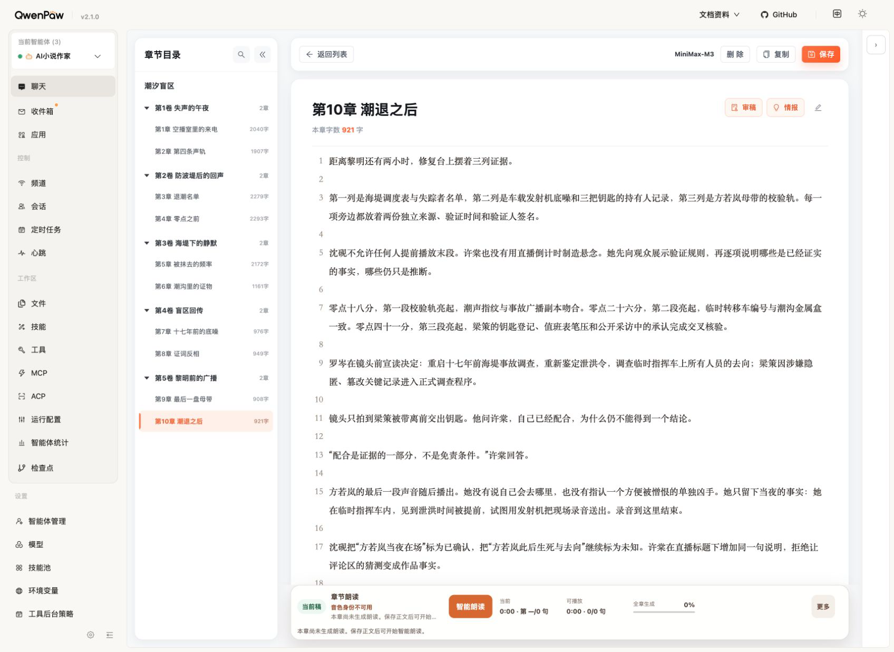
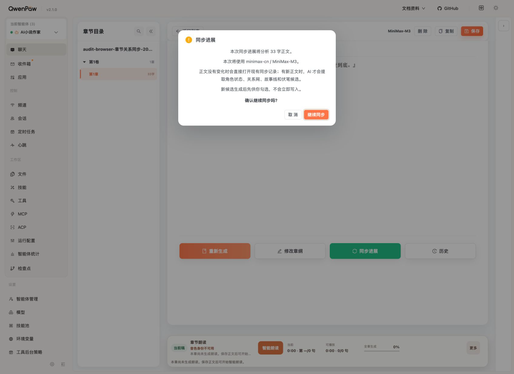
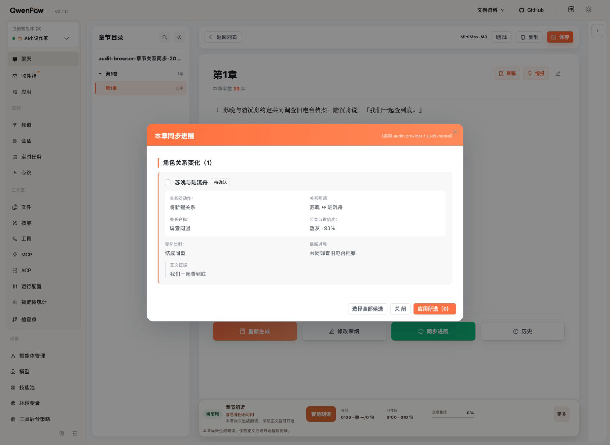
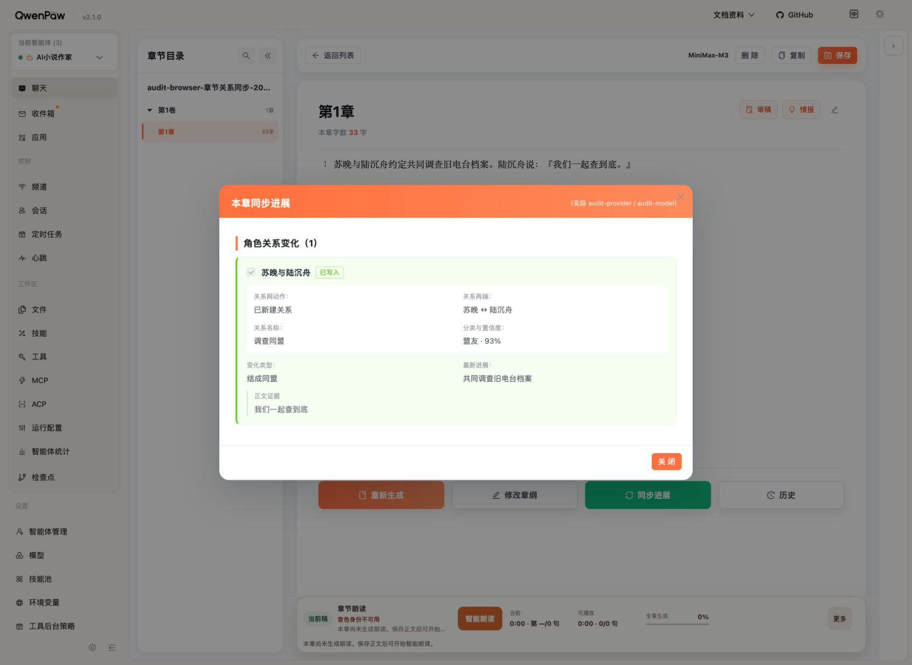
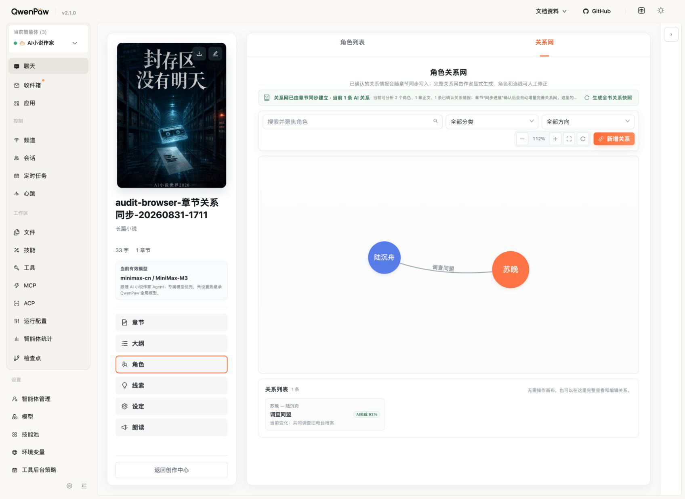
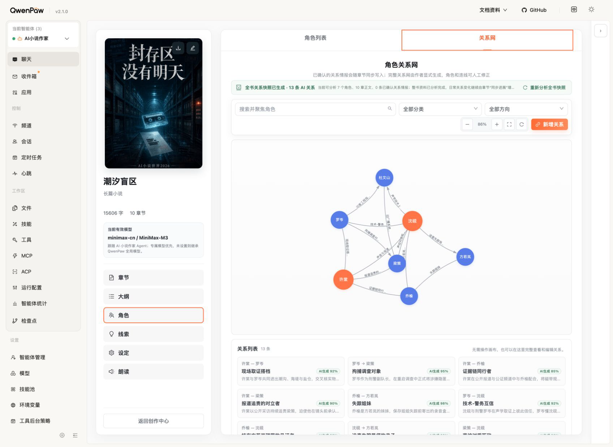

# 章节同步进展与关系网自查

日期：2026-08-31
范围：桌面端章节列表 → 章节正文 → 同步确认 → 关系候选确认 → 关系网结果；同时复核重复同步、任务超时、批量计数、时间线范围和服务端拒绝反馈。
结论：修复后未发现阻断使用的 P0/P1 问题。章节正文未变化时复用已有同步记录；新正文产生关系候选后，只有作者勾选应用才写入关系根和 StoryFact。

## 1. 章节入口 — 健康

- 分卷和章节层级清楚，能稳定进入目标章节。
- 桌面宽度下操作区与内容区没有遮挡。

## 2. 章节写作页 — 健康

- “情报”和底部“同步进展”入口同时可见于语义结构；同步按钮位于正文操作区。
- 正文、目录和朗读区之间没有出现覆盖或错位。

## 3. 同步前确认 — 健康

- 明确说明：正文不变时打开现有记录，有新正文才调用 AI；候选不会自动写入。
- 取消与继续同步均为真实按钮。截图只能确认视觉和语义角色，未据此宣称完整 WCAG 合规。

## 4. 待确认关系候选 — 健康

- 默认零选择，应用按钮禁用；显示关系两端、名称、中文分类、置信度、变化和逐字证据。
- 作者可逐项选择或全选，不会因为打开弹窗而修改关系网。

## 5. 作者确认后的结果 — 健康

- 确认后状态切换为“已写入 / 已新建关系”，不会继续显示“将新建关系”。
- 绿色结果态、禁用复选框和文案共同表达只读状态；不能仅依赖颜色判断。

## 6. 关系网增量结果 — 健康

- 空关系网可以由章节同步建立第一条关系；图、列表、关系名称、置信度和当前变化一致。
- 两节点时画布保留较大空白，这是固定关系图工作区的低密度表现，不影响操作；未来可把单边自动适配视口作为非阻断优化。

## 7. 现有小说非回归 — 健康

- 《潮汐盲区》现有 13 条 AI 关系仍正常展示，筛选、缩放、新增关系和关系列表入口均保留。
- 整书关系快照与章节增量同步的职责说明清楚，没有把整书生成伪装成每章必做步骤。

## 本轮发现并修复

1. 正文未变化仍建立新检查点并可能重复调用模型：改为直接打开当前 revision 的已有同步记录。
2. 同一批次两个事件指向同一条新关系时，可能同时计入新增和更新：改为同一关系只计一次。
3. 提交前只核对人物实例与人物根，未核对实例所属时间线：增加 origin timeline 重验。
4. 同步任务异常中断后可能长期停在 running：增加超时失败和新 attempt 恢复。
5. 服务端拒绝的候选可能被前端状态文案误报为已写入：改为“未写入”并显示拒绝数量。
6. 重复同步确认文案仍声称一定“生成候选”：改为按正文是否变化说明复用或生成。

## 证据限制

- 本轮按产品要求只验收桌面布局，不把移动端尺寸列为门禁。
- 浏览器证据覆盖真实 DOM 角色、点击、选择、确认和结果；没有使用屏幕截图推断完整键盘遍历顺序、读屏输出或量化色彩对比度。
- 合成小说只用于写入闭环，验收后按精确 ID 和标题删除并复核剩余计数为 0；《潮汐盲区》只读检查，没有生成新候选或修改正式数据。
