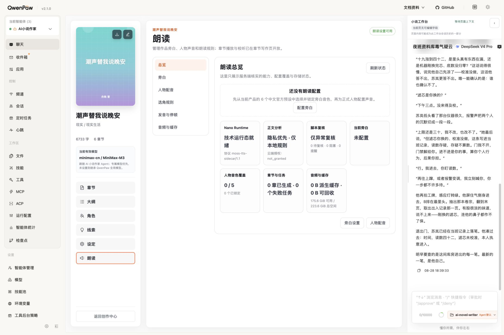
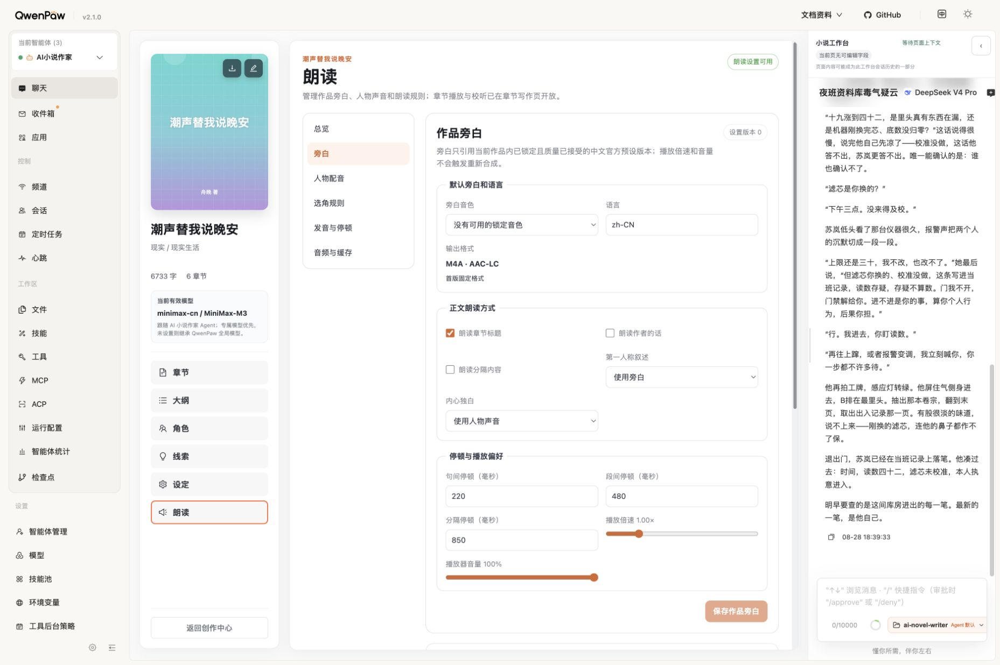
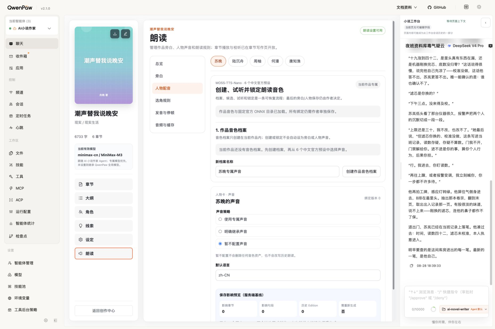
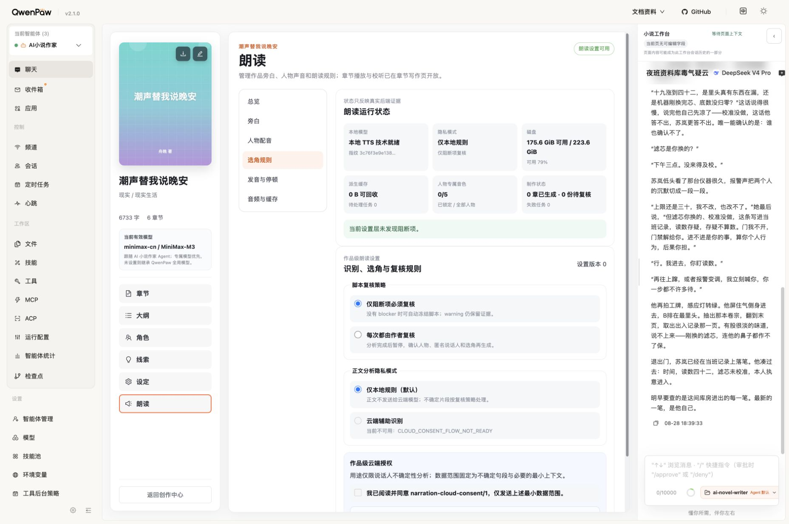
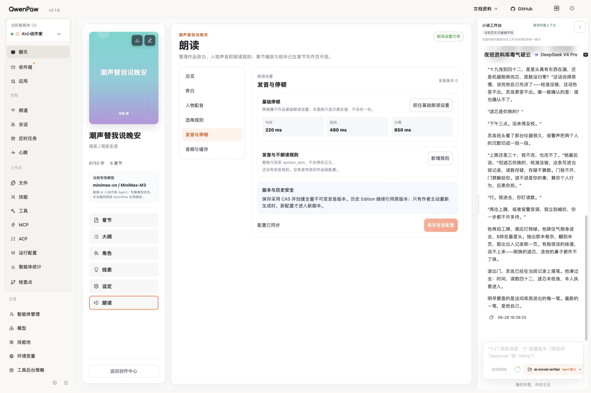
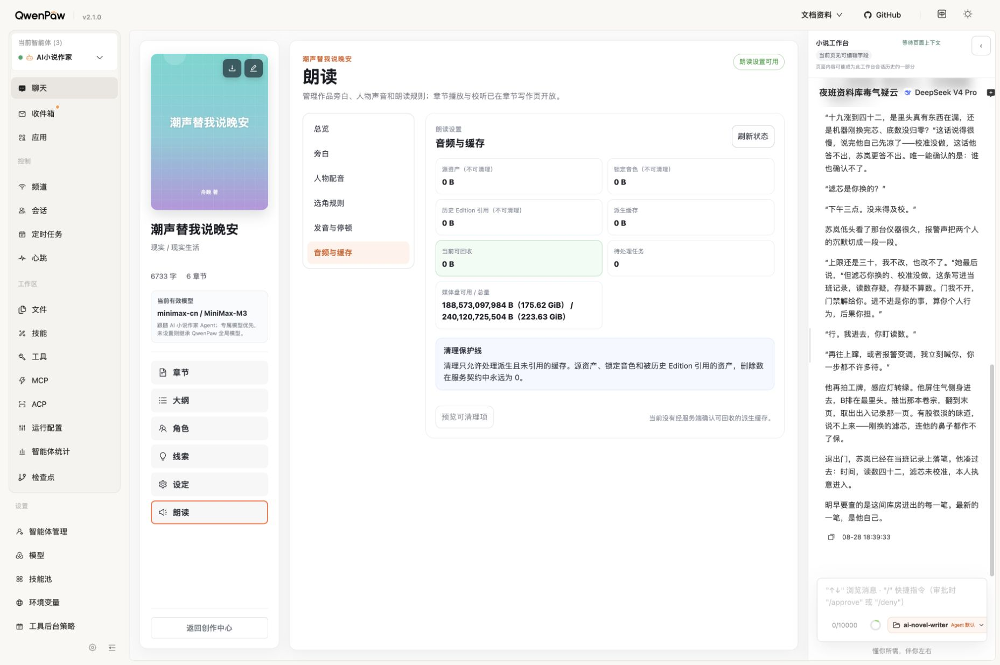

# MOSS-TTS-Nano 朗读设置只读审计

日期：2026-08-29（Asia/Shanghai）

范围：当前本机 QwenPaw 2.1.0 中作品“潮声替我说晚安”的朗读总览、旁白、人物配音、选角规则、发音与停顿、音频与缓存；同时复核项目固定 ONNX 目录、官方 Nano 参数和 MOSS-VoiceGenerator 能力。

性质：只读分析；未创建音色档案，未修改作品、角色、朗读设置、音频或数据库。

## 总结

当前朗读设置的安全性、版本保护和可恢复性设计总体合理，但首次使用流程明显过重。最主要的问题不是模型能力不足，而是项目在 2026-08-27 主动把 18 个固定官方 ONNX preset 收敛成只允许 6 个中文 preset，并把官方 preset 也套入“建档案—建版本—真实试听—锁定—绑定”的完整生产流程。其余 12 个 preset 是项目产品范围排除，不是模型运行时缺失，也不是项目现有证据证明个人本地使用被官方禁止。

当前页面不能使用 MOSS-VoiceGenerator 根据人物描述生成新音色，也没有用户可见的音色删除入口。后端有音色档案归档 API，数据库有私人音色删除请求的基础表，但公开页面没有接线；缓存清理明确保护锁定音色。

## 审计步骤

### 1. 总览 — 健康：良好，但首次入口不够直接

- 优点：运行态、隐私模式、复核策略、人物覆盖、任务、缓存和磁盘状态集中展示；数据来自服务端证据。
- 问题：空状态只引导“配置旁白”，没有直接展示 18/6 的范围差异，也不能先试听官方 preset 再决定是否建档案。
- 建议：增加“浏览全部官方预设”入口；对当前中文范围提供“一键试听并设为旁白”，后台仍可自动创建不可变档案和版本。

### 2. 旁白 — 健康：能力完整，信息密度偏高

- 合理：旁白、语言、章节标题、作者的话、分隔内容、第一人称、内心独白、句/段/分隔停顿、播放倍速和音量均有清晰用途。
- 合理：播放倍速和音量声明为播放器偏好，不触发重新合成。
- 需要优化：语言使用自由文本，当前只开放中文 preset 时应优先使用受控选择或自动继承；毫秒输入对普通作者过于技术化；分卷/章节覆盖属于高级能力，应默认折叠。
- 关键阻力：必须先创建音色档案、候选、试听、锁定，旁白下拉框才可用。安全上合理，但官方 preset 的首次使用成本过高。

### 3. 人物配音 — 健康：安全，批量效率不足

- 合理：专属、明确继承、暂不配置三态清楚；保存影响预览明确显示章节、句段、历史 Edition 和重生成影响。
- 问题：每个人物都先建作品音色档案，缺少直接从官方目录试听并绑定、批量配音和覆盖缺口扫描。
- 建议：人物列表直接显示当前绑定和试听按钮；允许多人物批量选择官方 preset，但保存时仍逐项记录不可变版本。

### 4. 选角规则 — 健康：安全边界清晰

- 合理：仅阻断项复核/每次复核、仅本地规则/云端辅助识别的分离正确；规则变更不改写历史 Edition。
- 问题：云端能力当前不可用，却仍显示完整授权框，容易让用户误以为勾选即可启用。
- 建议：不可用时收起授权表单，只显示原因和当前替代路径；未来开放时再展示确认动作。

### 5. 发音与停顿 — 健康：数据安全良好，编辑体验可简化

- 合理：替换朗读只改变 `spoken_text`，不修改正文；规则支持作品/分卷/章节范围；CAS 与不可变版本保护历史 Edition。
- 问题：`priority` 整数对作者不直观；缺少一条规则的即时试听和命中预览。
- 建议：用拖拽顺序或“高/普通/低”替代裸优先级，保留高级数值；增加原文→朗读文本预览与短句试听。

### 6. 音频与缓存 — 健康：很好

- 合理：源资产、锁定音色、历史 Edition 引用均不可由普通缓存清理删除；只允许清理未引用派生缓存，并要求先预览。
- 限制：这不是音色删除功能。锁定音色在本页明确受到保护。

## 官方 preset 与项目门禁

项目固定目录记录 18 个 preset：

- 中文：`Junhao`、`Zhiming`、`Weiguo`、`Xiaoyu`、`Yuewen`、`Lingyu`
- 英文：`Trump`、`Ava`、`Bella`、`Adam`、`Nathan`
- 日文：`Soyo`、`Saki`、`Mortis`、`Umiri`、`Mei`、`Anon`、`Arisa`

当前公开 API 只返回前 6 个中文 preset。阻断位置是 `backend/narration/official_presets.py` 的 `PRODUCT_OFFICIAL_PRESET_IDS` 和 `require_product_official_preset()`，测试还明确断言 `onnx.Trump` 不得进入产品目录。项目文档已经写明：其余 12 项是“当前非目标”，不是基于名称或公众人物标签的本地禁用。

官方 ONNX 仓库在固定 revision 的模型卡中标为 Apache-2.0。该许可信息支持“项目没有必要以商业审批为由阻断个人本地产品目录”的判断；但软件/模型许可不自动替代具体司法辖区对声音人格、冒充、公开传播或商业使用的法律判断。本审计不作法律保证。

## 官方可调参数与当前页面覆盖

### Nano ONNX 官方运行参数

- preset 或参考音频：`voice`、`prompt_audio_path/reference_audio_path`
- 生成策略：`sample_mode=greedy|fixed|full`、`do_sample`、`seed`
- 长度/切分：`max_new_frames`、`voice_clone_max_text_tokens`
- 文本层采样：`text_temperature`、`text_top_p`、`text_top_k`
- 音频层采样：`audio_temperature`、`audio_top_p`、`audio_top_k`、`audio_repetition_penalty`
- 文本处理：WeTextProcessing、robust text normalization
- 运行参数：流式解码、CPU threads、execution provider

项目固定官方 preset 使用 `sample_mode=fixed`、`do_sample=true`、`seed=1234`、`max_new_frames=375`、`text_temperature=1.0`、`text_top_p=1.0`、`text_top_k=50`、`audio_temperature=0.8`、`audio_top_p=0.95`、`audio_top_k=25`、`audio_repetition_penalty=1.2`。

当前页面不暴露上述模型采样参数。页面上的播放倍速、播放器音量和句段停顿不是 Nano 音色参数。这个默认策略适合保持长篇人物一致性，但应提供“高级实验设置”或至少提供受控的风格预设；直接暴露全部底层采样值不适合普通作者。

### MOSS-VoiceGenerator

官方模型可接收自由文本 `instruction` 描述声音特征、情绪、速度、音高和风格；推荐解码参数为 `audio_temperature=1.5`、`audio_top_p=0.6`、`audio_top_k=50`、`audio_repetition_penalty=1.1`。它可以作为人物专属音色生成层，再把作者选中的样音交给 Nano 做稳定参考音色。

当前项目没有开放该能力：运行适配器是 `DisabledVoiceDesignAdapter`，原因码 `VOICE_GENERATOR_NO_GO`，页面也不提供描述生成入口。人物自动分析→描述→生成候选目前只是产品设计，不是已实现能力。

## 音色删除现状

- 当前公开页面：无音色删除或归档按钮。
- 当前前端 API：存在 `archiveVoiceProfile()`，但没有接入可见工作区；归档不等于物理删除。
- 当前数据库：已有 `voice_deletion_requests`/`asset_tombstones` 结构，但未形成公开删除服务和 UI。
- 当前缓存页：只删未引用派生缓存，锁定音色删除数固定为 0。
- 建议的最终语义：未锁定候选可直接丢弃；已锁定但未引用音色可归档；已绑定或被历史 Edition 引用的私人音色先展示影响、解除/替换绑定并二次确认，再执行真删除，同时保留不可复原的最小审计墓碑。官方 preset 本身不由本项目删除，只删除/归档本地档案和派生试听资产。

## 证据限制

- 本轮未创建音色档案，因此官方 preset 卡片、试听成功、锁定和绑定后的动态状态由代码/API 契约复核，未以修改数据的方式走完整流程。
- 仅从截图和 DOM 可确认标签、可见状态和基础语义；未宣称完整 WCAG 合规，也未在本轮做键盘遍历、读屏或窄屏复测。
- 官方仓库和模型卡是时效性来源，未来升级 revision 时需重新核验。

## 官方来源

- https://github.com/OpenMOSS/MOSS-TTS-Nano/blob/main/infer_onnx.py
- https://github.com/OpenMOSS/MOSS-TTS-Nano/blob/main/infer.py
- https://huggingface.co/OpenMOSS-Team/MOSS-TTS-Nano-100M-ONNX/commit/f52645cb467506d8e18e746ddd59482685b74e58
- https://huggingface.co/OpenMOSS-Team/MOSS-VoiceGenerator/blob/main/README.md
