# 《回到1988，坐在你身边》桌面端全流程验收报告

验收日期：2026-08-23  
测试环境：`http://127.0.0.1:18088`，桌面端 1920×1080  
测试性质：真实新建数据、真实写入、真实保存、真实 AI 生成与情报入账；未修改原有两本小说。

## 结论

**本轮整体验收不通过。**

新书、章节、自动保存、正式版本、章节任务单、AI 生成、Diff、拒绝、情报提取、情报入账、故事账本、版本恢复等核心数据链路可以跑通；但页面存在阻断上线的**跨小说数据污染、虚假章节/分卷、项目资料不跟随当前小说、AI 助手串书**。这些问题会直接破坏作者对数据隔离和稿件真实性的信任。

最终保留的新书：

- 书名：**回到1988，坐在你身边**
- 小说 ID：`cec7e858-718c-47c3-ba30-d824076f224c`
- 实际结构：**1 卷、3 章**
- 可见正文：**4250 字**
- 三章均已自动保存，并分别建立正式版本

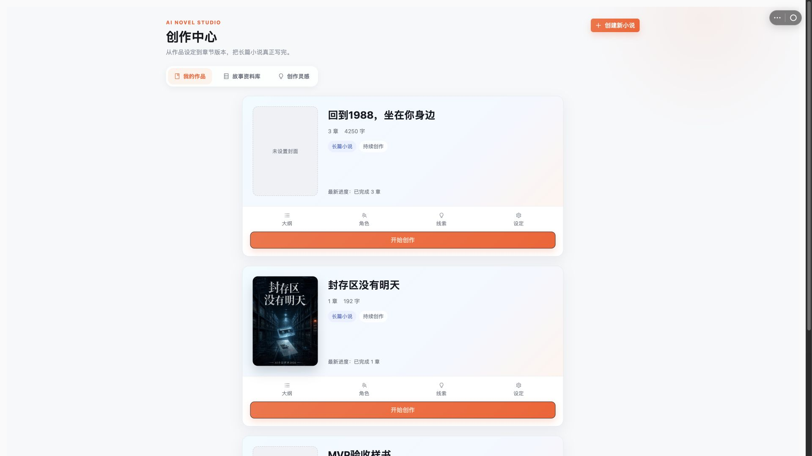

## 测试书稿

| 章节 | 内容定位 | 可见字数 | 保存结果 |
|---|---|---:|---|
| 第一章《铃声回到1988》 | 女主林知夏从 2026 年穿越回 1988 年高中课堂，重新遇见顾明川 | 1292 | 自动保存成功，正式版本成功 |
| 第二章《同桌递来的钢笔》 | 林知夏确认自己回到过去，借钢笔与顾明川重新建立联系 | 1454 | 自动保存成功，正式版本成功 |
| 第三章《操场边的约定》 | 两人在操场边交换约定，情感线与改变过去的风险同时启动 | 1504 | 自动保存成功，正式版本成功 |

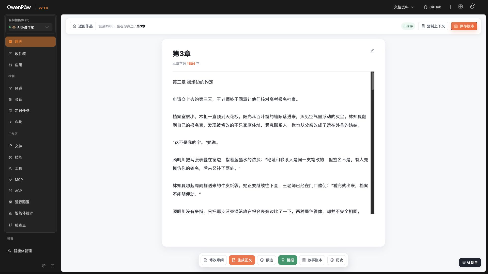

## 逐步验收

1. **创作中心初始加载 — ✅ 正常**  
   页面能稳定加载，原有作品可见，“创建新小说”入口明确。

2. **创建新小说弹窗 — ✅ 正常**  
   空标题时确认按钮不可用；填写书名后可提交；创建请求成功。

3. **新书创建后的项目页 — ❌ 严重错误**  
   后端实际只有 1 个空章节，但页面立即混入旧演示数据：出现“第二卷 改写痕迹”和旧章节。统计与列表互相矛盾。

   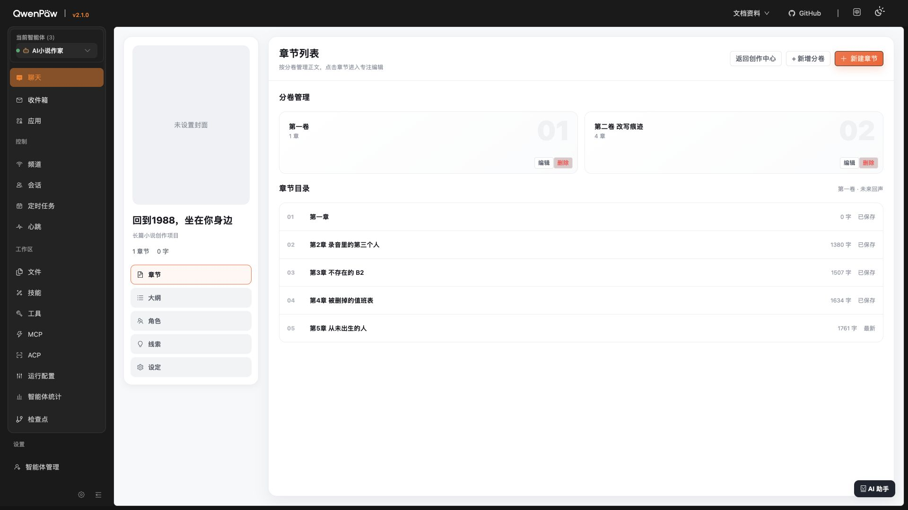

4. **第一章写作、自动保存、正式版本 — ✅ 正常**  
   正文可输入；字数更新；自动保存成功；“保存版本”成功。

5. **新建并写作第二章 — ✅ 正常**  
   新建章节成功；正文、自动保存与正式版本均成功。

6. **新建并写作第三章 — ✅ 正常**  
   新建章节成功；正文、自动保存与正式版本均成功。

7. **1 卷 3 章结构核验 — ❌ 展示不可信**  
   实际统计为 3 章、4250 字，但章节树仍显示额外的演示章节 4、5 以及演示第二卷；这些控件看似可操作，点击却无响应。

   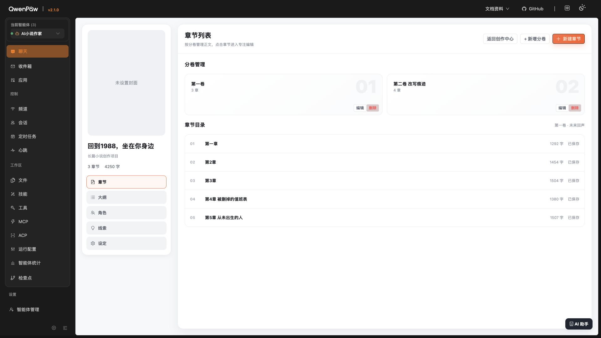

8. **章节任务单 — ✅ 功能通过，⚠️ 体验待优化**  
   目标字数、章节期望、五段大纲、禁区、必需/允许/仅上下文/禁止角色均可填写并保存。字段密度高，缺少更清晰的分组反馈。

   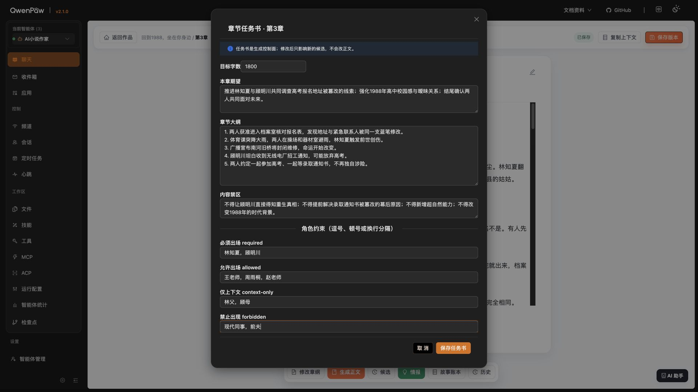

9. **AI 正文候选、Diff 与拒绝 — ❌ 不可安全采纳**  
   生成、Diff、滚动查看和拒绝流程都可用；但候选正文主要是标点改写，并在末尾夹入面向系统的技术说明块，会污染小说正文。因此本轮选择“拒绝”，没有把低质量候选写入正式稿。

   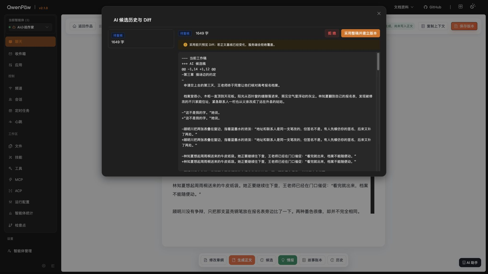

   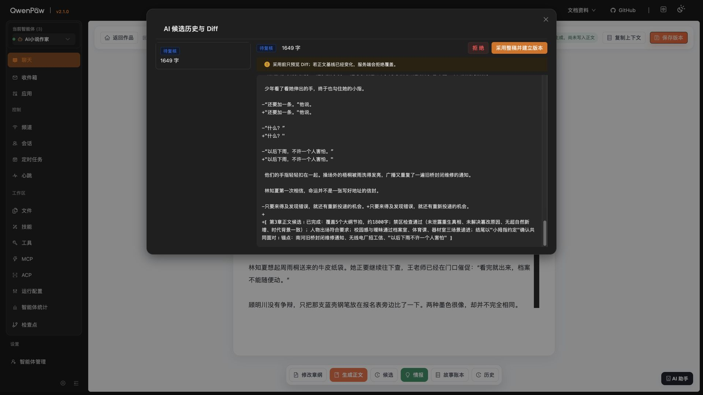

10. **情报提取与入账 — ✅ 链路通过，⚠️ 无障碍不足**  
    成功提取 15 条候选情报，逐条检查后全部写入故事账本。15 个复选框默认全选且都没有可访问名称，键盘/读屏操作存在障碍。

    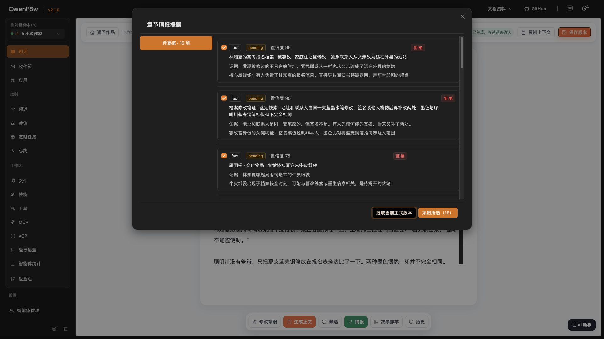

11. **故事账本 — ✅ 数据落库，⚠️ 产品化不足**  
    账本准确显示 15 条有效记录；但直接暴露 `character_state`、`fact`、`foreshadow_new` 和修订 ID 等内部英文类型，不适合普通作者。

    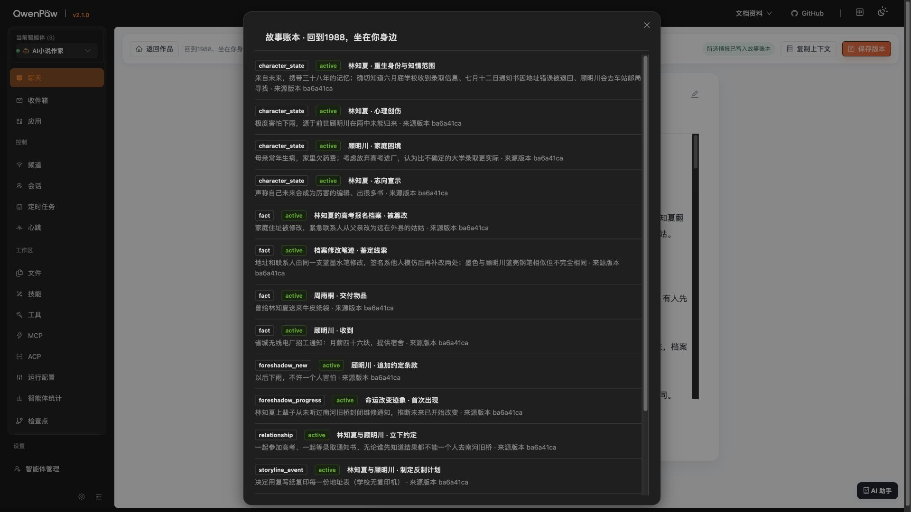

12. **版本历史与恢复 — ✅ 功能通过，⚠️ 交互有风险**  
    正式版本可见；将当前相同版本恢复为新版本后，正文保持不变，版本 3 成功生成。问题：恢复没有二次确认；版本编号在浅色卡片上几乎不可见；`manual_restore`、`manual_checkpoint`、`initial` 直接暴露内部英文状态。

    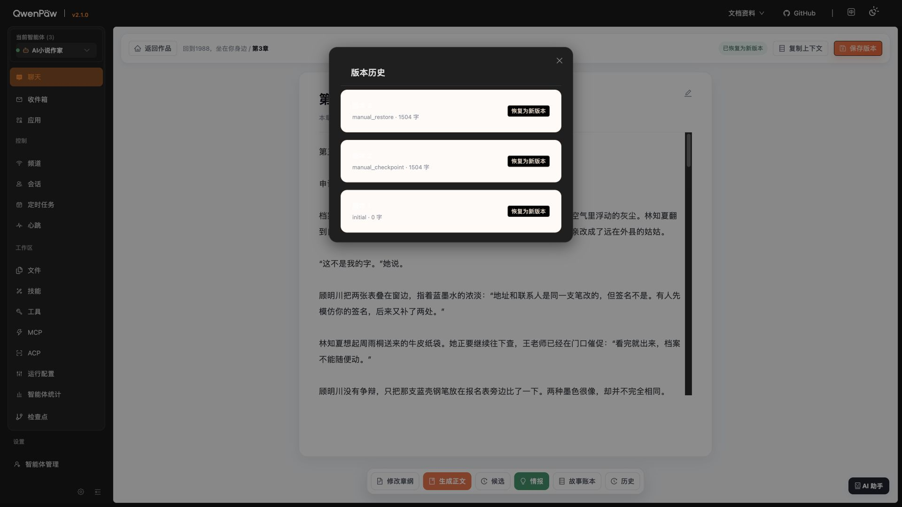

13. **角色、线索、大纲、设定 — ❌ 阻断级串书**  
    当前小说明明是林知夏/顾明川的 1988 校园言情，项目资料页却继续显示“封存区没有明天”的林默、B2、未来磁带、录音机等旧演示内容。刚写入的 15 条故事账本数据没有驱动这些页面。

    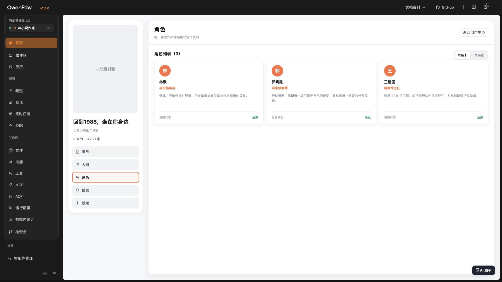

    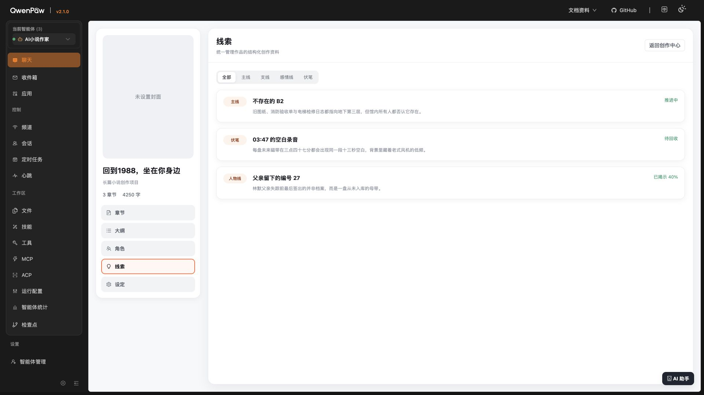

    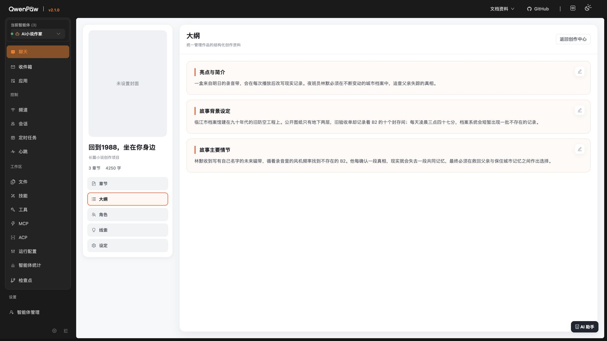

    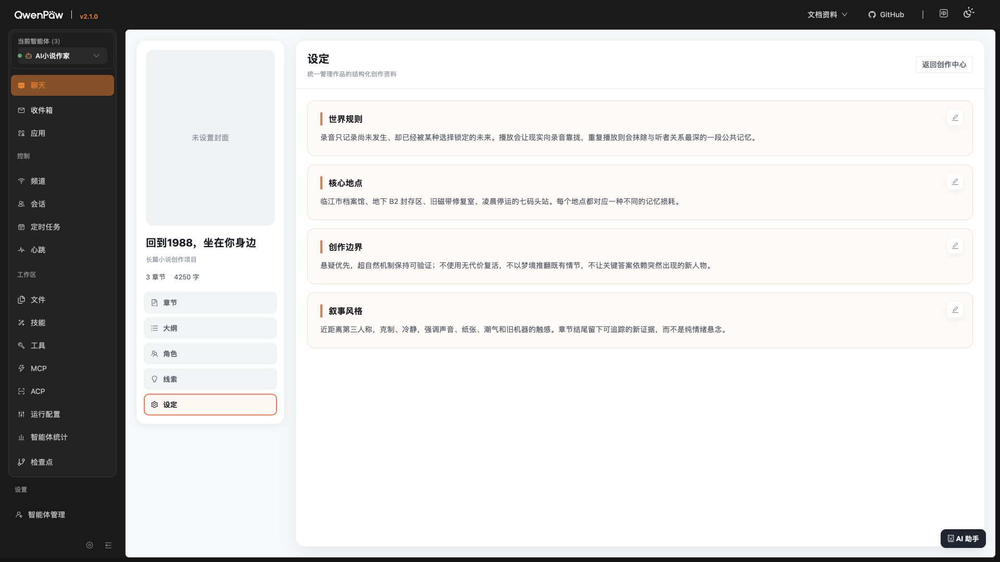

14. **AI 助手 — ❌ 阻断级上下文污染**  
    助手打开后显示上一部小说“封存区”的续写对话，而非当前 1988 小说；同时提示“当前标签页仅入队，发送由其他标签页完成”，本标签页无法完成发送。

    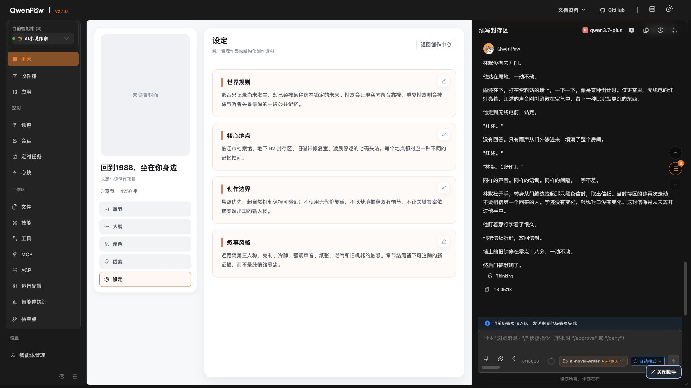

15. **创作中心最终统计 — ✅ 正常**  
    返回创作中心后，新书卡片准确显示 3 章、4250 字、已完成 3 章；共 3 本作品。

16. **故事资料库 / 创作灵感导航 — ❌ 空壳交互**  
    点击后仅切换激活样式，URL 不变，主体仍然是“我的作品，共 3 本”，没有加载对应内容。

17. **控制台与自动化回归 — ✅ 基础技术健康**  
    浏览器没有运行时 error；有重复警告 `[moduleRegistry] Module not found: AppCenter`。TypeScript、前端测试、后端测试和生产构建均通过：

    - TypeScript：通过
    - Vitest：1/1 通过
    - Pytest：12 通过、5 跳过（未配置集成数据库）
    - Vite production build：通过

## 最高优先级问题

### P0：当前小说与页面资料没有数据隔离

角色、线索、大纲、设定、AI 助手都混入另一部小说的数据。必须让所有查询、缓存、AI 会话严格绑定 `novel_id`；找不到当前小说数据时显示空态，绝不能回退到演示内容或最近一部作品。

### P0：章节树显示不存在的分卷和章节

实际 1 卷 3 章却显示额外演示卷与章节，且统计和列表互相冲突。章节树必须只渲染真实 API 数据；演示数据只能存在于独立示例项目。

### P1：AI 候选会把系统说明写入正文

生成层应返回严格结构化的“正文”和“元数据”，前端只能把正文送入 Diff/采纳；系统检查结果必须单独展示。

### P1：账本没有驱动项目资料页

15 条情报已经落入账本，但角色/线索/大纲/设定完全不更新。需要明确“账本 → 结构化资料”的同步规则、冲突策略和可追溯来源。

### P1：大量看似可点击但无结果的控件

演示章节、主线筛选、资料库、创作灵感等只改变样式或完全无响应。未实现功能应隐藏、禁用并解释，不能伪装成已完成。

### P1：版本恢复缺少防误触设计

恢复动作应先显示版本摘要/Diff，再二次确认；同时修复版本编号对比度，并把内部英文状态转换为作者可理解的中文。

### P1：无障碍基础不完整

情报复选框缺少可访问名称；部分浅色文字对比度偏低；纯图标按钮需要统一可访问标签、焦点态与键盘顺序。

## 做得好的部分

- 新书和三章正文真实持久化，返回页面后统计正确。
- 自动保存、正式版本、任务单保存都稳定。
- AI 生成等待过程可完成，Diff 和拒绝路径明确。
- 情报提取质量总体可用，15 条记录能够真实写入故事账本。
- 版本恢复采用“生成新版本”而不是覆盖旧稿，方向正确。
- 1920×1080 下整体页面没有横向溢出或明显布局崩坏。

## 验收边界

- 本轮仅测试桌面端 1920×1080，不含手机端。
- 为保护数据，没有测试删除小说、删除章节或删除分卷。
- 为保证最终仍是 1 卷 3 章，没有额外创建第二卷。
- AI 候选因含系统说明被拒绝，没有采纳进正式正文。
- 版本恢复使用当前相同版本进行安全验证，验证了流程而不改变正文。

