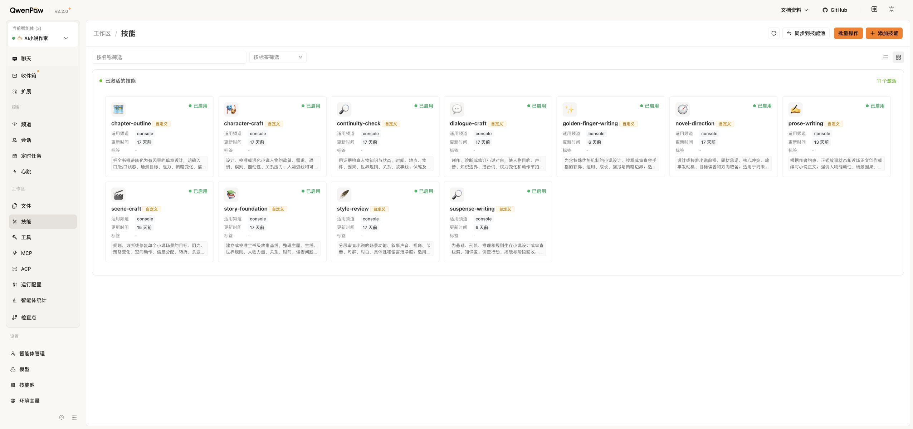
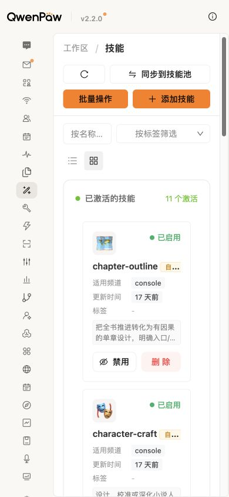

# 计划69技能页只读复验

状态：只读复验完成 / 窄屏PARTIAL；仅当前启用状态复验，不代表安装生命周期通过。

日期：2026-09-11。复用此前作者任务中的Edge技能页，不进入助手、不切换开关、不改正式小说。使用产品体验审查Skill，截图先保存并打开核对，再形成评价；不修改QwenPaw原生UI。

## 步骤1：核对当前Agent与11项启用

正常。`18088/skills`显示当前Agent为“AI小说作家”，已激活分区显示11个激活，各卡片显示“已启用”；与本轮新验证器公开GET结果一致。桌面截图完整，无错误弹层或加载占位。

评价：Agent范围和启用状态可辨识；卡片正文采用省略显示，不能仅凭卡片看到完整规则，也不能从“已启用”推断本章实际调用。标题多为英文技术标识，是作者理解成本的既有观察，不在本轮改造宿主。完整键盘操作、读屏与对比度数值尚未验收。

## 步骤2：刷新后读回

正常。执行正常页面刷新，初次观察处于加载期，未用该中间状态作截图结论；内容稳定后重新截图，仍为同一专用Agent、11项已启用。无需再次点击恢复。此证据仅证明页面刷新保持，不是宿主重启或插件重装保持。

## 步骤3：390×844窄屏

部分通过。技能导航图标、11个激活、卡片已启用及批量操作按钮可见，纵向滚动布局正常；页面顶端操作按钮换行。当前Agent名称随侧栏收缩后不在首屏显示，作者在此直接批量操作前不易核对作用域；记录为待处理的宿主UI风险，不修改QwenPaw核心。

截图保存后已重新打开核对，随后清除临时视口覆盖，恢复原桌面尺寸并确认仍为AI小说作家与11项激活。未点击禁用／删除；窄屏完整恢复动作、焦点遍历与读屏尚未验证，不据此声称全部可访问性通过。
