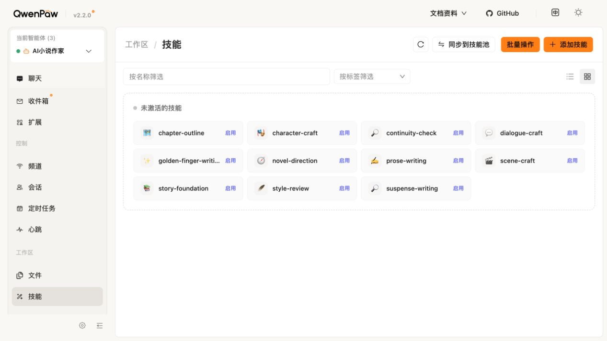

# S001：小说 Skills 全部未激活的原因调查

状态：`DIAGNOSED / 可重复触发机制已证实；历史精确触发事件未能定位；修复未实施`

日期：2026-09-11（Asia/Shanghai）。范围：正式环境只读；隔离环境通过公开接口进行诊断。不调用模型，不改正式小说、正式 Agent 状态或 QwenPaw 核心。

## 1. 结论

**已核实事实：公开强制重装插件会丢失此前的 Skill 启用状态；本项目完整安装编排有快照恢复，但低层热安装及离线替换入口没有统一保证恢复。现有验收允许专用 Agent 全部 Skill 关闭仍通过。**

这构成两项独立工程缺陷：状态恢复覆盖不完整、可用性验收遗漏。普通宿主重启在本次对照中没有造成丢失。

**技术推断：** 计划68期间的直接热安装记录与本次复现机制一致，是当前状态回归的高可信解释。但缺少每一次生产安装的前后公开快照，不能指认最后一次丢失的精确安装时间，也不能把所有历史停用都归于安装。没有证据证明用户主动关闭了当前这11项。

## 2. 正式现场：界面与接口一致

2026-09-11 16:25 +0800 的公开接口结果见 [public-state.json](./public-state.json)。此前本轮独立请求所得状态相同。

- `GET /api/skills`，带 `X-Agent-Id: ai-novel-writer`：11项均存在，`enabled=false`。
- Default／QA Agent：各可发现11项项目技能，启用数均为0；没有发现作用域污染。
- `GET /api/ai-novel-world-2026/writing-skills`：`catalog_available=false`、`catalog_version=null`、`capabilities=[]`。无作品scope的各入口布尔值不能单独用于证明所有生成入口失败；目录本身不可用已被证实。

UI步骤：打开原生 `/skills` → 核对左侧“AI小说作家” → 查看“未激活的技能”。只有页面导航和截图，没有点击启用或发出聊天请求。

评价：界面正确显示关闭状态；“启用”是可执行动作，不代表已启用。故不是页面与API相反，也不能将卡片可见等同于功能可用。原始JPEG为1267×713，SHA-256 `7a86f6df2b2a8b338a75bfb029a64fa3fd20539d6d821c972e008245bd5d1bc6`。本轮未变更UI，未进行窄屏与键盘修复验收。

## 3. 独立真实复现

使用项目已有生命周期隔离器，在本次唯一标签的容器、测试库和内部网络中运行 [reproduce_lifecycle.py](./reproduce_lifecycle.py)。候选为计划68已打包副本 `/private/tmp/plan68-b009e-ready-edition-gap-20260911`，候选身份由原验证器重新计算并存入回执；宿主为本机既有QwenPaw 2.2.0镜像。无正式卷挂载、无宿主端口、无模型调用。

| 诊断动作 | 专用Agent已启用 | 明确保留关闭 | 评价 |
| --- | --- | --- | --- |
| 初装后新建临时专用Agent | 0 | 11 | 符合插件默认关闭声明；需项目配置步骤 |
| 公开API启用10项 | 10 | suspense-writing | 建立可区分的混合基线 |
| 公开API `force=true` 重装 | 0 | 11 | **丢失10项启用状态，复现S001** |
| 再次建立10开1关并普通重启 | 10 | suspense-writing | 重启后精确保持，重启本身未复现丢失 |
| 公开卸载再安装 | 0 | 11 | 未通过项目恢复编排时回到默认关闭；需明确重装恢复策略 |
| 原生命周期门禁最终结果 | PASS | — | 注册／数据保留通过不等于启用保持通过 |

完整机器证据：[isolated-lifecycle-r2.json](./isolated-lifecycle-r2.json)。本实验用API逐点观测，不是作者UI流程验收，不为这些API步骤伪造页面截图。

首轮在强制重装后已观察到同样丢失；随后诊断脚本把临时容器字段误写为 `qwenpaw` 而非 `qwenpaw_container`，导致重启对照未执行。保留 [isolated-lifecycle.json](./isolated-lifecycle.json) 的失败记录；修正后第二轮完整通过。两轮均按精确名称与双所有权标签清理了各自2个容器、5个临时卷和1个网络，`cleanup.status=passed`，无广泛清理。临时测试数据不可恢复，正式数据与备份不受影响。

## 4. 代码因果链

1. `plugin.py:39` 注册整个Skill目录，`enabled_by_default=False`。这是避免污染其他Agent的合理边界，不应改成全局默认启用。
2. `scripts/qwenpaw_lab_plugin.py:958` 的完整 `install()` 会保存安装前快照，替换后向 `configure()` 传入快照。但 `hot_install_packaged_plugin()` 只执行公开强制安装；离线替换函数也不是完整的Agent状态事务。
3. `scripts/configure_qwenpaw_novel_agent.py:46` 对已有Agent且缺少安装前快照返回空启用计划。单独运行配置脚本不能知道当前的全关是用户选择还是刚丢失；把全关再存成新快照，只会延续丢失结果。
4. 配置脚本的读回校验发生在完整 `install()` 后续重启之前；完整发布结束还应对同一快照再次核对，避免最终验收失去基线。
5. `scripts/verify_qwenpaw_lab.py:537` 仅判断启用集合是已发布集合的子集，空集合也成立。用现有测试夹具把所有Skill改成 `enabled=false` 后执行真实 `verify()` 函数，仍返回成功且 `enabled_novel_skills` 三个Agent全空。这是纯本地验证器诊断，未访问运行环境。
6. `scripts/tts/verify_qwenpaw_plugin_lifecycle.py:1926` 的注册快照只保存名字，不保存 `enabled`；计划67历史回执中的隔离Agent列表甚至没有 `ai-novel-writer`。原门禁可证明注册与卸载清理，不能证明专用写作Agent可用。
7. `backend/writing_skills/button.py:128` 实际只接受公开接口中已启用的Skill；主Skill关闭时拒绝组成方法包。这解释了为何“文件和卡片都在”而正式目录不可用。

## 5. 历史证据的准确边界

- 找到临时公开快照 `ai-novel-skill-state-osavm2v5.json`，11项全开，文件修改时间为09-08 08:41；原路径位于本机临时目录，SHA-256 `db67f68d79f23837a1bf9060e6274d3453fb3807786867c8489c46d3ae0bfde6`。文件修改时间不等于可靠业务事件时间，仅为旁证。
- [计划63公开升级前快照](../../../docs/开发文档/证据/计划63/QPAW63-preupgrade-skill-state-18088.json)全部关闭；[该计划证据](../../../docs/开发文档/证据/计划63/README.md)明确说明升级保留全关。所以不能把那次2.2.0升级直接定为丢失原因。
- [计划64记录](../../plan64/README.md)记载按作者指令通过公开API重新启用11项；[计划68静态检查](../skill-review.md)记载当时界面启用。它们是历史观察，不代表本轮当前状态。
- [计划68恢复记录](../resume.md)记录后续直接公开热安装。当前缺少该次与其他生产替换逐次的启用状态前后回执，因此不补造精确事件链。

## 6. 验证与方案入口

既有相关测试97项通过，运行退出码0：`tests/writing_skills/test_upgrade_snapshot.py`、`tests/test_assistant_install_contract.py`、`tests/test_qwenpaw_integration_contract.py`。已有测试通过与真实丢失共存，表明需补的是行为覆盖，而非仅重复运行旧门禁。

修复方案见 [计划69](../../../docs/开发文档/69-写作Skill启用状态保持与可用性验收修复计划.md)。本轮仅新增诊断、证据与方案；S001进入 `DESIGNED`，没有实施产品修复、启用生产Skill、安装生产候选、提交或推送。
