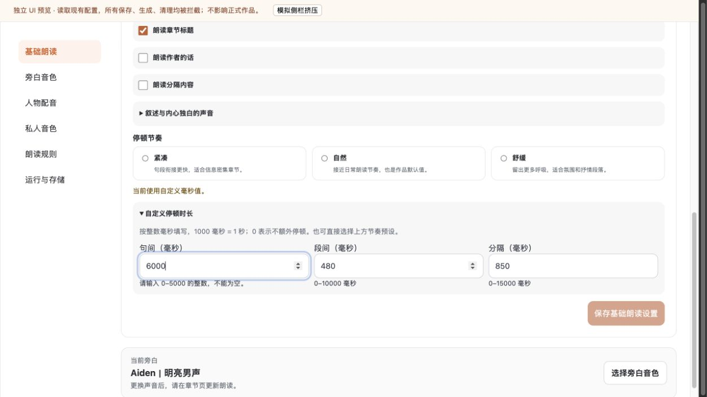
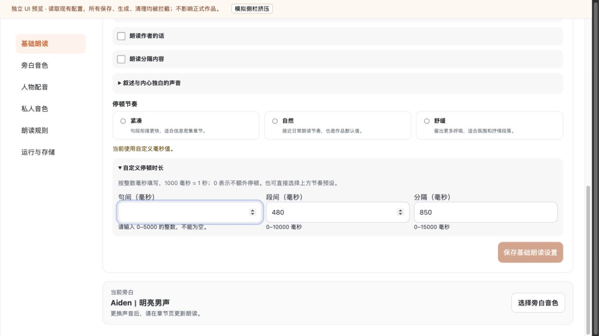
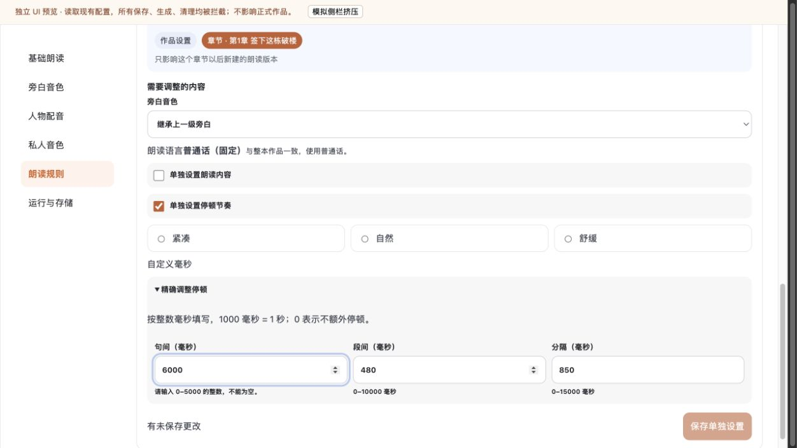
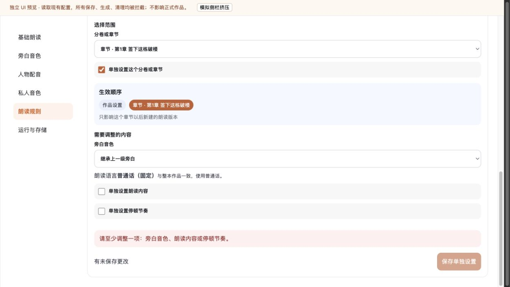
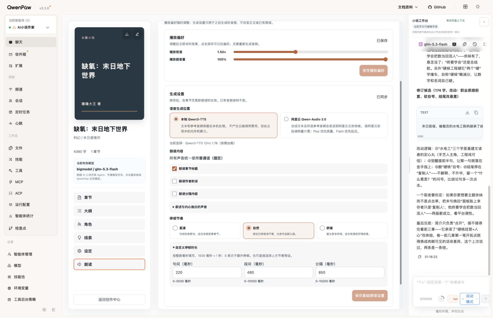

# 朗读高级设置输入续查 · V1.3

2026-09-12：已公开热更新正式 18088，未提交／推送 Git。

## 检查与结论

使用界面审查技能，先截图再验证交互，针对实际错误修正，不增加页面或基础设施。以下截图均为本轮保存后重新打开检查；预览读取现有配置，但代理拒绝所有非 GET 请求，未保存正式设置。

1. **基础朗读／自定义停顿：已修复。** 原先填入 6000 会无提示跳回 220。现在保留越界输入或键盘清空后的空白，说明允许的整数范围，并通过 `aria-invalid`、描述关联及保存处理函数阻止提交。有效数字仍使用原有整数毫秒契约。明确 1000 毫秒为 1 秒、0 表示不额外停顿。
2. **恢复路径：通过本轮检查。** 基础设置空白错误在切换运行与存储再返回后保持；选“自然”恢复 220／480／850 和正常字段状态。组件测试覆盖有效 221 修正后可保存、非法状态直接调用保存处理函数不会调用 API。
3. **章节例外：已修复。** 同样保留 6000 并阻止保存；取消“单独设置停顿节奏”后移除该错误。预览中未配置其他例外时，仍按原契约提示至少调整一项，不能提交空覆盖；已有覆盖关闭停顿后可保存由组件测试覆盖。
4. **发音词典／叙述选项：局部检查，无新增修改。** 展开叙述与内心独白选项、范围设置和新增发音规则编辑器，排版可读；发音规则已有逐项必填提示，保留结构。本轮未保存这些设置，未宣称所有选择组合、跨章节目标切换、发音效果已通过。

检查前：[基础高级项](./35-advanced-before.png)、[章节高级项](./36-override-before.png)、[发音编辑器](./37-pronunciation-edit.png)。

## 实现与验证

- 产品源文件：`reading-preferences-panel.ts`、`scope-overrides-panel.ts`，新增窄共享 `timing-input.ts`，合并原先重复的三个字段范围和解析；不改 DTO、服务端上限、API 或 CSS。
- 补充基础保存处理函数中的第一人称人物有效性检查；原按钮校验保留。
- 新增 12 项共享输入测试、2 项组件回归，原有测试保留。
- 工作区类型检查、156 文件／1361 项 Vitest、构建通过；后补显式字段可访问名称的精确版本在隔离候选完整重验。
- 精确候选类型检查、156 文件／1353 项 Vitest、构建、打包、19 项打包契约通过。数量差异来自排除其他任务候选。
- 真实桌面预览验证上述错误／恢复路径；正式有宿主两侧面板挤压时无页面横向溢出。正式字段原值 220／480／850、范围描述和可访问名称正确。
- `git diff --check` 通过；与 V1.2 源码比较仅本轮三产品文件和对应三测试改变，不夹带其他工作区候选。

## 正式更新与恢复

独立源码、安装备份、归档、Skill 快照、配置快照及逐文件哈希位于 `/private/tmp/reading77-input-release.D5C7nM`。以已部署 V1.2 源码为基线，仅叠加上述六文件；安装树逐文件比较唯一变化是 `frontend/dist/index.js`。经项目互斥安装锁和公开热更新安装，不直接编辑已安装副本。

正式与候选 bundle SHA-256：`bc027e9afaeb1fe4b68369d3c4f821507ce6dfa8d302e3b1e14603a63ecdfd5a`。

容器 `ai-novel-2026-qwenpaw-lab` 的 ID 仍为 `a874d5a19c130999388a9e9021a7c5496c9c17d85bc9c1798fadb564f654bbb5`，启动时间 `2026-09-12T13:15:46.24776296Z` 未变，healthy。公开运行检查 ready，worker／reference clone ready，9 官方音色、11 Skills、5 工具与专属 Agent 作用域保持。overview 的 settings／authorization 更新前后一致。

恢复：使用项目 `.venv/bin/python /private/tmp/reading77-input-release.D5C7nM/deploy.py rollback` 经同一公开安装路径恢复 V1.2 和 Skill 状态；无需数据库回退，本次未触发。临时路径恢复材料需要保留时应归档，不能视作永久备份。

## 边界

无正文、声音绑定、播放偏好或生成设置写入；无模型调用、音频生成／清理、数据库迁移或容器重启。TTS 健康检查不等于本轮重新验证音质。未执行真实保存与冲突联调、屏幕阅读器和全面键盘专项；不能宣称全部设置端到端验收。正式深链接可能被宿主恢复为此前分区，页面内导航正常，本轮不修改上游路由。
