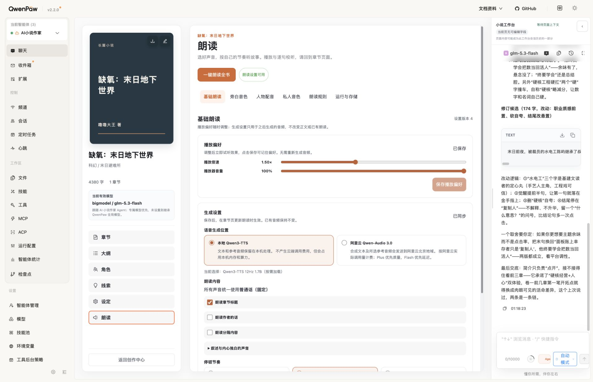
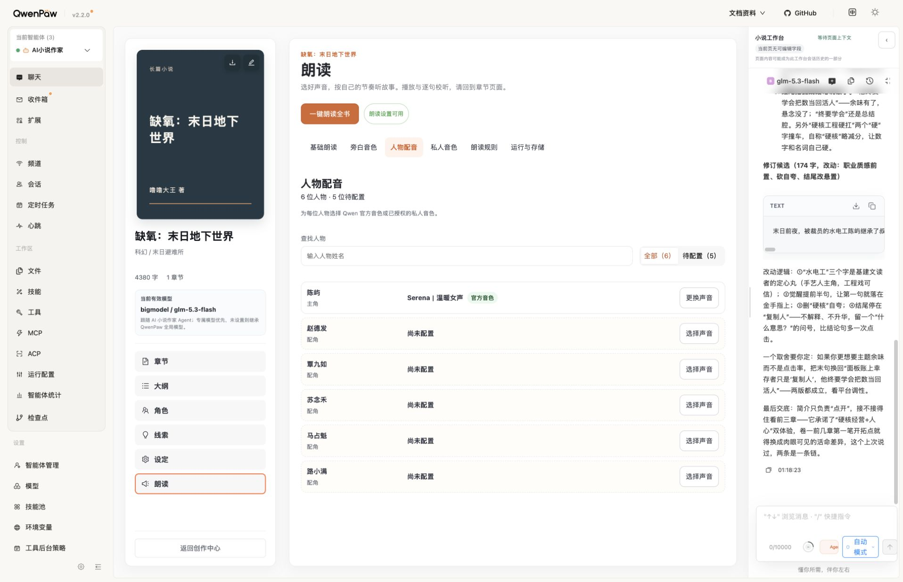
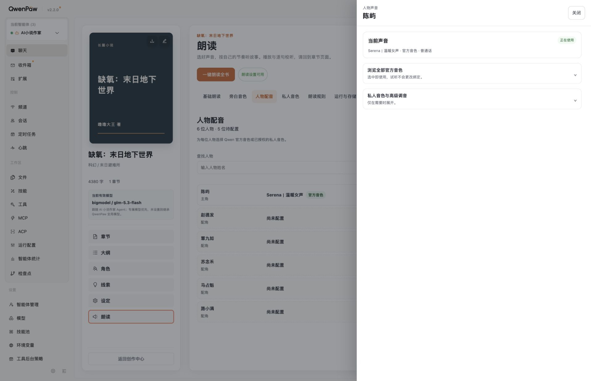
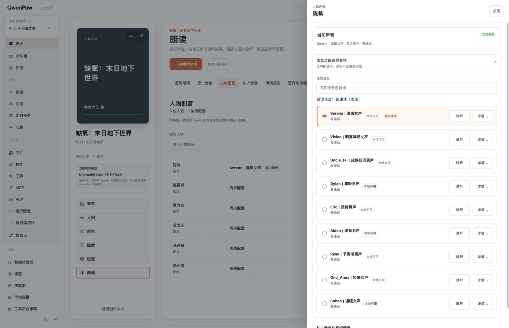
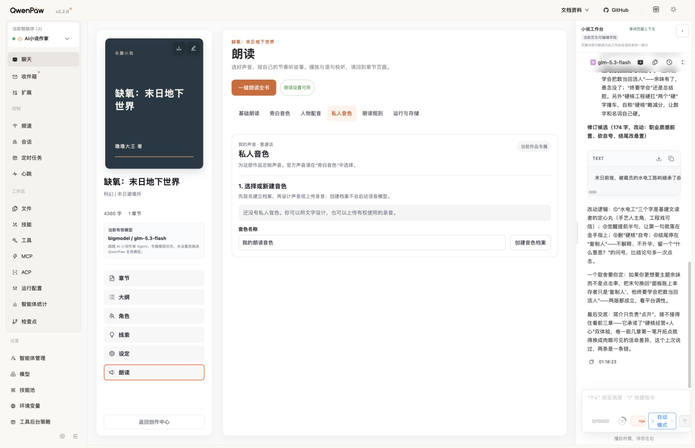
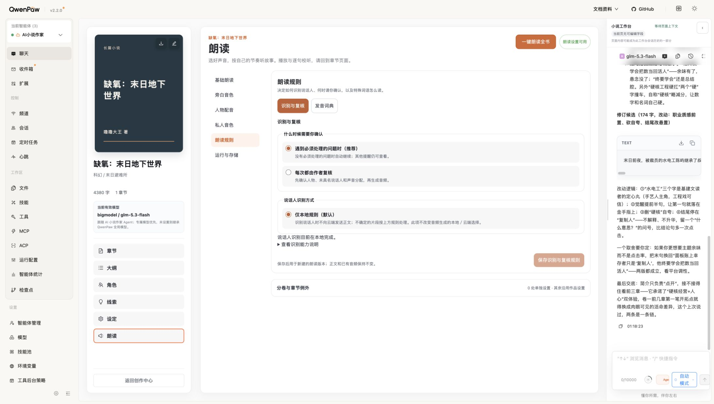
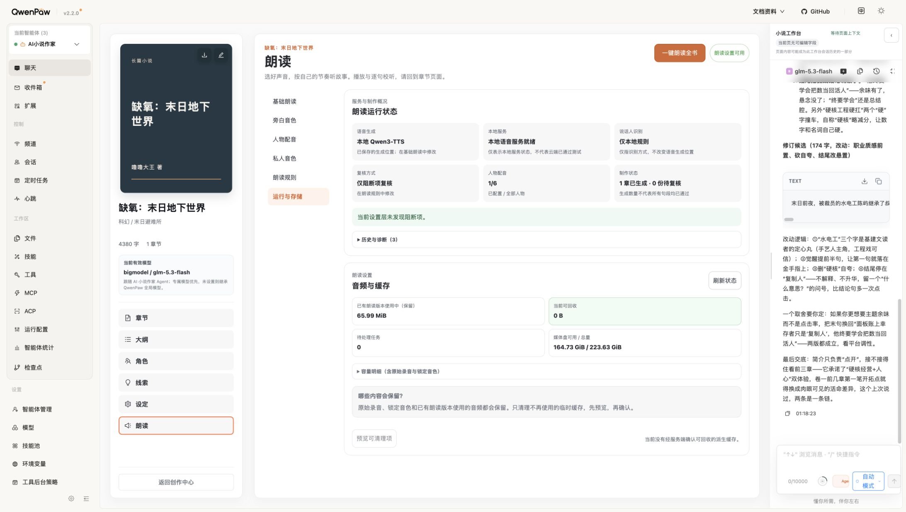
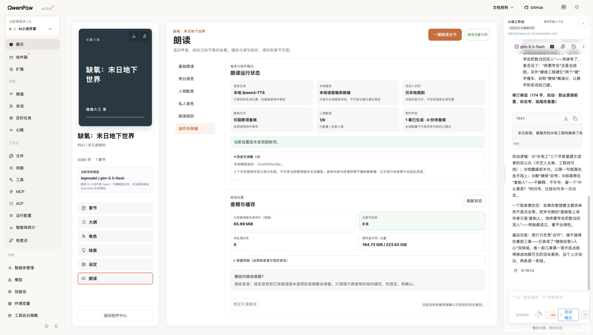

# 朗读设置六分区审查

日期：2026-09-12。状态：仅审查与建议，未施工、未部署、未提交 Git。

## 结论与范围

仍需要优化，但适合窄范围收敛，不需要重做六分区、模型接入或播放器。当前查看路径没有出现页面崩溃或人物音色卡片溢出；不能据此宣称全部设置、保存和音频功能通过。

采用界面审查技能，在正式 18088 当前作品中捕获六分区及人物抽屉。截图均为本轮新保存并重新打开检查。审查期间浏览器实际视口从 1916px 变为 2185px，未由本次自动化设置视口；分别记录横向与纵向导航，不把不同宽度的截图当成同尺寸回归比较。只点击导航、抽屉和诊断展开／关闭，没有选择音色、保存配置、创建档案、生成试听或清理媒体。最终回到作者原先的朗读规则页面。

## 优先级

| 优先级 | 问题 | 证据与影响 | 最小建议 |
| --- | --- | --- | --- |
| 优先修正 | “立即试听”说明与接线不符 | 基础页承诺调整后立即试听，但已发布源码的 ReadingPage 未传入 onImmediatePlaybackChange；页面没有试听播放器 | 改为准确的保存／章节播放说明，先不新增播放器 |
| 优先收敛 | 常见桌面宽度触发两套导航 | 同一规则页在本轮 1916px 视口为顶部导航，2185px 为左侧导航；既有 900px 内容容器断点改变页面结构 | 六分区优先固定一种导航；建议固定顶部横排，宽度不足仅滚动，不随助手宽度切换方向。属于建议，等待作者确认 |
| 优先改善 | 更换声音后仍需展开主要操作 | 已配置人物点击“更换声音”后只出现当前音色和两个折叠组 | 官方音色列表默认展开；私人音色／高级项继续折叠 |
| 次优先 | 保存方式提示不一致 | 基础与规则须保存，官方音色单选触发 applyVoice/onUse；人物抽屉有“选中即使用”，旁白页主说明没有 | 保持现有保存行为，统一显示“选中即保存／试听不改变声音／已有音频不变” |
| 次优先 | 重复标题与说明占据首屏 | 规则页多层“朗读规则／识别与复核”，旁白页多次重复普通话、数量和本地标签，基础页卡片较高 | 一层分区标题＋清晰分组；公共约束只说一次，条目只展示差异／异常 |
| 后续微调 | 长表单操作距离 | 基础页首屏到达停顿前已经需要滚动，生成设置保存按钮位于更后方 | 缩短顶部与卡片间距；再按实际高度决定是否需要分区底部固定操作条，不引入全局自动保存 |

## 逐步检查

### 1. 基础朗读：需要修正文案，布局可减重

播放偏好与生成设置已经分开，普通话固定、本地／云端的说明可见；无更改时两个保存按钮禁用。首屏设置较长，“一键朗读全书”比当前设置操作更突出，主要保存入口不在同一屏。

“调整后立即试听效果”不是本页当前接线事实。只读搜索工作区与 V1.3 精确发布源码 `/private/tmp/reading77-input-release.D5C7nM/source`，ReadingPage 创建 ReadingPreferencesPanel 时仅提供保存与刷新回调，未提供 onImmediatePlaybackChange；该回调只在组件中可选调用。应先修正表述，不把组件的可选能力说成已在页面连接。

### 2. 旁白音色：列表正常，重复信息与保存提示可改善

当前旁白明确，官方库未折叠，九项名称统一；当前窗口单列卡片没有横向溢出。“普通话”在页面说明、固定语言行和每个音色中重复，“本地可用”九次重复。说明数量、标签可压缩，但来源、可用性与异常不能删除。

普通单选在源码中直接触发选择保存；页面应明确这一点，与需要显式保存的基础页区分。本轮未点击单选或试听，不能声称真实绑定／试听成功。

### 3. 人物配音：列表与抽屉布局正常，主操作多一步

“6 位人物／5 位待配置”、搜索、待配置筛选和“选择／更换”区分清楚。进入陈屿声音抽屉时焦点落在关闭按钮，关闭后回到“更换陈屿的声音”，dialog／aria-modal 存在。展开后 760px 抽屉 scrollWidth 等于 clientWidth，九个卡片单列显示，没有原先按钮挤出问题。

但点击“更换声音”后列表默认折叠，主体大片空白；作者需要再展开一次才能完成刚才明确发起的动作。建议默认展示官方选项，保留高级部分折叠。

### 4. 私人音色：空态清楚，建议暂时保持

现有页面明确作品专属、先建档再设计／上传以及建档不启动语音模型；没有私人音色时未展示大量无意义禁用操作。此状态适合保留，空白区域并不需要填满。已有名称草稿未改动。

正式创建会写入数据，未为审查而创建档案，因此只验空态；设计、上传、试听、锁定与重新进入的完整交互仍需隔离环境另验。

### 5. 朗读规则：结构可用，但层级过重

识别复核与发音词典分区存在，复核选择、保存后只影响新版本、章节例外的范围说明可读。当前只提供本地识别，却同时呈现单个单选、大段解释和相同结论，可以收敛为只读状态＋能力详情；不假装支持额外模式。

同一页面内重复标题、卡片嵌套与顶部空间增大查找成本。当前两种桌面宽度下的导航位置差异明显，建议统一，不变更业务规则。本轮未新增发音词条或改变复核方式。

### 6. 运行与存储：信息边界明确，暂不大改

语音生成位置和说话人识别分别显示；本地服务状态明确不代表云端测试通过。历史三个失败任务在诊断中注明不等于当前音频无法播放，未冒充当前实时失败。0 可回收时按钮禁用，明确保护已有朗读、录音和锁定音色。

可以精简重复的“朗读设置／服务与制作概况”小标题，但不要删除生成位置、历史与当前状态的区分或缓存保护说明，也不要为简洁弱化清理确认。未执行清理。

## 保留与不做

- 保留六分区、当前暖橙视觉、名称规则、普通话约束、局部状态更新和已有错误校验。
- 不改模型、接口、数据库、声音绑定或播放逻辑；不新增框架、全局自动保存或第二个播放器。
- 若后续授权，先处理文案准确、导航稳定、人物主操作展开，再统一重复层级和保存反馈；这是优先建议，不是获批施工计划。

## 验证边界与可访问性

本轮是正式只读 UI 审查及少量源码接线核对，未运行模型、真实保存、自动化回归或部署。对比度存在浅灰小字的可读性风险，但未进行仪器化测量，不能宣称 WCAG 合规或违规；抽屉初始焦点和返回焦点正常不代表完整 Tab 循环／Escape／屏幕阅读器验收。未重新验证全部高级表单、网络失败／冲突、音频听感和章节连续播放。

仅新增本报告和对应审查截图；不改现行计划状态，不把建议写成已实施事实。
