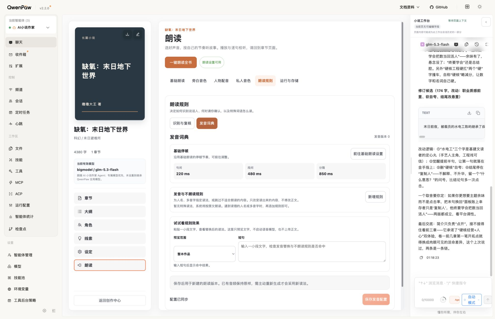
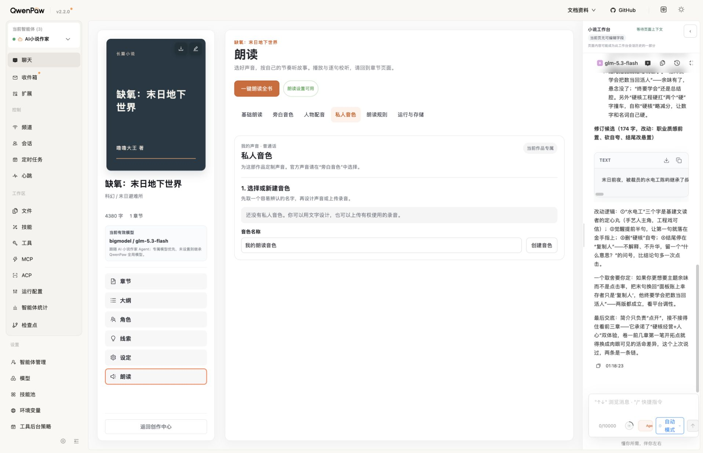
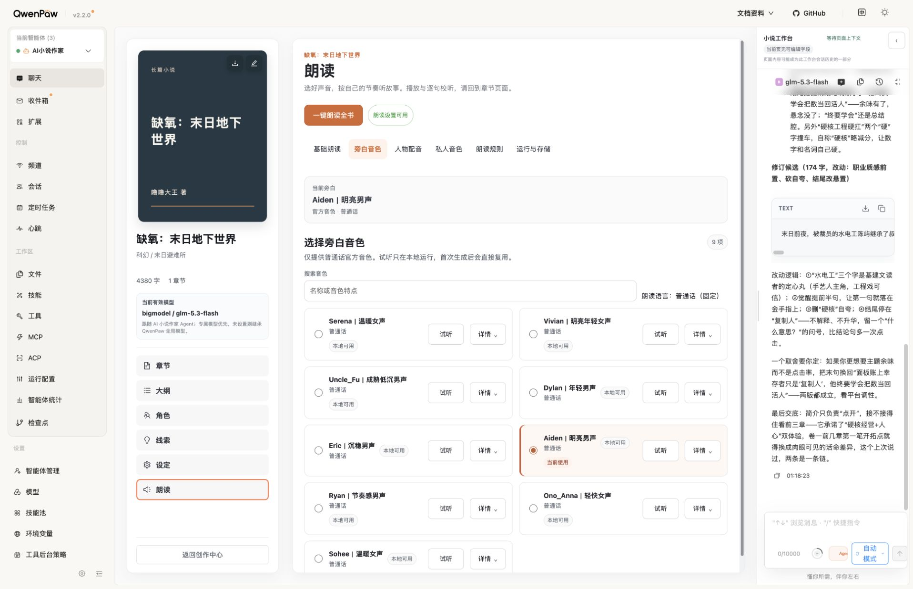
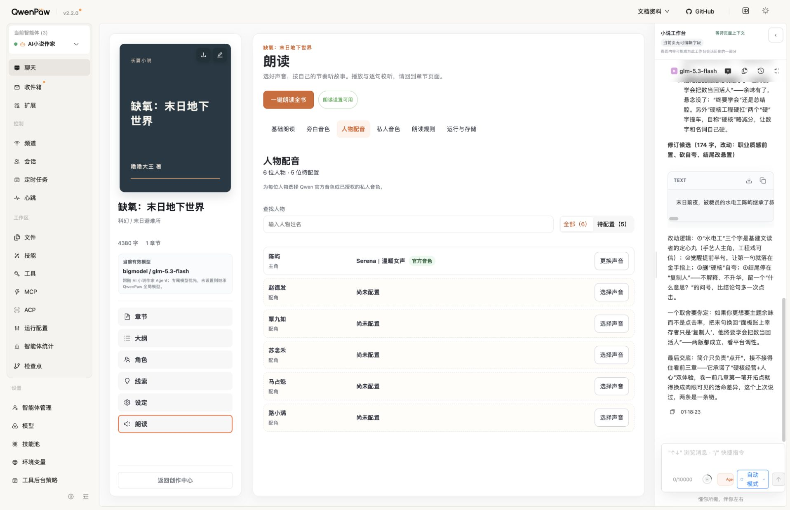
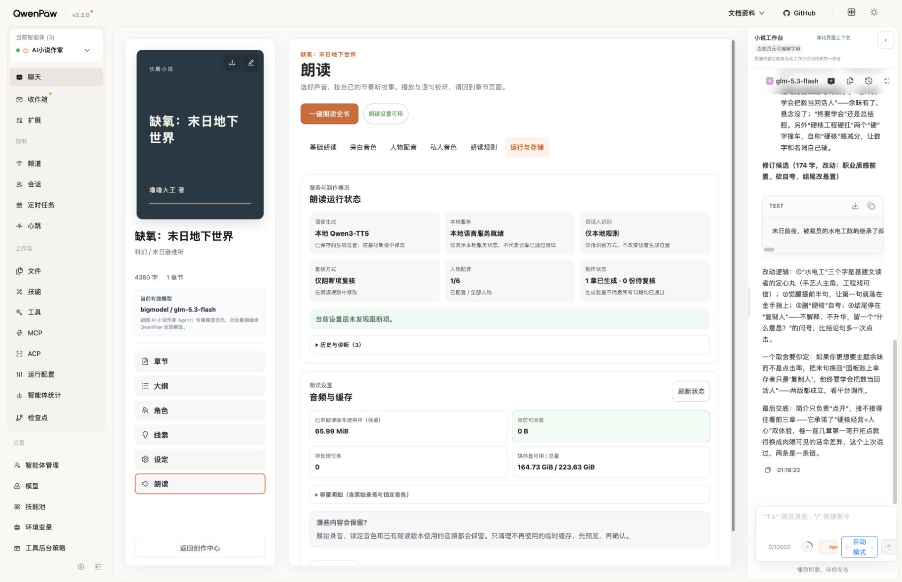
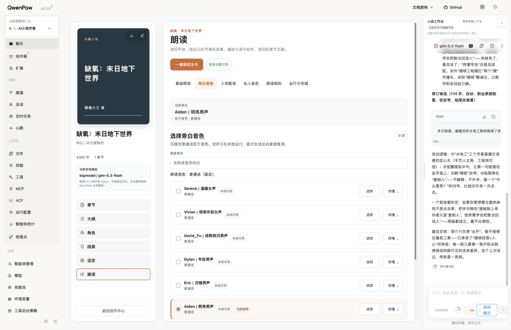

# 朗读设置六分区续查与优化

2026-09-12，V1.2：已公开热更新到正式 18088，未提交／推送 Git。

## 审查范围与步骤

目标是让作者分清生成位置、识别规则和缓存保护，减少桌面侧栏挤压下的阅读负担。采用界面审查技能：先捕获实际六分区，再针对证据修改现有前端，不重新设计产品或新增基础设施。以下均为本轮新捕获、保存并复看的截图。

1. 运行与存储：有明确分组与容量保护；但识别模式被称为“隐私模式”，容易与合成位置混淆，容量信息上下重复。已修正。技术指纹移到诊断，历史失败不再显示 Edition 术语或无帮助的同页跳转。

2. 基础朗读：播放偏好与生成设置分开，生成后生效说明和普通话约束可见，本轮未发现需要改动的首屏布局。未在正式页保存或切换 Provider；不宣称所有高级选项已逐一人工验收。

3. 朗读规则：识别与复核、发音词典两分区可切换；空词典有说明，文字预览明确不启动语音模型。本轮保持，不在正式页新增规则。

4. 私人音色：空态与名称输入正常，但“创建音色”容易让人以为直接合成。按钮改为“创建音色档案”，说明建档不启动模型。真实生成／上传／锁定未执行，不改变此前听感门禁状态。

5. 旁白音色：作者侧栏展开时容器约 889px，双列标题和标签过密。单列断点由容器 860px 提升至 960px；超过此宽度继续双列，保留上一轮抽屉单列机制。

6. 人物配音：六位人物、五位待配置，动作入口和名称清楚；本轮未改动人物绑定行为。抽屉沿用 V1.1 布局，未重新调用试听。

## 修改与验证

- 运行状态独立展示已保存的“语音生成”位置和“说话人识别”；本地 ready 标签与 provider/model 实际条件矛盾时显示“尚未就绪”，不错误声称云端通过测试。
- 缓存常驻指标由七项减到四项：已有朗读占用、可回收、待处理任务、磁盘空间；原始录音、锁定音色与完整精确字节数仍在展开明细可查。清理授权、快照校验、二次确认与保护契约未改。
- 删除状态组件不再使用的重复容量格式化函数、字段与其专属等值测试；引用搜索确认没有外部调用者，缓存组件原有非法容量／保护契约测试保留。新增云端合成与本地识别分离、矛盾 ready 状态回归。
- 工作区类型检查／155 文件、1347 项 Vitest／构建通过；最后仅更正测试协议字符串与源码缩进，此精确版本在隔离候选重新全验通过。
- 隔离候选类型检查／155 文件、1339 项 Vitest／构建／打包通过；19 项打包契约通过。测试数量差异来自排除其他任务候选。
- 只读预览：容量明细和诊断可展开，七项精确容量仍存在，0 可回收时预览按钮禁用。旁白 837px 单列，无横向溢出。
- 正式：新版状态文字和四项容量指标符合预期；旁白 889px 单列，scrollWidth 不超过 clientWidth；私人音色新按钮与说明可见。最后回到作者原先“运行与存储”页。

[预览状态](./28-storage-preview.png)／[诊断展开](./29-diagnostics-preview.png)／[建档说明](./30-private-preview.png)／[窄容器](./31-narrator-preview.png)

## 发布与恢复

独立候选及恢复材料：`/private/tmp/reading77-review-release.Edes0d`。已部署 V1.1 源码为基线，仅叠加本轮四个产品源文件和对应四个测试。与当前安装树逐文件哈希比较，唯一差异为 `frontend/dist/index.js`。使用项目安装互斥锁、公开热安装，未直接改写安装副本。

正式与候选 bundle SHA-256：`3ff8a78a1702d3eec8ab80e80955f50ab8752a560f0178b350726a1d2f828516`。容器 ID `a874d5a19c130999388a9e9021a7c5496c9c17d85bc9c1798fadb564f654bbb5`，启动时间仍为 `2026-09-12T13:15:46.24776296Z`，healthy；公开运行检查通过，worker/reference clone ready、9 个官方音色、11 个小说 Skills 和 5 个工具作用域保持。

公开 overview 的 settings／authorization 更新前后一致，Skill 快照恢复一致。未迁移数据库、生成或清理音频、修改正文或声音绑定。备份包含 installed-before、归档、Skill 快照和逐文件哈希；需要恢复时用项目 `.venv/bin/python` 执行该目录 `deploy.py rollback`，通过同一公开更新路径恢复 V1.1，无数据库回退。此次未触发回退。

刷新深链接仍可能恢复宿主之前的分区；通过页面内“运行与存储”按钮可正常返回，本轮不修改宿主路由。

## 验证边界

本轮主要是展示语义、信息层级和容器布局验证。没有执行新音色创建、试听生成、云端调用、规则保存或清理。原生按钮与 details 的名称／展开状态可读，但未运行屏幕阅读器、全量键盘与对比度专项，不能声称完全无障碍合规；未逐一展开全部高级参数，也不将首屏六页检查说成全功能端到端验收。
