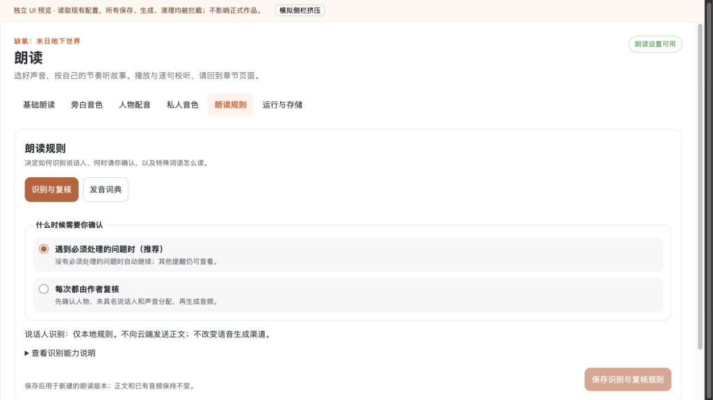
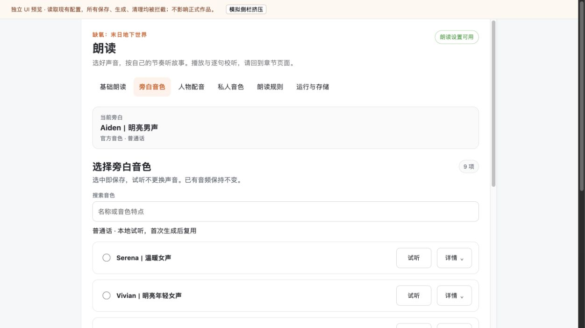
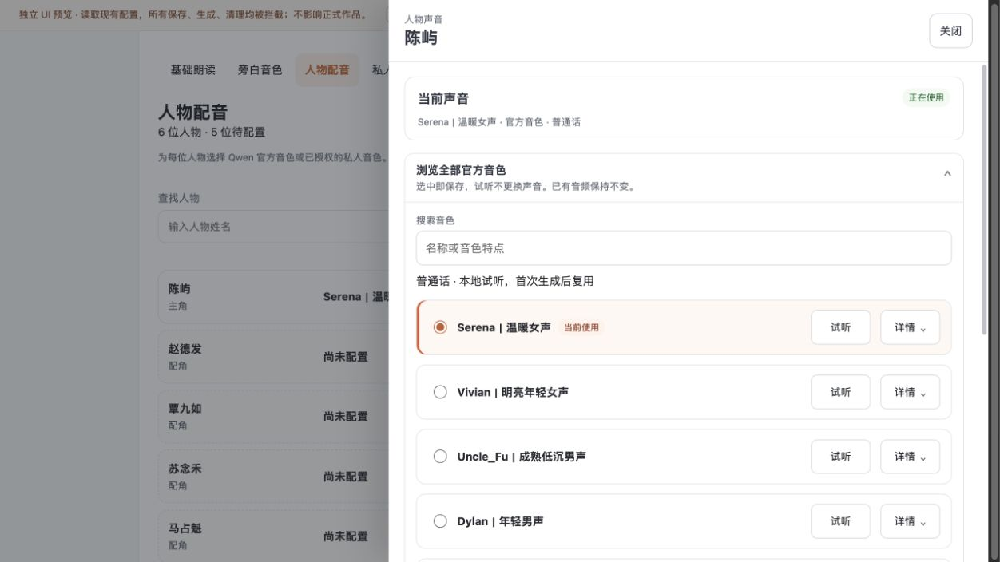

# V1.4 朗读设置简洁化：已正式发布

更新：2026-09-13。Docker 恢复后已完成备份、公开热安装和正式桌面只读验证，V1.4 已生效。以下 2026-09-12 候选及阻塞过程保留为历史，最终发布结论见文末；不代表 TTS 全功能与听感全部验收。

## 完成内容

- 六分区固定顶部横向导航；宽度不足时只横向滚动，键盘焦点可达，不再切换为侧边菜单或双列菜单。保留其他桌面压缩布局，缩减导航前后间距。
- 更换人物声音时官方库默认展开，私人音色／高级内容仍折叠。显式 `officialVoicesOpenByDefault: false` 继续有效；只拉取音色目录，不触发绑定或音频生成。
- 旁白和人物库一致提示选中即保存、试听不改声音、已有音频不变。
- 正常音色重复语言和可用性标签仅保留辅助技术可读内容；统一展示普通话与本地试听说明。不可用音色的限制标签仍可见，禁用及 `aria-describedby` 不变。
- 删除规则页重复标题，只保留可访问区域名称。本地为唯一当前选择时显示只读说明；云端可见或旧云端选择需要恢复时仍保留原选择器、授权和恢复路径。
- 修正未接入“立即试听”能力的播放偏好文案，改为保存后到章节页播放。未增加第二个播放器或自动保存。
- 清理已无调用者的音色语言样式、规则页 header 选择器和被统一导航替代的分支，不删除其他独立权限／恢复／云端测试。

## 精确范围与测试

隔离候选：`/private/tmp/reading77-simple-release.3sbQgE/source`，基于 V1.3 精确发布源码，仅覆盖七个产品源文件、六个相关测试文件。只涉及 narration 内 `styles/t2-b.ts`、`styles/t2-g.ts`、`styles/voice-library.ts`、`reading-preferences-panel.ts`、`reading-rules-panel.ts`、`official-voice-library.ts`、`character-voice-configurator.ts` 和相关测试。未复制其他任务的业务改动。

- 工作区 156 文件／1363 项 Vitest、类型检查与构建通过；最后的未使用 CSS 清理由精确隔离候选重新完整验证。
- 精确候选 156 文件／1355 项 Vitest、类型检查、构建、打包、19 项打包契约通过。数量差异是隔离候选排除了其他任务的测试增量。
- 新增默认展开／显式折叠回归；补充操作文案、云端不可用提示保留和唯一横向导航断言。更新只读识别结构对应的集成与可访问名称断言，原云端撤销／恢复与禁用测试保持通过。
- `git diff --check` 通过。没有提交或推送 Git。

候选 bundle SHA-256：`0f50827b4077cdf82ff6cfbac616320e590d63f1b854d4ee61920a6501d87cf6`。

## 浏览器预览

预览位于 `http://127.0.0.1:18177`。读取正式配置，但写入、生成和清理请求被代理拒绝；不是正式应用。截图均在本轮保存后重新打开检查。

1. 1188px 和 837px 内容容器：导航均为横向 row，无页面横向溢出。通过 Tab 从基础朗读移动到旁白音色。
2. 旁白：说明明确、重复标签收起、列表仍可见，未点击声音选择或试听。
3. 人物抽屉：760px 默认展开官方库、私人高级项折叠，scrollWidth 等于 clientWidth；打开焦点落在关闭按钮。
4. 基础页：实际 DOM 中显示“保存倍速和音量偏好后，请到章节页播放”，不承诺本页即时试听。

## 正式发布为何停止

`docker cp` 读取当前 PawApp 安装树超过两分钟不返回，目标备份和 Skill 快照尚未生成；随后独立 `docker inspect` 也持续等待。正式应用健康端点仍返回 HTTP 200，不能把管理接口问题说成 TTS 或应用已宕机。

备份尚未结束时，发布助手被调用一次；其安装前逐文件一致性断言因缺少备份立即失败，未进入归档、热安装或任何正式配置写入。之后没有绕过断言重试。已终止本次挂起的备份 shell、docker cp 和 docker inspect 客户端进程；未终止 Docker 服务或容器。

因此本次没有正式更新，也没有本轮可用的新安装树备份；不能把临时目录中的候选称为恢复材料齐全。正式最后一次成功发布仍是 V1.3，见[此前记录](./advanced-input-review.md)。本轮无模型、声音绑定、正文、媒体或数据库写入。

## 继续条件与边界

Docker 管理接口恢复后，先重新检查正式版本并完整备份当前安装树和公开 Skill 状态，确认仅前端 bundle 差异，再按已授权公开热安装流程发布；失败恢复依赖届时完成的备份。不要直接运行当前 deploy.py 绕过备份门禁，不擅自重启 Docker。

没有执行本轮正式浏览器验收、真实保存／绑定、生成试听、云端请求或完整无障碍专项。候选验收不能代替这些结论。

## 2026-09-13 授权后续查

作者同意继续发布。重新核对隔离候选 bundle，SHA-256 与上述已验收候选一致，未重建或夹带工作区其他改动。

- 目标容器 `docker inspect` 在 15 秒内未返回，已由超时控制终止本次客户端。
- 正式 PawApp 健康 HTTP 端点返回 200。
- Docker 官方 `/_ping` 返回 OK、`/version` 返回 200；限定目标的 `docker ps` 返回 `Up 3 hours (healthy)`。因此不是 Docker 基础连接完全不可用；阻塞至少涉及目标容器 inspect，具体内部原因尚未确定。
- 本轮未执行备份、安装、容器或 Docker 重启，没有模型调用、正文、声音绑定、配置或媒体写入。最后成功发布仍为 V1.3，V1.4 继续处于发布阻塞状态。

恢复需先解决容器管理请求阻塞，随后完整备份和差异核验，不跳过发布门禁。重启 Docker 会中断当前正式写作／朗读服务，不包含在本次只读排障动作中，须另获明确授权并确认作者已保存工作。

## 2026-09-13 作者授权重启后的恢复阻塞

作者明确同意重启 Docker 后，执行官方 `docker desktop restart --timeout 120`。命令退出 1，报告停止超时、Docker Desktop／backend／virtualization 等进程仍在运行；公开 `docker desktop status` 为 `stopping`，桌面 UI 同样显示 `Engine stopping`。正式健康端点在停止过程中请求超时（HTTP 000），不能沿用此前 HTTP 200 的可用性结论。

随后通过官方 `docker desktop start --timeout 45` 尝试恢复，命令虽退出 0，但仅报告 `Docker Desktop is already running`，不代表引擎或应用恢复。未强杀虚拟机、重置 Docker、升级 Docker、删除容器或数据卷。候选 bundle 哈希仍与已验收版本一致；未执行安装，正式最后成功发布仍为 V1.3。

本轮新增阻塞是 Docker 停止过程无法完成，需要先恢复 Docker Desktop。V1.4 发布继续等待完整安装树备份、Skill 快照、仅 bundle 差异核验与正式浏览器验收；不将重启尝试或命令退出 0 写成发布成功。

## 2026-09-13 恢复后正式发布：PASS（本轮前端范围）

作者报告已恢复后，Docker inspect 正常响应，正式应用 HTTP 200。容器仍为 `ai-novel-2026-qwenpaw-lab`，ID `a874d5a19c130999388a9e9021a7c5496c9c17d85bc9c1798fadb564f654bbb5`，启动时间 `2026-09-12T16:38:17.493682209Z`。本次热安装前后该启动时间不变，未再次重启。

1. 在项目安装互斥锁内完成当前安装树与公开 Skill 快照备份；等待备份成功后才继续。逐文件哈希比较确认唯一差异为 `frontend/dist/index.js`，旧包哈希为 V1.3 的 `bc027e9afaeb1fe4b68369d3c4f821507ce6dfa8d302e3b1e14603a63ecdfd5a`。
2. 候选与此前精确验收版本哈希相同，引用此前 1355 项前端测试、类型检查、构建与 19 项打包契约证据，未重建或夹带其他候选。
3. 通过 QwenPaw 官方 `plugin install --force` 热更新成功；Skill 恢复结果 `state_preserved=true`，11 项启用状态保持，无新增／移除。作品 overview 的 settings 与 authorization 更新前后一致。
4. 实际已安装 bundle 哈希为 `0f50827b4077cdf82ff6cfbac616320e590d63f1b854d4ee61920a6501d87cf6`。公开健康 `status=ready`，数据库连接正常，朗读 worker、playback 与 reference clone 就绪，容器 healthy。
5. 正式浏览器重新加载后检查六分区：基础提示准确；旁白 9 音色常显和统一命名；人物官方库默认展开、私人高级项折叠，焦点在关闭按钮；私人音色空态与创建档案说明正常；规则页显示仅本地识别只读说明；运行页本地服务就绪、缓存保护说明正常。没有保存、绑定、试听生成或清理操作。
6. 实际 1748px 桌面窗口，导航为 sticky 横向 row，页面无横向溢出；宿主助手展开后导航宽度 815px，仍为 row 且无溢出；人物抽屉宽 760px、正文区 749px，两者 scrollWidth 均等于 clientWidth。原生助手内容正常显示，未发送消息。

正式截图已保存并逐张重新打开检查：[规则页](./57-simple-rules-formal.png)、[旁白页](./58-simple-narrator-formal.png)、[人物抽屉](./59-simple-drawer-formal.png)、[宿主助手展开](./60-simple-rules-assistant-formal.png)。浏览器留在作者原作品的朗读规则页。

恢复材料：`/private/tmp/reading77-simple-release.3sbQgE` 下的 `installed-before`、`installed-before.tar.gz`、`candidate.tar.gz`、`skills-before.json`、`overview-before.json`、`release-hashes.json`、`deploy-result.json`。需要恢复时，先核对当前正式版本未有后续更新，再通过项目解释器执行该目录 `deploy.py rollback`，经同一公开接口恢复 V1.3 与 Skill 状态；不回退数据库。本轮未触发恢复。此目录为临时存储，不作永久备份承诺。

边界：仅本轮前端优化正式生效；没有模型调用、正文／声音绑定／媒体写入或数据库迁移。服务就绪不等于完整长章节连续实听、云端真凭据与私人音色生成锁定全链均已复验。未提交或推送 Git。
