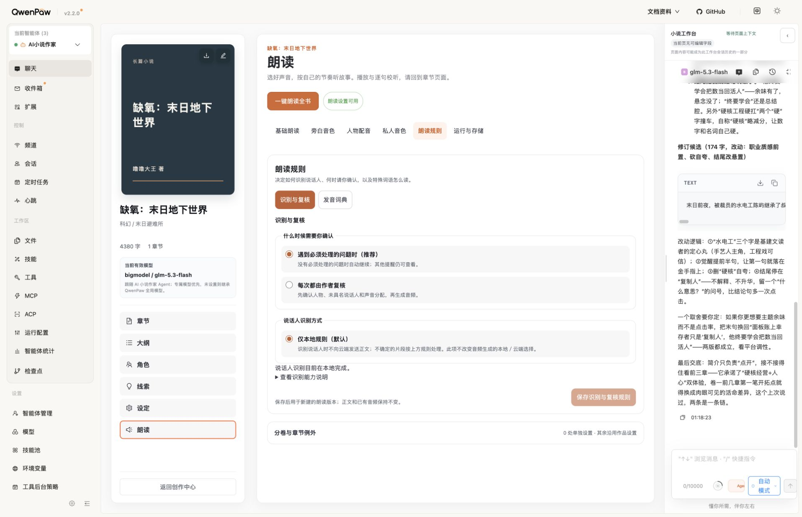

# 当前 UI 是否回退：只读核查

2026-09-12。用户询问是否换回旧 UI；本轮只读检查，不修改代码、不刷新页面、不保存设置或重新部署。

1. 版本检查：正常。正式安装 bundle SHA-256 为 `bc027e9afaeb1fe4b68369d3c4f821507ce6dfa8d302e3b1e14603a63ecdfd5a`，与 V1.3 发布记录一致，未发现安装版本回退。
2. 当前朗读规则首屏：布局完整，没有页面横向溢出。浏览器视口 1916px，左侧宿主与作品栏、右侧助手占据空间，朗读页面内容宽度约 899.923px；实际导航为横向 row。已加载样式包含 `@container (max-width: 900px)`：小于等于该宽度时，纵向导航切横向、标题按钮换行。这解释了导航样式变化，不应误称为版本回退。
3. 设计体验：仍需收敛。当前画面同时出现多个层次的导航与卡片，以及“朗读规则／识别与复核”的重复标题，顶部留白较多。断点恰好接近当前宽度，窗口或助手面板变化可能触发明显布局切换。以上为截图和 CSS 支持的设计风险，不是“所有 UI 已正确”的验收。

截图已在本轮保存后重新打开核对。当前六分区和规则控件样式已加载，不能据此宣称所有设置交互、音频生成或无障碍都通过。本轮未触碰其他页面和配置；没有把未知的“之前 UI”具体样式自行认定为用户期望版本。

建议：以作者认可的布局为基准统一导航、标题和卡片层级；先确认用户指出的差异是否正是纵向导航变横向，再决定修改范围。
