# AI 小说世界 2026 · UI / 排版 / 交互复查报告

> 已归档：用户随后把验收范围调整为仅桌面端 1920×1080 与 2560×1440。本报告中的移动端结论不再属于当前验收结论；请以 `audit/ui-desktop-2026-08-23/report.md` 为准。

- 验收日期：2026-08-23
- 验收方式：真实浏览器只读巡检、桌面端与 390×844 窄屏复查、DOM/可访问性抽查、前端类型检查与测试、后端单元测试、生产构建
- 桌面视口：1440×1000
- 窄屏视口：390×844
- 验收原则：不创建、不删除、不恢复版本、不采用候选、不写入故事账本，不修改任何作品正文

## 总结

当前 UI 已经具备可用的视觉骨架：创作中心、作品工作台、正文编辑器的层级和主要排版在桌面端稳定，卡片、字号、留白、章节纸张感也基本成立；没有发现页面崩溃、白屏或 P0 级阻断。

但它还不能作为“交互定稿版”。目前至少有四类 P1 问题：一批看起来可点击的控件没有行为；手机端存在退出项目和关键操作不可见的问题；弹窗主题与主界面割裂且版本标题出现不可见文字；部分已接通的写入/恢复操作没有确认或预览。结论是：**视觉方向可以保留，响应式和交互状态必须先修，再进入全面功能接通。**

## 最高优先级问题

| 优先级 | 问题 | 复现与证据 | 影响 |
| --- | --- | --- | --- |
| P1 | 多个可见控件是“假按钮” | 创作中心“故事资料库 / 创作灵感”、角色页“关系图”、线索页全部筛选、分卷“编辑 / 删除”、演示章节、演示大纲/设定的铅笔图标都没有有效行为。源码也显示相应节点没有 `onClick`：`frontend/src/workbench-v2.ts:219-221, 754, 770-777, 793-799, 809, 833`。 | 用户会把“没反应”理解为系统故障；演示数据与真实数据混在一起，破坏信任。 |
| P1 | 手机端无法正常退出作品 | 窄屏样式把项目页所有非主按钮隐藏，包含“返回创作中心”：`frontend/src/styles.ts:480`；实际窄屏 DOM 中也没有该入口。直接打开工作台根地址仍保留在当前项目状态。 | 用户进入作品后只能依赖浏览器历史返回，应用内导航形成死路。 |
| P1 | 手机端编辑器关键动作被裁切 | 390×844 下，顶部“保存版本”只剩约 6px 可见；底部操作区约 300px 可视宽度、589px 内容宽度，“情报 / 故事账本 / 历史”等位于屏外，只能横向滚动且没有提示。对应样式直接使用横向 `overflow-x:auto`：`frontend/src/styles.ts:495-497`。 | 核心保存与工作流动作难以发现，容易误以为功能缺失。 |
| P1 | 弹窗主题断层，版本历史存在不可见文字 | 创建小说、任务书、候选、情报、账本、历史弹窗都显示为宿主深色，而页面主体是浅色；版本历史卡片中的“版本 1 / 版本 2”在 DOM 存在，但实屏上接近白色、无法阅读。 | 视觉割裂；历史恢复前无法识别目标版本，属于高风险信息缺失。 |
| P1 | 当前标签页的 AI 助手不能发送 | 打开 AI 助手后出现“当前标签页仅入队，发送由其他标签页完成”。面板能打开，但当前创作上下文里无法完成对话。 | 入口存在但主任务不可完成，用户会困惑消息去了哪里。 |
| P1 | 已接通的写入/恢复动作缺少确认层 | 新建分卷、新建章节会立即 POST；“恢复为新版本”“采用整稿”“采用所选情报”也直接写入。见 `frontend/src/workbench-v2.ts:473-497, 527-542` 和 `frontend/src/chapter-workflow.ts:296-326, 418-438`。 | 误触即可改变作品结构或版本状态；恢复/批量采用尤其需要目标摘要、影响说明和确认。 |
| P1 | 关键颜色对比度不足 | 实测白字对橙色 `#ff7043` 为约 2.74:1；白字对绿色 `#07986b` 为约 3.68:1，均未达到普通文本 4.5:1。 | 低视力、低亮度或户外环境下按钮文字不清楚。 |
| P1 | 情报列表的复选框缺少可访问名称 | DOM 只暴露无名称的 `checkbox`；代码也没有 `aria-label` 或关联 `label`：`frontend/src/chapter-workflow.ts:797-801`。每条“拒绝”按钮也同名，缺少项目关联。 | 屏幕阅读器用户无法判断正在选择或拒绝哪条情报。 |

## 次优先级问题

| 优先级 | 问题 | 建议 |
| --- | --- | --- |
| P2 | 正文编辑区呈现为“纸张编辑器”，内容却直接显示 Markdown 标记 | 若产品定位是普通作者工具，默认应显示富文本/纯正文；可把 Markdown 源码作为高级模式。 |
| P2 | 任务书和情报弹窗信息过密 | `required / allowed / context-only / forbidden`、`fact / storyline_event / pending` 等技术词直接暴露；统一中文化，并分组/渐进展开。 |
| P2 | 大型空状态弹窗比例失衡 | “候选”“故事账本”没有数据时仍使用 880–1120px 大弹窗，空内容显得突兀；空状态应缩窄或改抽屉。 |
| P2 | 手机端项目流程导航采用整页宽横滑 | 每个标签宽约 309px，五项总宽约 1545px；只有当前项完整可见，并出现原生横向滚动条。改为五等分图标标签、下拉或固定紧凑标签更易发现。 |
| P2 | 创作中心手机端顶部导航被截断 | “创作灵感”只露出一部分并显示粗原生滚动条；应提供渐隐、箭头或更紧凑布局。 |
| P2 | 触控尺寸偏小 | 32–38px 高的按钮虽然达到 WCAG 2.5.8 的最低 24px，但低于常用的 44px 舒适触控尺寸。 |
| P2 | 技术文案面向开发者而非作者 | “复制上下文”“AI 候选历史与 Diff”“manual_checkpoint”“initial”等需要改成作者能立即理解的语言。 |
| P2 | 演示数据没有明显标识 | 第二卷与第 2–5 章是演示占位，却与真实作品呈现完全相同；应标注“示例”或在验收后移除。 |
| P3 | 页面下半区留白偏大 | 角色、线索、设定页桌面端内容较少，主卡片仍占很大高度；可在有真实数据后再收敛。 |
| P3 | 宿主控制台有一条集成警告 | 观察到 `[moduleRegistry] Module not found: AppCenter`，当前不阻断页面，但应在联调阶段确认是否会影响应用中心能力。 |

## 流程逐步验收

1. **创作中心（⚠️ 视觉通过、导航未完成）**：标题、创建按钮、作品卡层级清楚；作品快捷入口可进入对应模块。“故事资料库 / 创作灵感”无行为，手机端顶部标签被截断。

   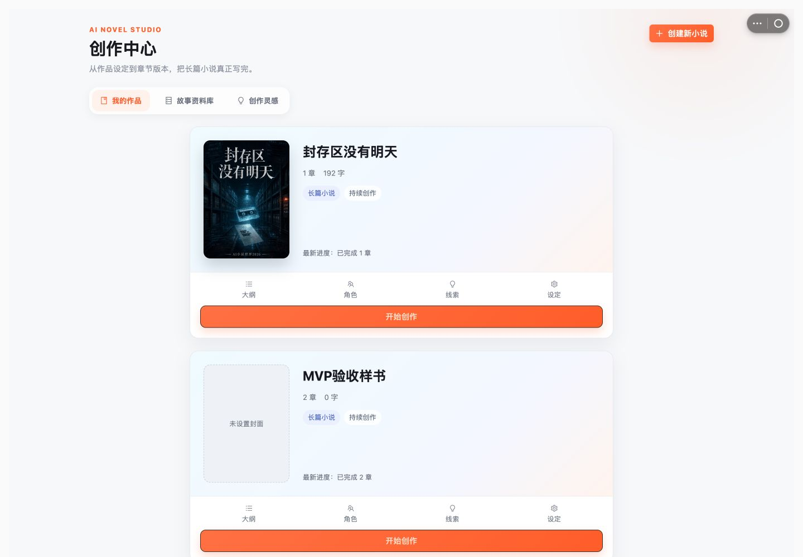

   

2. **创建小说弹窗（⚠️ 基础交互通过、主题不一致）**：空标题时确认按钮禁用；输入后启用；取消可正常关闭。深色弹窗与浅色页面不一致。

   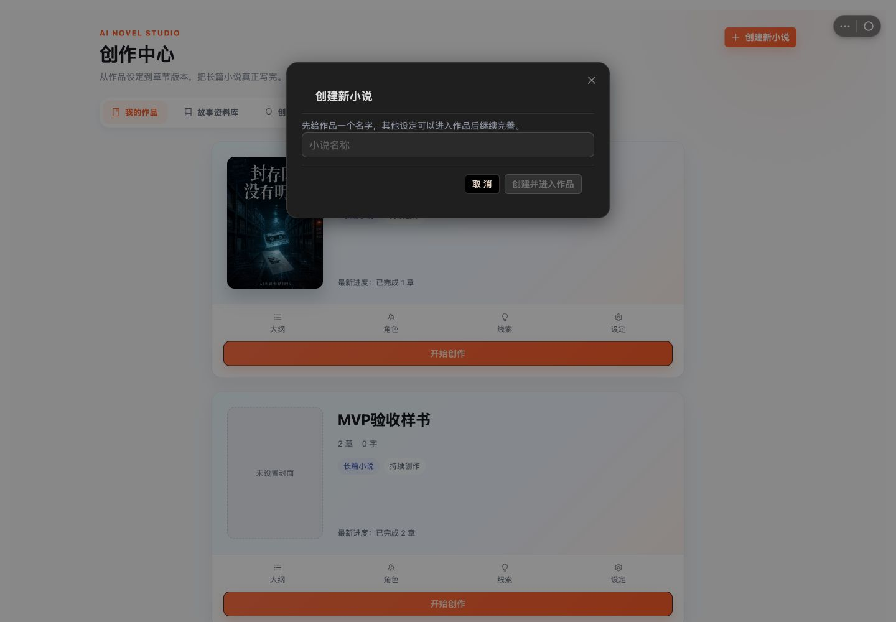

3. **作品章节页（⚠️ 主流程通过、占位控件失效）**：章节页、分卷区和目录排版正确；真实第一章可进入编辑。演示章节、分卷编辑/删除没有行为；新建动作会立即写数据。

   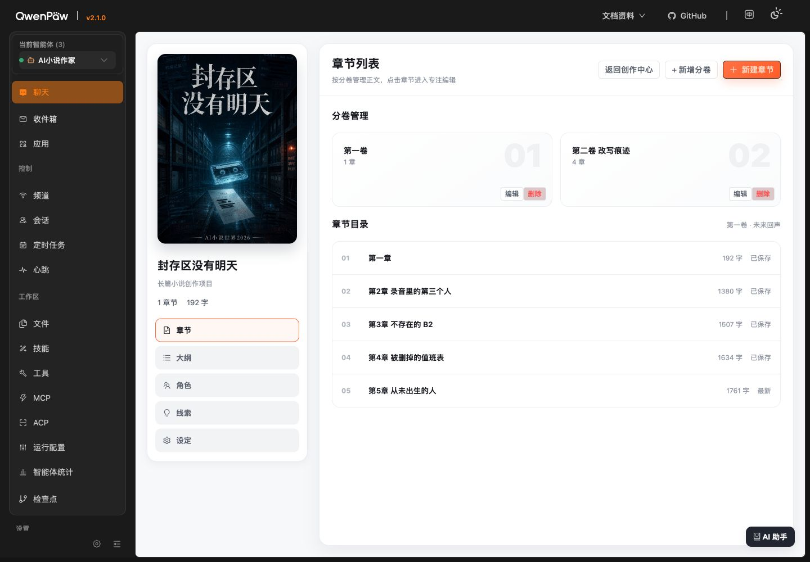

   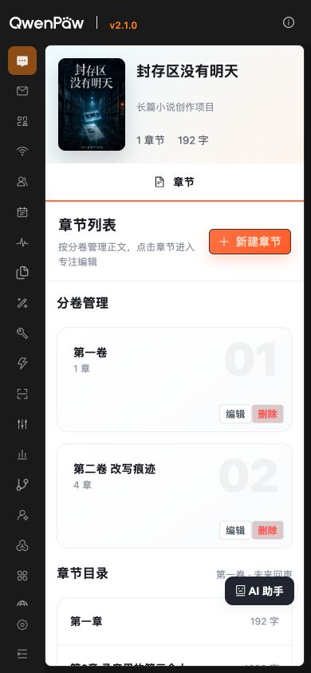

4. **大纲页（✅ 版式通过；⚠️ 编辑入口未完成）**：信息卡层次、行长和字号良好；铅笔只是图标，不是可操作按钮。

   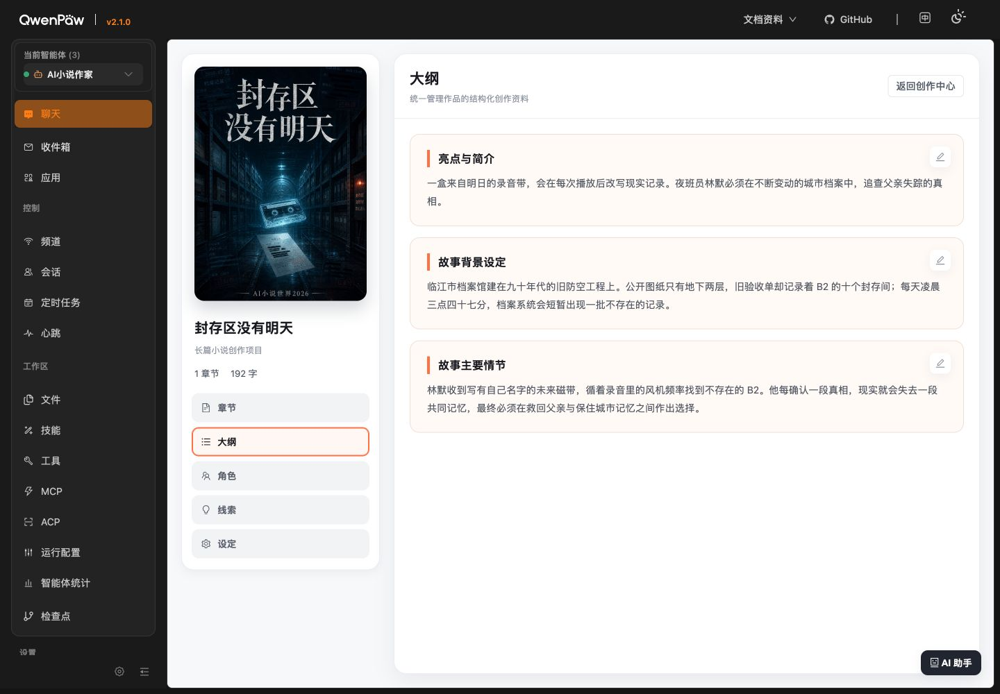

   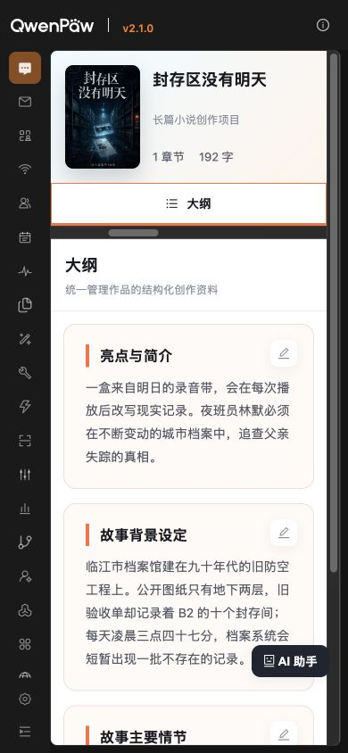

5. **角色页（⚠️ 卡片通过、视图切换失效）**：“角色卡”布局清楚；点击“关系图”不切换。

   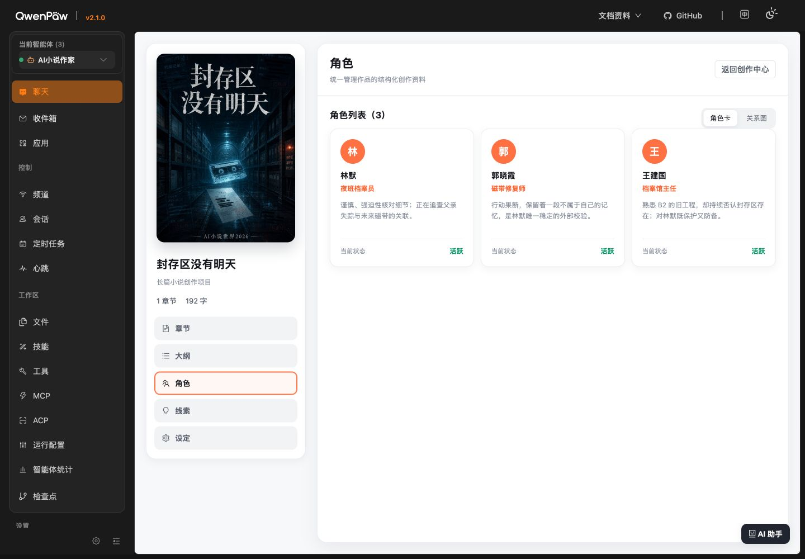

6. **线索页（⚠️ 列表通过、筛选失效）**：状态和线索卡可读；“全部 / 主线 / 支线 / 感情线 / 伏笔”均未接筛选。

   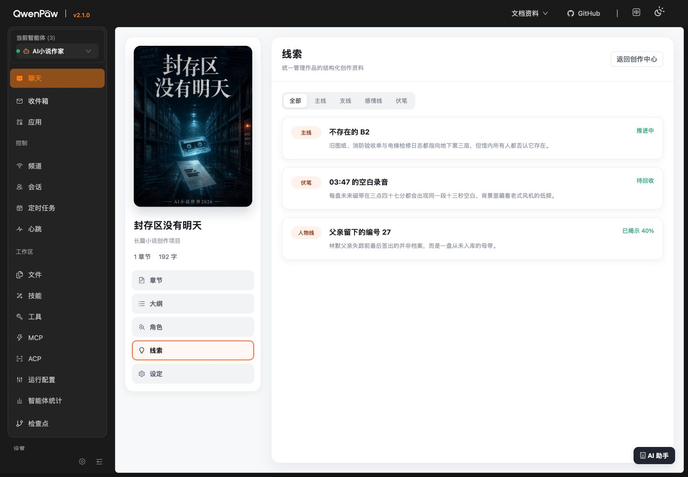

7. **设定页（✅ 版式通过；⚠️ 编辑入口未完成）**：整体排版稳定；示例卡的铅笔不可操作。

   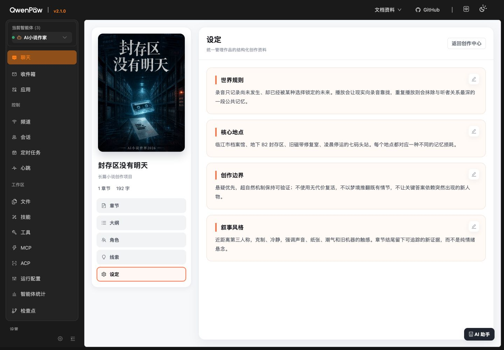

8. **正文编辑器（⚠️ 桌面布局通过、内容形态与移动操作有问题）**：桌面端纸张区域、字数、自动保存状态、工作流按钮稳定；正文直接显示 Markdown；窄屏保存与底部动作被裁切。

   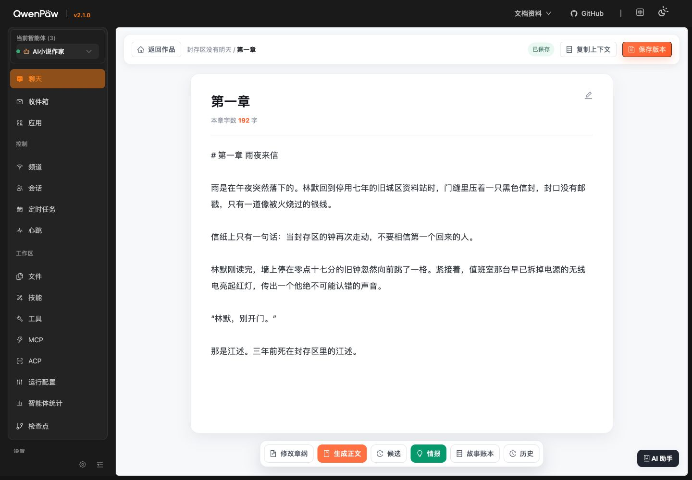

   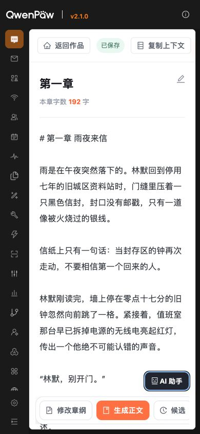

9. **章节任务书（⚠️ 可滚动但过密）**：打开、滚动、取消正常；手机端内容高度超过视口并依赖内部滚动，角色约束字段混用中英文。

   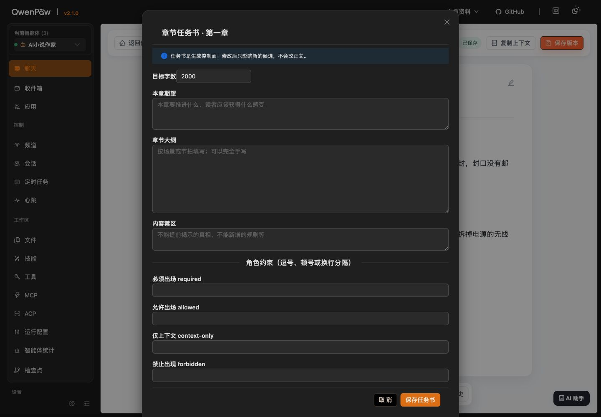

   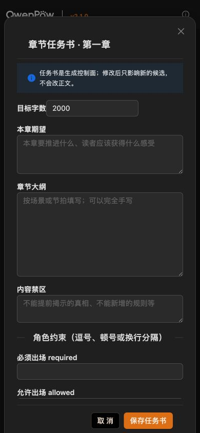

10. **候选 / 情报 / 故事账本 / 版本历史（❌ 需要重做弹窗层）**：四类弹窗都可打开与关闭；情报数据能载入且内部滚动正常。但主题断层、信息密度、默认全选、无标签复选框、空状态尺寸和历史标题不可见需要修正。

    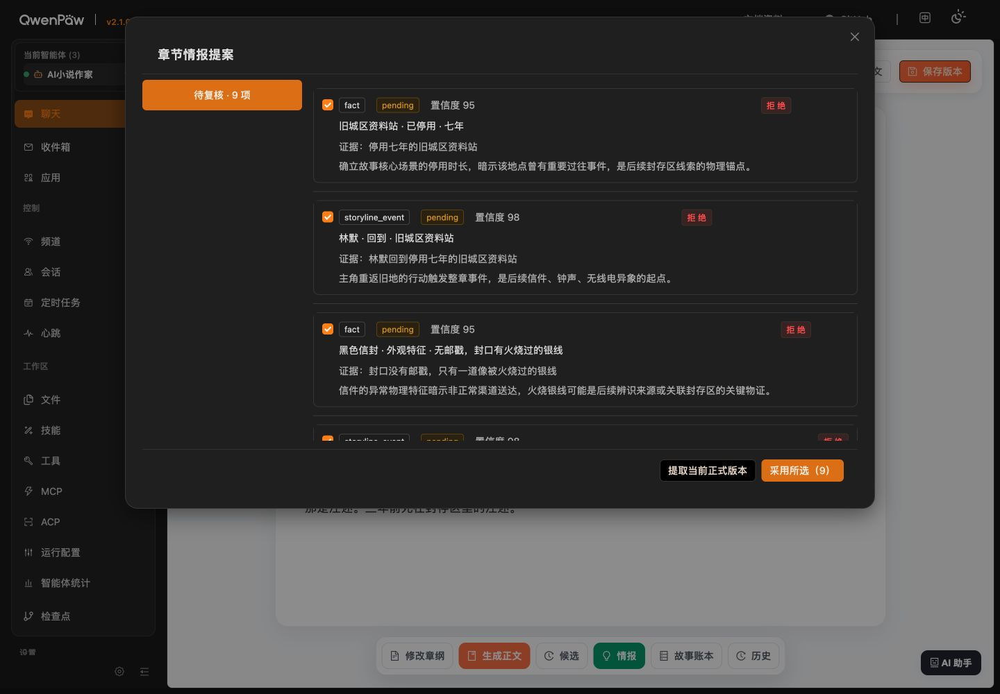

    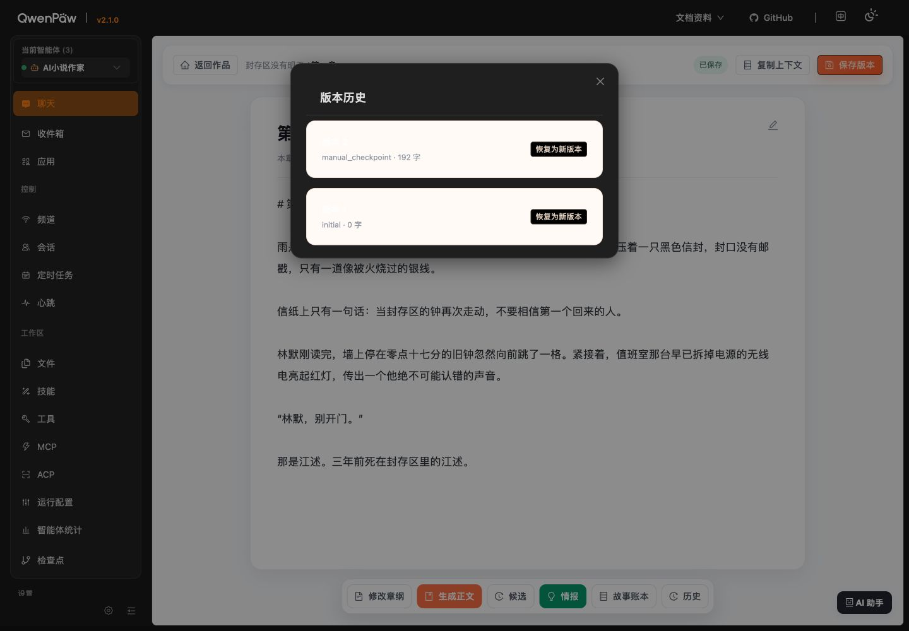

11. **AI 助手（❌ 当前标签页不能完成发送）**：面板开合和编辑区重排正常，但发送权在另一个标签页。

    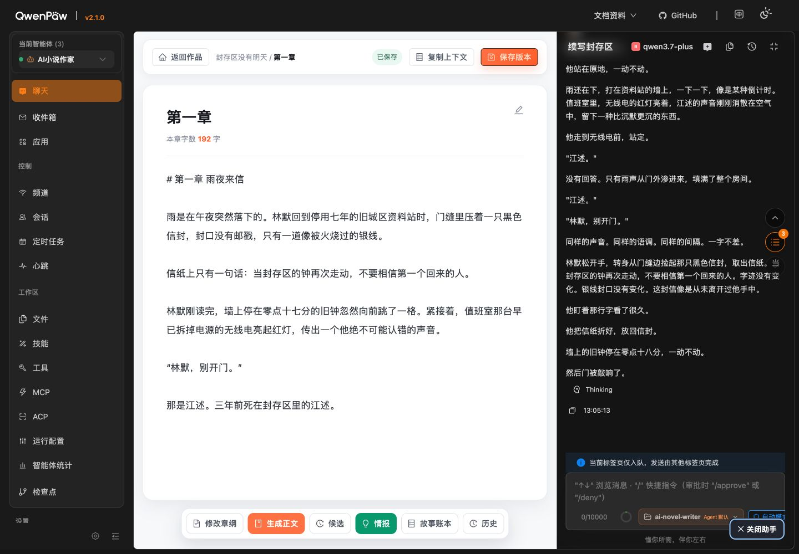

12. **响应式（❌ 尚未通过）**：创作中心卡片本身响应良好；项目页与编辑器的导航、退出、保存、工作流动作存在明显断点。

## 可访问性与键盘检查

- 页面已有语义化 `h1 / h2 / h3`，多数主要操作使用真实 `button`，这是正确基础。
- 主要桌面按钮目标尺寸均不低于 24px；移动端仍建议提高到 44px 左右。
- 橙色、绿色主按钮文字对比度不足，需调整底色或字体颜色。
- 大纲/设定铅笔图标没有按钮语义；情报复选框没有可访问名称。
- 浏览器自动化中，焦点停在 AI 助手按钮后无法继续前进。由于这也可能受宿主焦点管理影响，不能据此断言存在确定的键盘陷阱；发布前仍需人工用 Tab / Shift+Tab / Esc 完整走一遍。

## 技术检查结果

- 前端 TypeScript：通过（`tsc --noEmit`）。
- 前端测试：1 个测试文件、1 个测试通过。
- 后端测试：12 通过、5 跳过；跳过项均因为未配置集成数据库。
- 生产构建：通过；单文件约 538.87kB，gzip 约 368.44kB。当前不是阻断，但后续可检查宿主加载耗时与按需拆包。
- 本次浏览器巡检未出现应用 JavaScript 异常；仅观察到宿主 `AppCenter` 模块警告。

## 本次验收边界

- 为避免改变用户数据，没有实际点击：新建分卷、新建章节、保存版本、生成正文、采用/拒绝候选、提取/采用情报、恢复历史版本、删除分卷。
- 因此这些操作的服务端成功/失败反馈、并发冲突和撤销能力，本轮只依据 UI、DOM 与源码做风险审查，不等同于完整端到端写入验收。
- 本轮没有修改产品代码或作品数据。

## 建议的施工顺序

1. 先修手机端退出、保存和底部工作流可见性。
2. 清理所有假按钮：能做就接最小状态，暂不做就禁用并标“即将开放”，演示数据要标明。
3. 统一弹窗主题与响应式容器，优先修版本历史不可见文字。
4. 为恢复、采用、批量写入等操作增加摘要、二次确认和结果反馈。
5. 修复颜色对比度、复选框标签、图标按钮语义，再做人工键盘巡检。
6. 最后处理 Markdown 显示模式、技术文案和空状态尺寸等体验优化。
