# AI 小说世界 2026 · 桌面端 UI 验收报告

- 日期：2026-08-23
- 分辨率：1920×1080、2560×1440（QHD，本文简称 2K）
- 范围：创作中心、创建小说弹窗、作品章节页、大纲、角色、线索、设定、正文编辑器、章节任务书、候选、情报、故事账本、版本历史、AI 助手
- 明确排除：手机端与窄屏响应式，不纳入本报告的任何通过/不通过结论
- 操作原则：只读验收；未创建、删除、恢复、采用、生成或修改作品数据

## 验收结论

桌面端没有崩溃、白屏、横向溢出或 P0 阻断；1920×1080 下正文编辑器完成度最好，纸张宽度、字号、操作条和 AI 分栏都稳定。作品工作台的左侧作品栏、顶部操作区和五个资料模块也能保持正确结构。

但当前仍不适合直接锁定 UI：

1. **创作中心没有大屏布局策略**：作品区被固定为 760px 并纵向堆叠，1920 已显得窄，2K 下页面大部分为空白。
2. **资料页反方向铺得过宽**：大纲、线索、设定直接拉满工作台，正文形成超长单行；2K 下尤为明显。
3. **大量真实外观控件没有行为**：资料库、创作灵感、关系图、筛选、编辑/删除、演示章节等都会造成“系统坏了”的感觉。
4. **弹窗视觉层没有完成**：弹窗全部继承宿主深色，与浅色创作界面断裂；版本历史标题甚至不可见。
5. **高影响写入操作缺少确认**：恢复、采用、批量写入、新建结构等会直接发请求。

总体判断：**桌面端布局骨架可保留，但创作中心宽度、资料页最大阅读宽度、弹窗主题与假按钮必须先修，之后才适合进入功能全面接通。**

## P1：应在下一轮首先修复

### 1. 创作中心在 1920 / 2K 下过窄、过空

- `.anw-library-grid` 被固定为 `width:min(760px,100%)`，两本书仍纵向堆叠。
- 1920×1080 下作品卡只占页面约四成宽；2K 下占比进一步下降，大量空间完全没有用途。
- 页面标题/创建按钮位于 1120px 容器两端，作品卡又在该容器内二次居中，标题、卡片和 CTA 的对齐线不统一。
- 建议：桌面宽屏改为两列作品卡，内容区最大宽度约 1200–1440px；单本作品时才使用居中单列。

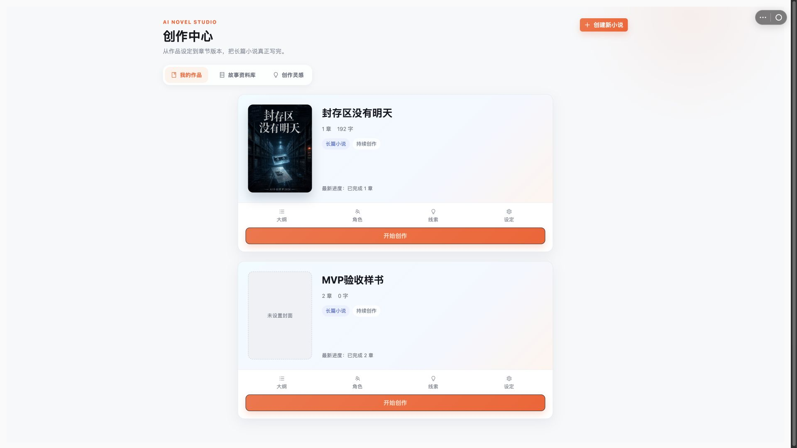

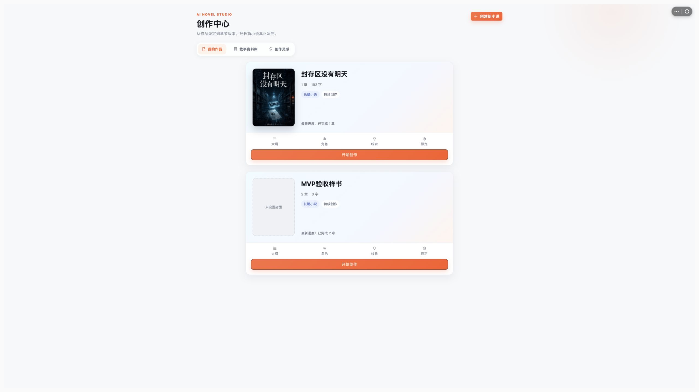

### 2. 大纲、线索、设定在大屏上行长过长

- 工作台主区域会随浏览器无限扩张，而资料卡没有自己的阅读宽度上限。
- 1920 下大纲和设定段落已经横跨约 1200px；2K 工作台更宽，视觉重心集中在页面顶部一条窄带，下面留下整屏空白。
- 超长行会降低扫读效率，也让卡片像表格行而不是创作资料。
- 建议：资料内容设 1000–1200px 的阅读区上限，或改为两列卡片；角色页可以保留三列，线索页可采用“主内容 + 右侧状态/筛选”结构。

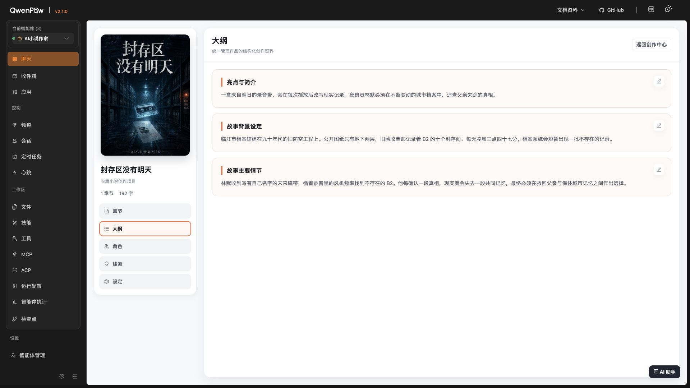

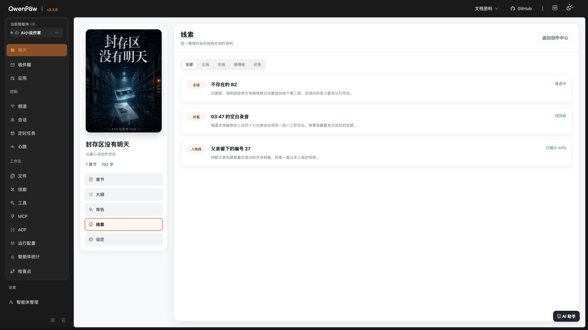

### 3. 多个可见控件没有行为

实测并结合源码确认：

- 创作中心“故事资料库 / 创作灵感”点击后页面和选中态均不变；源码节点没有 `onClick`：`frontend/src/workbench-v2.ts:219-221`。
- 角色页“关系图”点击后仍是“角色卡”选中：`frontend/src/workbench-v2.ts:809`。
- 线索页“主线 / 支线 / 感情线 / 伏笔”点击后仍是“全部”选中：`frontend/src/workbench-v2.ts:833`。
- 分卷“编辑 / 删除”没有回调：`frontend/src/workbench-v2.ts:754`。
- 演示第 2–5 章是 `<button>`，但没有 `onClick`：`frontend/src/workbench-v2.ts:770-777`。
- 大纲/设定示例卡显示铅笔，却只是图标而非按钮：`frontend/src/workbench-v2.ts:793-799`。

建议只有两种状态：已经可用的控件接最小交互；暂不实现的控件禁用并标注“即将开放”。不要保留可以点击但无反馈的中间状态。

### 4. 弹窗主题断层，版本历史的版本号不可见

- 创建小说、任务书、候选、情报、故事账本、版本历史均显示宿主深色主题，而创作产品主体为浅色。
- 版本历史卡片是浅色，但“版本 1 / 版本 2”继承了近白色文字；DOM 中存在，实屏不可读。
- `manual_checkpoint`、`initial` 等内部值直接暴露。
- 建议统一为浅色创作弹窗，或为所有弹窗单独建立完整深色 token；版本号必须是卡片第一视觉层，并把来源改为“手动保存 / 初始版本”。

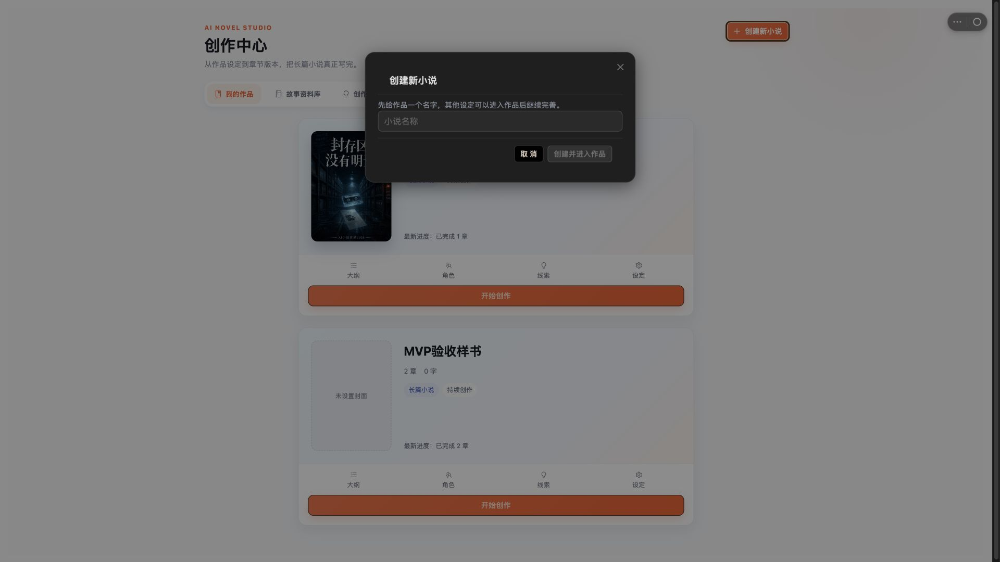

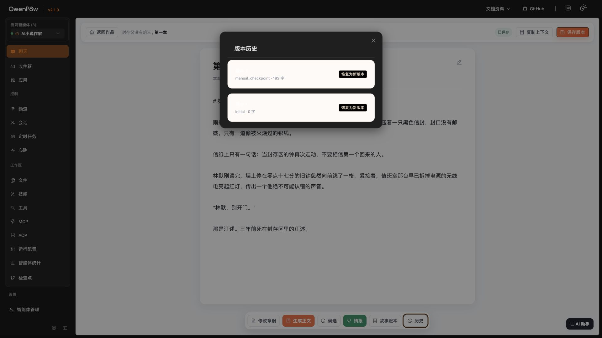

### 5. AI 助手当前标签页不能完成发送

- 1920 下分栏比例和编辑器重排本身正确。
- 面板明确提示“当前标签页仅入队，发送由其他标签页完成”，即入口能打开但当前创作流程不能完成对话。
- 建议在这个入口直接取得发送权；如果产品机制必须跨标签页，则入口应显示为“在主会话中打开”，并明确跳转目标。

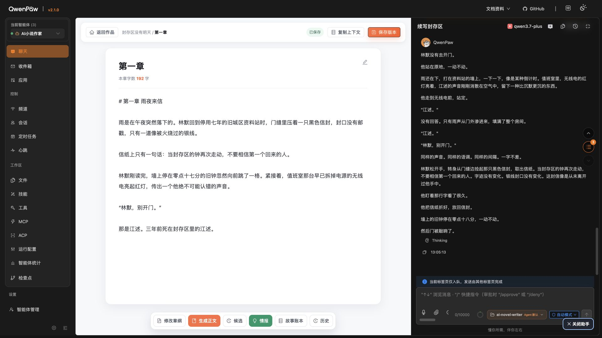

### 6. 直接写入、恢复、采用操作缺少确认

- 新建章节/分卷会立即 POST：`frontend/src/workbench-v2.ts:473-497`。
- 恢复版本会直接 POST 并生成新版本：`frontend/src/workbench-v2.ts:527-542`。
- 采用/拒绝候选、采用情报也会直接写入：`frontend/src/chapter-workflow.ts:296-326, 418-438`。
- 建议新建普通章节可以直接执行但提供撤销；恢复、采用整稿、批量采用情报必须先显示目标、影响范围和确认。

### 7. 对比度与可访问名称不完整

- 白字对橙色 `#ff7043` 实测约 2.74:1；白字对绿色 `#07986b` 约 3.68:1，均低于普通文本 4.5:1。
- 情报列表复选框没有 `aria-label` 或关联 `label`：`frontend/src/chapter-workflow.ts:797-801`。
- 多个“拒绝”按钮同名，屏幕阅读器无法判断对应哪条情报。
- 大纲/设定铅笔没有按钮语义。

## P2：视觉与信息架构优化

### 正文编辑器

- 1920 下纸张约 880px 宽，阅读和输入最稳定，是目前完成度最高的页面。
- 2K 下仍保持 880px，符合专注写作，但左右留白非常大；可以提供“标准 / 宽屏”两种稿纸宽度或缩放，不必默认铺满。
- 正文以纸张编辑器形式呈现，却直接显示 `# 第一章 雨夜来信` 等 Markdown 标记。若面向普通作者，应默认渲染正文，把 Markdown 源码放进高级模式。
- 标题旁铅笔看起来可编辑，实际无行为。
- “复制上下文”偏开发术语，可改为“发送给 AI / 复制本章资料”。

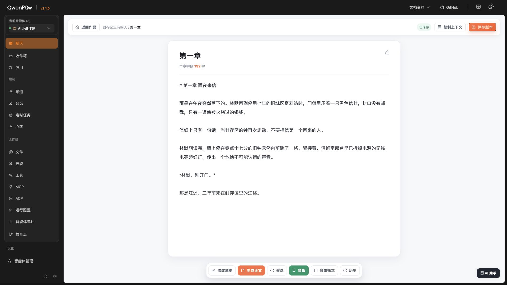

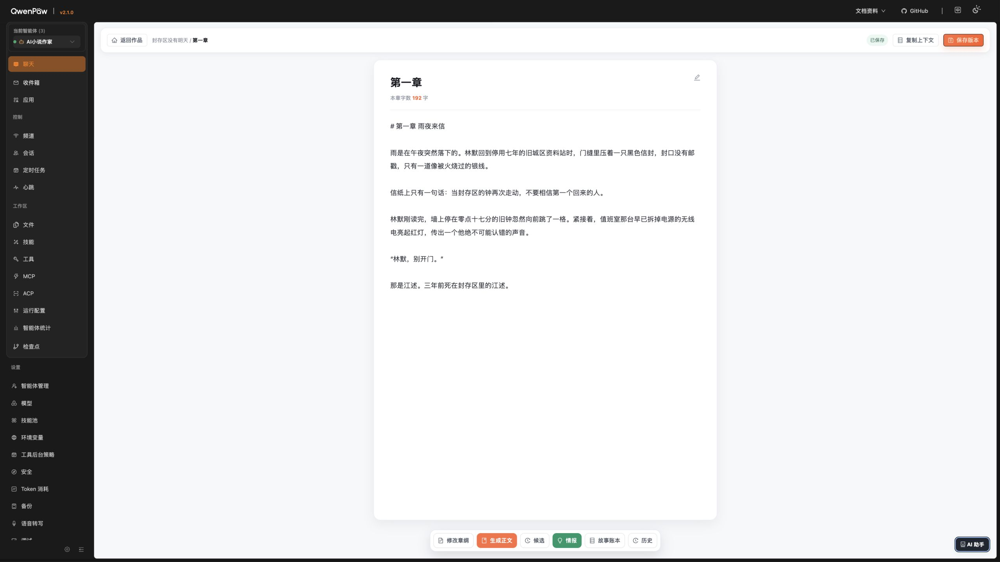

### 章节任务书

- 1920×1080 下弹窗高约 1014px、顶部 24px，几乎占满整屏；虽然能内部滚动，但视觉压力很大。
- `required / allowed / context-only / forbidden` 混用中英文，不符合作者工作流语言。
- 建议将“基础任务”“角色约束”“内容禁区”拆成分组或折叠段，保留底部操作条。

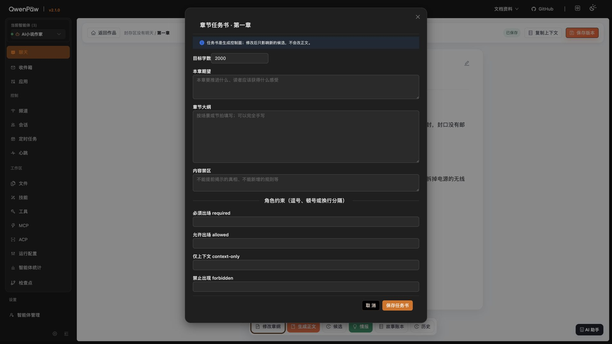

### 候选、情报与账本

- 候选空状态宽 1120px、高约 266px；故事账本空状态宽 880px、高约 266px，空内容弹窗过宽。
- 情报弹窗 1080×733，尺寸在 1920 下合理，内部滚动正常；但左栏只有一个提案却固定占 230px，空间浪费。
- 9 条待复核情报默认全部选中，“采用所选（9）”风险过高；更安全的默认是全不选或按高置信度分组确认。
- `fact / storyline_event / pending` 等内部枚举没有中文化。

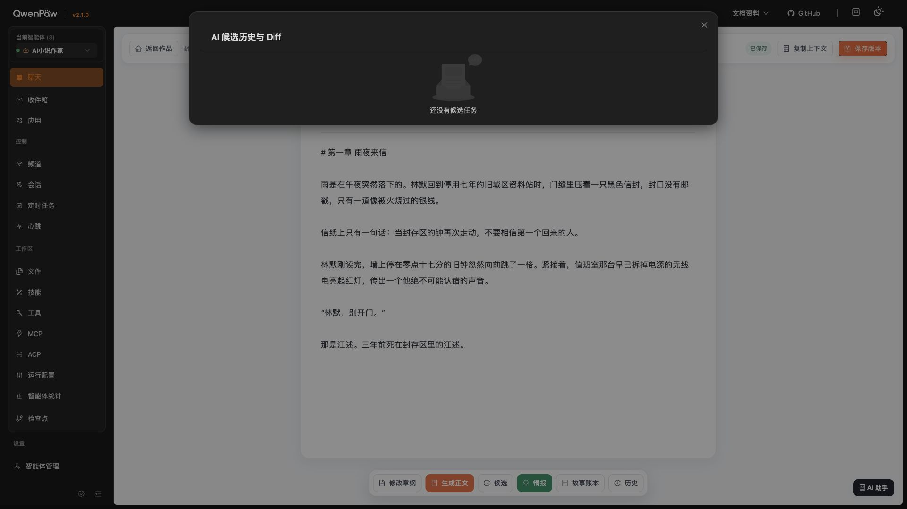

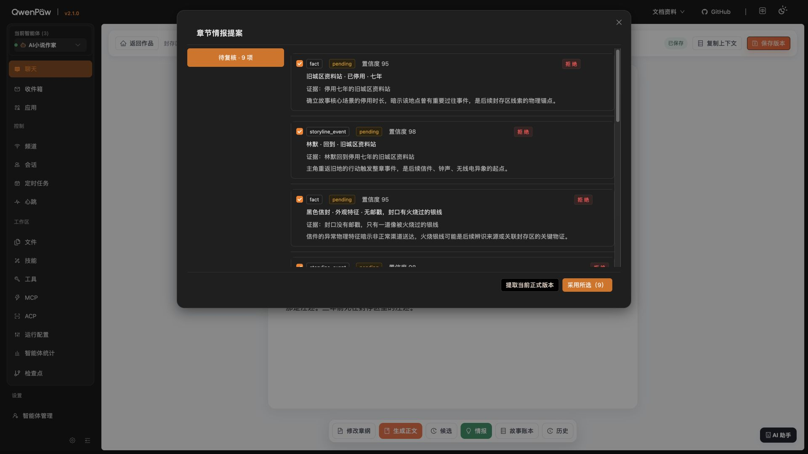

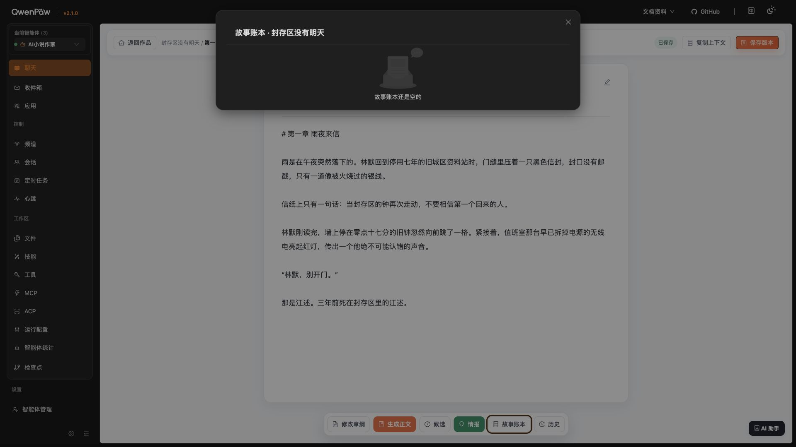

### 作品工作台

- 1920 下左侧作品栏、五项导航和主面板比例清楚，顶部按钮没有裁切。
- 2K 下主面板横向扩张到几乎整屏，但有效信息只集中在顶部约 500px，视觉密度过低。
- 建议给工作台设大屏内容策略：主面板最大宽度或将“分卷 / 章节 / 最近活动”重组成三列，而不是让两张分卷卡无限变宽。

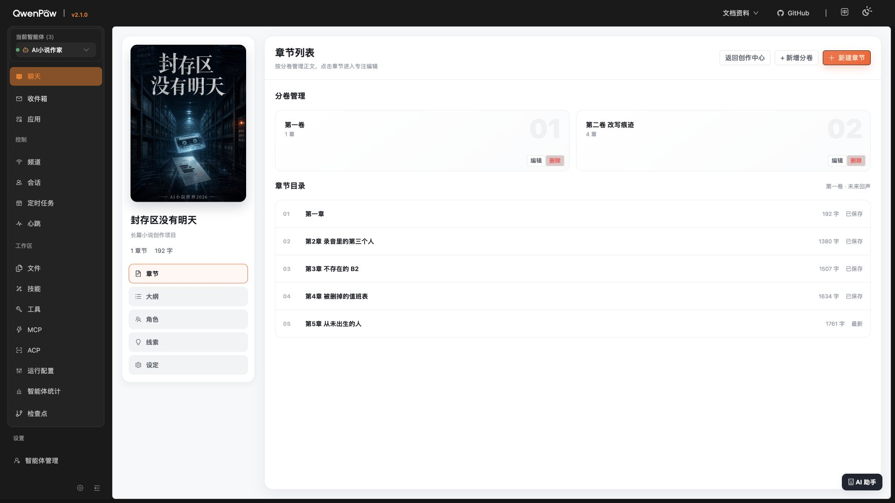

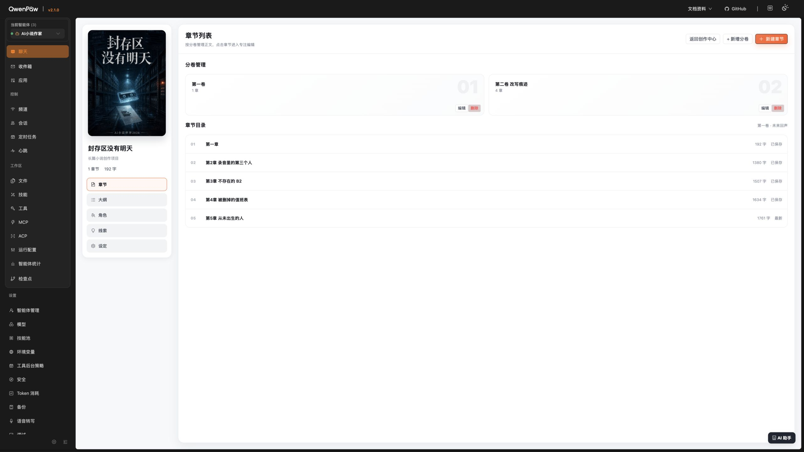

## 逐步交互验收

| 步骤 | 健康度 | 结果 |
| --- | --- | --- |
| 1. 创作中心 | ⚠️ | 作品卡、快捷入口、创建按钮可见；大屏宽度利用差；资料库/灵感无行为。 |
| 2. 创建小说弹窗 | ⚠️ | 空标题禁用、输入后启用、取消关闭均正常；主题不一致。 |
| 3. 章节工作台 | ⚠️ | 五项主导航和真实第一章可用；演示章节、分卷编辑/删除无行为。 |
| 4. 大纲 | ⚠️ | 页面切换正常，版式稳定；行长过长，铅笔不可用。 |
| 5. 角色 | ⚠️ | 三列卡片在 1920 下正确；“关系图”无行为。 |
| 6. 线索 | ⚠️ | 三条线索显示正确；全部筛选无行为。 |
| 7. 设定 | ⚠️ | 内容卡显示正确；行长过长，铅笔不可用。 |
| 8. 正文编辑器 | ✅/⚠️ | 1920 与 2K 均无裁切，保存/工作流区可见；Markdown 和标题编辑问题待处理。 |
| 9. 章节任务书 | ⚠️ | 打开、滚动、取消正常；过高、过密、混用技术英文。 |
| 10. 候选/情报/账本/历史 | ❌ | 均能打开关闭；主题断层、空状态过宽、默认全选、版本号不可见。 |
| 11. AI 助手 | ❌ | 分栏与开合正常；当前标签页不能发送。 |

## 技术检查

- TypeScript：`tsc --noEmit` 通过。
- 前端测试：1 个测试文件、1 个测试通过。
- 后端测试：12 通过、5 跳过；跳过项均为未配置集成数据库。
- Vite 生产构建：通过；输出约 538.87kB，gzip 约 368.44kB。
- 浏览器巡检未发现应用 JavaScript 异常；宿主控制台有一条 `[moduleRegistry] Module not found: AppCenter` 警告，当前未阻断页面。
- 浏览器自动化未能从 AI 助手按钮继续推进焦点；可能受宿主焦点管理影响，发布前仍需人工用 Tab / Shift+Tab / Esc 完整验证，不能仅据此断言存在键盘陷阱。

## 建议施工顺序

1. 重做创作中心 1920 / 2K 的两列布局与对齐线。
2. 给大纲、线索、设定增加最大阅读宽度或多列布局。
3. 处理所有假按钮：接最小交互，或明确禁用/标“即将开放”。
4. 统一浅色弹窗主题，立即修复版本历史不可见标题。
5. 给恢复、采用和批量写入增加确认/撤销。
6. 修复对比度、复选框名称、图标按钮语义和技术文案。
7. 最后优化编辑器 Markdown 模式、任务书分组和空状态尺寸。

## 验收边界

- 本轮没有测试任何手机端或窄屏状态。
- 为避免改变作品数据，没有实际执行新建、删除、保存版本、生成正文、采用/拒绝、提取情报或恢复版本。
- 因此写入接口的成功反馈、失败反馈、并发冲突与撤销仍需在功能接通阶段单独验收。
- 本轮没有修改产品代码或作品内容。

