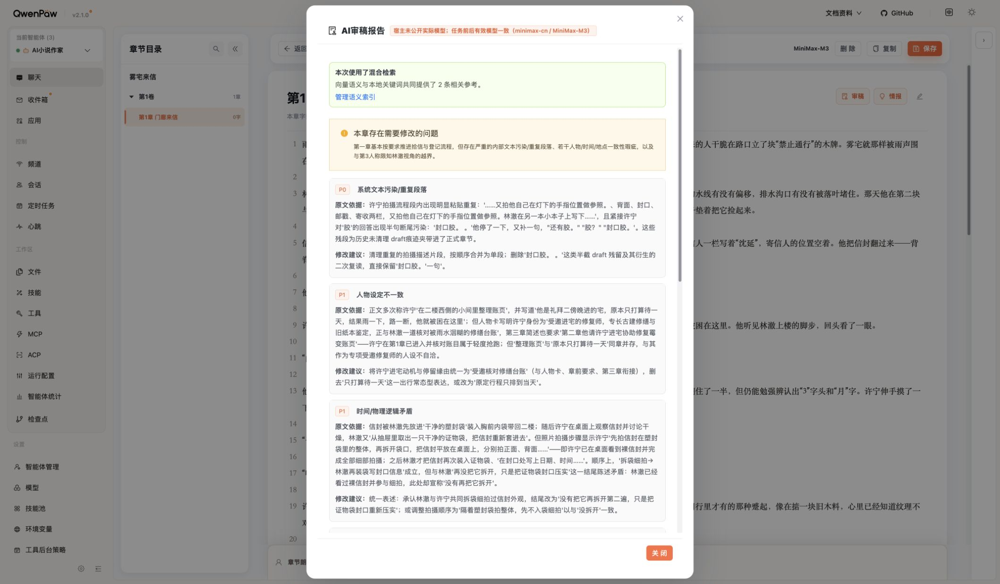
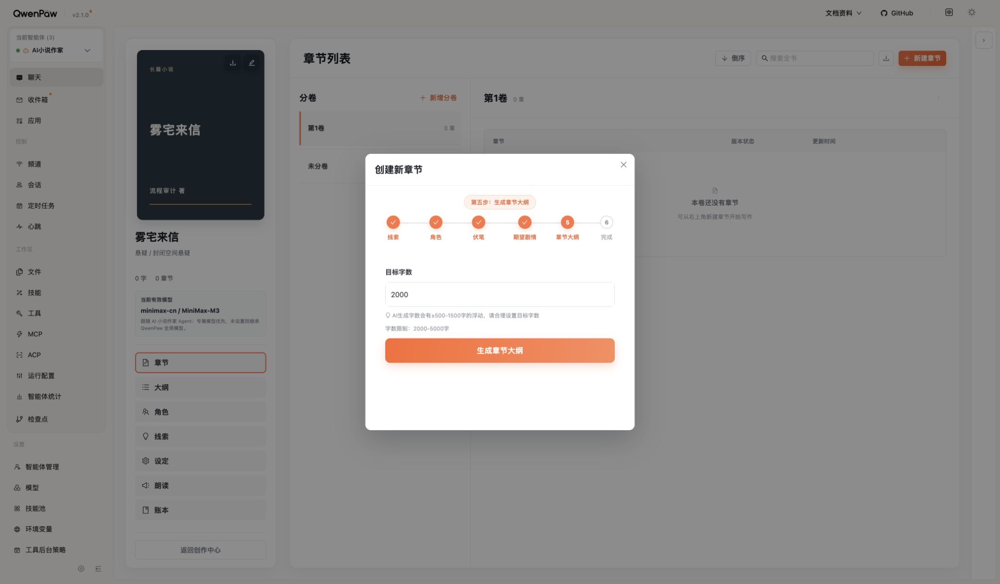
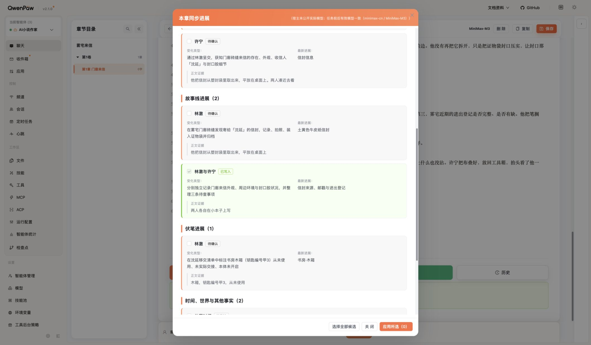

# 《雾宅来信》真实写作流程审计

状态：本轮主流程体验已整理；有阻断与未验证项，不是产品全功能通过。2026-09-08。

复查状态（2026-09-08）：已重新核对原始JSON、关键截图和相关当前源码；补充结论见[复查与遗漏](#六复查与遗漏2026-09-08)。本次是对用户指定的原审计证据进行复核，不是重新跑完网页，不新增模型调用，不修改产品或恢复已取消施工。

## 结论先说

**用户关于“流程太重”的担心有依据，但不应据此删除全部账本和恢复能力。应该减掉的是重复选择、重复确认、强制创作规则与低价值模型调用；应该补好的是资料准确传递、正文审改和清楚的保存状态。**

本轮从产品内置弹窗新建《雾宅来信》，完成大纲、两章正文（1880＋1852字），真实审稿、同步9条候选并只接受2条，检查人物/关系/故事线/伏笔/账本/索引，验证手动改字保存和历史恢复，触发全书导出。没有向QwenPaw右侧助手发消息，没有修改产品代码、Skill、数据库结构或部署，没有提交Git；原有作品未操作。局部AI改写提交后没有结果，是明确阻断项。

这是一部样书、两章的流程观察，不是文学能力排名，也不能据此判定某个悬疑Skill整体可靠或不可靠。本轮没有独立核实所有方法装载回执，更没有关闭某个Skill或数据源做对照。

## 一、必须先处理的写作问题

### 1. 审稿把检索片段当正文，产生了可复核的误报

已核实事实：首章审稿给出8条问题，其中最高P0所指的重复、断句片段不在实际正文，却可在本章检索snippet中找到；审稿引用还含自己的拼接与省略，不应说整段引文逐字一致。甲-3在检索片段中变成甲3，审稿又把两种写法当正文不一致。它漏掉了实际存在的“下一章再核”人物对白、署名被改成收件人等问题。不能据此把8条意见全部判为误报。

技术推断：当前源码把重叠chunk直接拼接为snippet，与本次重复相吻合。这是资料加工与来源区分问题，不应通过再增加一层审稿或不断加长Skill遮盖。

项目建议：审稿以待审正文为唯一文字对象；引用检索原文时保留来源/范围并去重，旧大纲不应无解释地压过作者本章意图。改稿必须回到原文定位，不让误报推动无谓重写。修复尚未实施或验证。

### 2. 字数硬编码已经实际改变了创作内容

已核实事实：

- 目标1000字被界面自动改为2000字，前后端限制2000—5000。
- 第二章第一份章纲239字，后端ready；前端因为固定260—500字门槛自动再生成，第二份305字被采用。
- 两份章纲连调查对象都变了：鞋印/门窗痕迹，变成墨迹/压痕/钥匙簿。第二次输入明确记录rewrite_attempt=2和长度重写原因。
- 正文确认框还允许长度不达标最多自动整章重写2次；本轮两章正文均首轮达标，不能说已发生正文重写。

项目建议：长度由作者决定，技术容量上限与文学长度目标分开；超出目标先提示与保留结果，不自动整篇换情节。章纲是否有用应看它是否足够指导本章，而不是够不够260字。第一次章纲自身也有推断错误，不能反过来说短的一定更好。

### 3. 数据确实进入续写，但“进去”不等于“正确使用”

已核实事实：第二章输入包括首章完整revision、2条已接受事实、正式大纲、4个人物资料；没有预算省略。它确实继续了待查清单中的进出登记，没有重演发现信件，说明不是每章从零开始。

同时出现三类问题：

- 未来规划与当前事实同时提供：全书大纲提前包含临摹、同源、合谋、真相。第二章也出现临摹结论，但本轮不足以独立证明是检索导致。
- 当前章只选两人，仍装入四个人物资料；其他人物可以作为背景，但不应默认变成可以出场/可以泄露秘密。
- 生成中仍有常识与推理错误：三年任职、三年一册却有三册；近期登记被当成三年前字迹；“像临摹”最后成了“签字是被临摹的”。

项目建议：不新建一堆账本。先把已有上下文分清“作者本章要求、已写事实、当前人物所知、未来计划”，按任务拿必要数据。边界不清时可提示作者，不用硬编码固定悬疑情节。

### 4. 局部改写没走通，无法形成最基本的审改闭环

已核实事实：使用正文原生选区助手，仅要求修正章末对白；点击开始修改，浮层消失，没有候选/Diff/错误，限定本章的任务记录也没有selection_edit。没有绕行右侧助手，也没有为了制造通过而手改后声称AI已完成。

项目建议：先修“选中文字→一句修改要求→候选对照→采用/取消”，失败保留原文和要求。它比增加整书审计页更直接影响写作。运行态原因仍待定位；不把当前未提交代码直接当已部署代码。

## 二、每个环节应该保留、精简还是补足

下表按真实体验顺序汇总；更细的50条日志、模型输入及截图编号见[逐步记录](README.md)。健康度描述本轮观察，不代表全部分支通过。

| 步骤 | 环节／健康度 | 真实使用感受与处理意见 | 截图 |
| --- | --- | --- | --- |
| 1 | 创作中心／可用 | 入口集中；旧聊天与当前书容易混淆。只用产品入口即可写作。 | 01 |
| 2 | 长短篇、受众／部分阻断 | 短篇可点却报验收限制；男/女频独立一步且默认男频。合并基本信息，未开放能力不要伪装成可用。 | 02—04 |
| 3 | 创意与模板／可用但偏重 | 原始创意实际保留；五短语应是可选辅助，不应强迫所有创意压成同一模板。 | 05—06 |
| 4 | 命名、封面、完成页／可精简 | 真实书名手填；文字封面足够。默认AI封面、多次完成确认没有增加正文质量。 | 07—10 |
| 5 | 章数与背景／可用 | 默认200章可改；没必要先锁死全书规模才能开写。允许暂定和滚动规划。 | 11—12 |
| 6 | 人物规划／需要审阅 | 四人候选可改，但固定4—8人有扩张阵容风险；提前引入外界查档能力。人数和角色任务由故事决定。 | 13—14 |
| 7 | 情节与简介／质量有问题 | 大纲有进宅、封路与远程查证冲突；简介把30章变三十天。需审阅候选，不能以任务ready当质量通过。 | 15—16 |
| 8 | 分卷／额外阻挡 | 无卷不能建首章，默认第1卷可自动建；管理多卷能力仍保留为可选。 | 17—18 |
| 9 | 线路选择及AI推荐／本例低价值 | 只有唯一主线还要选、推荐、确认；默认选中唯一项足够，多线路才需推荐。 | 19—20 |
| 10 | 本章人物／默认不理想 | 新增/退场默认许可，续章需再纠正。继承可编辑的本书偏好，同时能按本章调整。 | 21、51 |
| 11 | 伏笔选择／可选能力有价值 | 空列表仍占单独一步；新增正确为待埋。并入本章准备的可选区，不强制每章推进伏笔。 | 22—24 |
| 12 | 本章意图／重要但后置 | 到第四步才输入且标可选；应前置，成为其他选项与资料调用的依据。 | 25 |
| 13 | 章纲、字数、完成确认／有硬限制 | 目标被钳制，章纲因长度自动重写；采用结果前后重复确认。保留可改章纲，取消纯字数自动改剧情。 | 26—28、52 |
| 14 | 私有素材与正文／生成可用、质量有误 | 素材未默认选中是正面；先跳过无关素材。正文进入工作稿，生成后却立刻催同步。先读正文。 | 29—32、53 |
| 15 | 审稿与选区改写／高风险＋阻断 | 审稿误报且缺定位；局部修改无结果。最优先修这条闭环。 | 33—35 |
| 16 | 同步候选与来源／应保留 | 九项默认不选，仅接受两项；有原文来源可回查，阻止错误自动进账本。 | 37—38、41 |
| 17 | 账本／信息真实、展示混乱 | 第一章错显第1000章；active事件被标历史变化，作者易误解无效；技术字段过多。保留数据，重做面向写作的摘要。 | 39—41 |
| 18 | 人物卡／可用但重复催填 | 已有身份/性格却提示待补；完整度计数催补秘密/成长。按写作需要展示，别用填满表证明好人物。 | 42—44 |
| 19 | 关系网／可选定位合理 | 同步渐进建立，整书分析仅初始化/重建；无关系事实所以0条不是故障。 | 45 |
| 20 | 故事线／需要精简 | 全书大纲存成一条巨长说明，卡片截断；有最近事件仍0%。应显示本线目标和待解决点，不用不明百分比代表完成。 | 46 |
| 21 | 模板、伏笔、时间线、索引／部分清楚 | 模板露英文键；伏笔仍待埋需核对；单时间线默认是好做法；索引有效不代表检索质量好。 | 47—50 |
| 22 | 第二章承接／资料有用但输出仍有错 | 待查事项被延续；推测变事实、时间和册数矛盾。不要继续堆数据，要改善取用与审改。 | 51—53、第二章JSON |
| 23 | 保存／可用但文案不实 | 已有分卷仍要选卷，确认还声称删除退场角色记忆；本次实际只保存，没有同步第二章事实。保存、同步和新建应明确区分。 | 54—55 |
| 24 | 自动保存与历史恢复／样本通过 | 手动一字改动重进仍在，恢复保留pre_restore_checkpoint并创建新revision。保护值得保留；生成历史不是全部编辑历史。 | 36、56—57 |
| 25 | 全书导出／记录ready、文件未验 | 元数据1卷2章3732字正确；未核对实际导出字节、编码、顺序和落盘。页面缺持久回执，应显示下载结果和重试入口。 | 58、导出JSON |

## 三、内容硬编码清单：不要与安全约束混为一谈

| 条目 | 证据等级 | 判断 |
| --- | --- | --- |
| 建章目标2000—5000 | 前端实测＋后端校验 | 创作目标不该被静默改写；技术容量上限另行说明。 |
| 章纲固定260—500字，最多自动3轮 | 实际第二轮输入、两份输出＋源码 | 已触发额外调用并改变情节；应该优先取消仅凭长度的自动整篇重写。 |
| 正文±15%长度范围，最多3轮 | 确认框＋任务验收范围 | 机制存在，本次未触发重写；改成作者可选择的目标处理方式。 |
| 章纲必须伏笔推进、结尾钩子 | 当前源码 | 无条件叙事规则应改为按任务适用；本轮平静结尾成功，不能夸大为已强插反转。 |
| 固定人物4—8个、至少1主2配 | 当前源码＋实际生成4人 | 有扩充阵容风险，本例未证明单独因果；不应用最少人数绑架小场景作品。 |
| 固定五模板字段、8—18字短语 | 当前源码＋五项输出 | 可作可选模板，原始长创意仍在；不能误报创意被删除。 |
| “只选主线可能停滞”，推荐感情/势力支线 | 实际界面固定文案 | 方法不具普适性，改为中性选择说明。 |
| “退场角色自动删除记忆” | 实际保存确认文案 | 与本次运行行为和当前保存分支不一致；本轮没有证据表明真的删除。 |
| JSON格式、ID范围、CAS、版本、权限检查 | 工程契约 | 不等于固化故事，应保留必要保护；不要让作者直接面对技术JSON。 |

以上仅覆盖本轮涉及入口，不是整个仓库所有提示词的穷尽清单。当前源码可能包含未部署改动，因此代码级风险与运行事实分开列示。

## 四、建议的简单框架

这不是新施工授权，只是本轮体验后的产品建议。

1. **建书：写清想写什么，确认必要设定，即可开写。** 书名、题材、创意放一起。背景、人物、全书走向可辅助生成、可分次补；封面和长篇规模不阻挡首章。
2. **章前：说明这一章想发生什么，核对系统带来的少量相关资料。** 默认承接上一章，人物/线路/伏笔折叠成可改选项；唯一选择不调用AI推荐。重要边界优先，未知项不强制填。
3. **写章：生成→阅读→局部修改→作者采用。** 章纲按需使用，错误应能定位到句子。长度和节奏由作者控制，不能用统一钩子、统一人数、统一字数替代判断。
4. **章后：保存→确认必要变化→下一章。** 自动提取只能产候选，不自动决定故事真相。已确认资料服务续写；版本、来源和恢复在后台可靠运行。

账本的最简作者视图只需回答：发生了什么、谁知道、还有什么未解决、来自哪一章。关系图、多时间线、向量配置、版本ID等保留在需要时打开，不要求每章巡检。

Skill的职责是“这个任务需要哪些资料、如何利用、输出什么”，不是把每部小说写成同一结构。拆书成果适合变成**可选方法＋适用条件＋反例**；用在真实章节后检查是否少了具体错误、是否更好读。先修一条真实审改链、回看同一段正文即可，不必先启动多模型长时间评测或重新造一套框架。

## 五、证据与剩余范围

- [50条逐步记录及截图索引](README.md)。本轮使用product-design:audit按真实界面截图组织记录；另用本项目源码和精确限定样书的后端只读查询核对，不用截图推测数据库事实。
- [首章审稿输入与输出](首章审稿输入与输出.json)：正文与检索重复片段、审稿结果。
- [首章已确认事实](首章已接受故事事实.json)与[第二章输入](第二章正文与输入.json)：已确认数据进入续写。
- [第二章恢复与章纲任务](第二章恢复与章纲任务.json)：修改前检查点与新恢复revision均保留。
- [导出与硬编码重试](导出与硬编码重试证据.json)、[最终任务状态](本轮任务最终状态.json)。10个creative＋2个正文＋1个同步记录；正文无重写，第二章章纲自动重写1次；不是Provider计费请求统计。
- 模型requested及前后effective为MiniMax-M3；actual/usage未公开，不声称已独立核实Provider实际模型。
- 局部改写—Diff—采用未通过；短篇入口阻断；下载落盘未确认。可选整书分析、多时间线、私有库新素材导入、断网恢复、并发冲突、跨版本事实恢复未验证；TTS明确不测。
- 桌面截图可见浅色小字、多层滚动、部分浮层越出视口等可访问性风险；未测窄屏、屏幕阅读器或完整键盘路径，不能作无障碍合规结论。
- 本轮未修改产品，因此未跑产品构建/回归，不把过去测试当本次结果。收尾实际通过：6个JSON可解析、Markdown本地引用无缺失、58张截图文件存在并已打开检查、git diff --check零错误；git status仍保留原有计划58改动，本轮仅新增审计目录。

当前样书保留生成中的文学问题作为审计证据，不是可发布成稿。第二章恢复到了原生成稿，手动一字修改仍保存在revision4；首章只接受两条可核实变化，第二章没有同步新事实。没有删除任何小说或历史版本。

## 六、复查与遗漏（2026-09-08）

本节修订上述结论的解释边界，不改原始截图、任务JSON或历史观察。主代理串行复核，未派发子代理；不涉及开发工作包或共享运行环境写入。

### 复查步骤与结果

| 步骤 | 复核对象 | 结果／健康度 |
| --- | --- | --- |
| R1 | 25环节汇总与50条日志 | 范围描述基本准确；覆盖主路径，不是所有按钮和异常分支完成 |
| R2 | 审稿正文、检索片段、8条输出及截图33 | 误报证据成立；收窄“逐字一致”，不将全部意见作废 |
| R3 | 两份章纲、重写输入、截图26及长度判断源码 | 固定长度触发额外生成成立；两次后端任务各为attempt=1，前端rewrite_attempt为1、2 |
| R4 | 第二章完整正文及输入快照 | 数据可达成立；独立增益、分类Skill装载、错误单因归属未证实 |
| R5 | 两条事实、恢复revision链、保存截图55、导出记录 | 两条事实及恢复链成立；保存删除记忆仅为误导文案；导出文件仍未验 |
| R6 | 当前任务Skill映射与旧施工文档状态 | 发现需补核的任务方法映射；旧文档施工状态不能覆盖用户后来的取消指令 |

### 1. 不能把“流程能走”和“小说好读”混成一个结论

已核实事实：两章都产出了可阅读正文，也存在具体逻辑错误；首章未修好即继续第二章，是审计为了观察问题传递的有意选择，不是推荐作者跳过审阅的正常流程。

人工阅读判断：雨声、纸张、封存等具体细节形成了稳定气氛；第二章从发现物证转入登记核查，确实有推进。但两人的大量短回应和相近的谨慎表达，容易使声音趋同；拍照、记录、封存的过程较突出，人物为何在乎、选择的个人代价相对较弱。这是本样本的读感，不是模型或Skill的总体评分。

项目建议：下一次真实验收同时看“事实与指令是否正确”和“读起来是否有吸引力、人物是否可辨”。平静章节可以好读，不应把补足读感变成强制争吵、每章反转或固定钩子。本轮作者提示本来就限定为小步核查，因此不能拿本例节奏慢直接判整个框架失败。

### 2. 账本可达已证实，独立增益未证实

已核实事实：两条已确认事实和包含同样事件的首章全文，都在第二章输入内。本章期待还直接要求延续待查事项。不能分离究竟是账本、上章全文还是作者要求促成承接；更不能说向量检索提高了文笔。

项目建议：保留唯一故事事实源及其可恢复性；前台不要求每章巡检全部账本。以后对某一资料路径有争议时，做一次针对该路径的窄验证，不先启动全模型、多阶段大型评测。

### 3. 需要补查“任务用对方法”，而不只是“有没有分类Skill”

当前源码事实：`backend/app.py`正文调用声明`prose-writing`；`backend/creative_services.py::creative_generation_skill`对非`selection_edit`且非`character_profile_completion`的任务返回`story-foundation`，`backend/creative_api.py`调用该映射。因此当前通用映射存在让章纲／审稿等不同任务共用基础方法的风险，值得按实际kind逐项核对。

仍待验证：本轮六份JSON没有提供完整的宿主最终系统提示及分类方法正文装载回执；源码声明不等于本次运行已核实装载，更不能证明错误由某份Skill引起。局部改写没有生成任务，也不能说是改写模型能力差。

项目建议：先核对正文、章纲、审稿、局部修改、事实抽取这几种实际任务的输入与方法。分类只补充适用方法；事实抽取不能借创作方法增添情节。不以此恢复计划58或新增路由模型、框架、数据表。

### 4. “作者意图优先”必须补上冲突边界

已核实事实：第二章自然语言写明限知林澈，但快照中的`_v3.point_of_view`仍为null；自然语言要求存在，不等于结构化边界已表达。所选两人落在allowed而非required，说明“允许参与”与“必须出场”也不能混说。这些不是已证实丢失全部要求。

项目建议：通用创作规则不得压过本章要求；但本章要求若与既有正式事实矛盾，应让作者决定是回改旧文、设定修订还是保留事实，而不是静默改写既有真相。区别已写事实、人物所知和未来计划，优先复用现有字段；未知不强制填，不新造四套账本。

### 5. 补入界面状态与结果范围的遗漏

- 字数口径不一致：截图26提示可浮动500—1500字，实际本次正文验收为目标2000的±15%（1700—2300）。这不是同一个范围，应统一作者可见承诺与实际处理。
- 任务提示不一致：日志17要求不切屏／不息屏，正文确认允许后台运行。没有实测切屏丢任务，不能宣称一定中断；应核对恢复行为后写真实提示。
- 截图55中央正文1852字、第二章侧栏0字；首章生成时也出现类似差异。需要说明或统一工作稿／检查点的字数口径，不把它直接当作丢稿。
- 生成历史不等于全部编辑历史：底层保留手改检查点是正面，但作者能否从当前页面找到并恢复那次手改仍未验证；“保留了”与“容易找回来”须分开。
- 导出ready与3732字元数据不是文本文件验收；没有导出字节就不能宣称内容哈希、卷章顺序、编码或移动端下载已通过。

### 6. 硬编码、默认值和模型错误要分开处理

项目建议：代码不得无条件规定故事必须出现何种内容；把人数下限、结尾钩子、强制伏笔推进等移除或改为有适用条件的方法。可编辑的默认章数不等于强制剧情，需检查是否干扰作者；“三十天”是本例模型自行添加，尚未找到固定该情节的源码。技术容量、安全范围、JSON协议、CAS和恢复检查不能因统称硬编码而一起删除。

清单尚非穷尽。后续仅沿建书到审改的实际调用链补查隐藏提示、默认值、自动重试和角色退出语义，不先扩为全仓库规则治理工程。

### 7. 剩余缺口按影响分级，不先补完所有页面再行动

直接影响主写作闭环、应在相关优化验收中补齐：选区修改的候选／Diff／采用／失败恢复；关键任务实际方法装载；导出内容与下载；修改后旧事实如何处理；首章与续章保存状态。已有原始稿包含错误，验证应使用明确区分的修订候选，不覆盖本轮原始证据。

后置独立验证：私有素材导入和绑定、整书分析、多时间线、开书中断续办、窄屏与完整键盘操作。断网／并发等不必本轮逐项重测，但后续若改保存或恢复链，必须跑受影响验证。TTS继续排除。

复现边界：当前代码存在用户未提交候选，原始证据未附足以重建部署树的完整版本摘要；下一次真实修复对照需记录实际安装版本与相关文件哈希，不能只记仓库HEAD。本次未重新连接运行环境，不对“此刻是否仍复现”作新结论。

### 8. 下一步选择：轻量流程方案先于关键页设计

这是方向建议，不是已批准施工计划，也未创建Figma文件。

1. 先用一份简短方案逐项决定：保留什么、合并什么、改成可选什么、修什么；每项写清它怎样服务写作、怎样判断完成。复用现有框架，区别功能修复与界面调整，不顺带恢复旧任务。
2. 范围确认后，只绘制四个关键视图的拟议设计：建书、章前准备、正文与审改、章后变化确认。沿用QwenPaw/PawApp现有视觉，使用《雾宅来信》的真实数据；补上生成中、失败、未保存、待采用等状态，以及关键窄屏布局。不是新增四个必经页面，能合并为抽屉或折叠区就不多造页面。
3. 审稿来源混用、长度自动重写、局部修改阻断、误导保存提示不依赖高保真画稿才能定位；可在获批修复范围内先处理。页面设计用于确认操作布局，不能代替后端真实验证。
4. 最后按确定的小范围施工，再从原生按钮走一次真实审改与续写。先验证错误减少、操作减少、作者更容易采用结果；不宣称一次通过就证明长期写作能力提升。

现状截图已经有58张，不建议为了“真实图”把全部页面再描一遍。Figma高保真图是未来设计，不是已实现网页；若只为查看当前界面，现有截图更直接。
