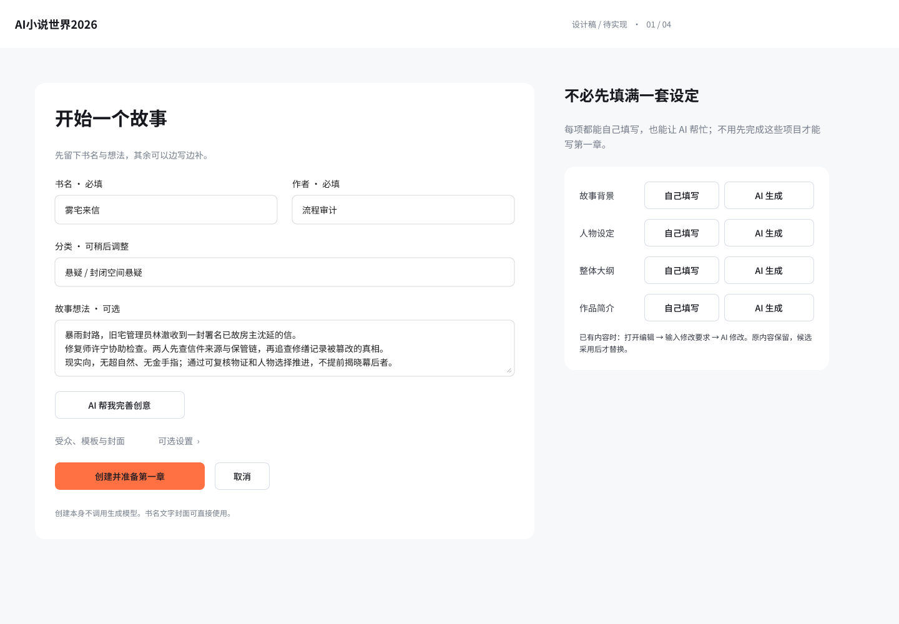
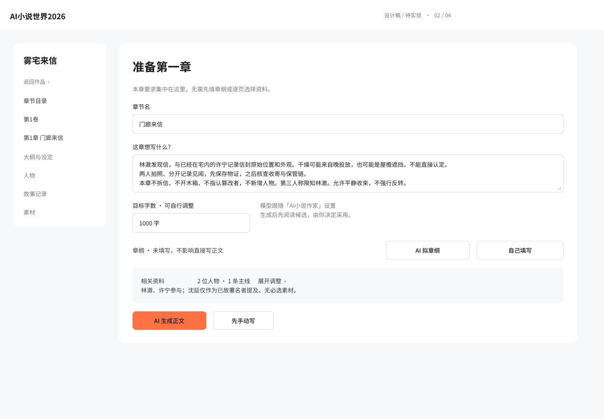
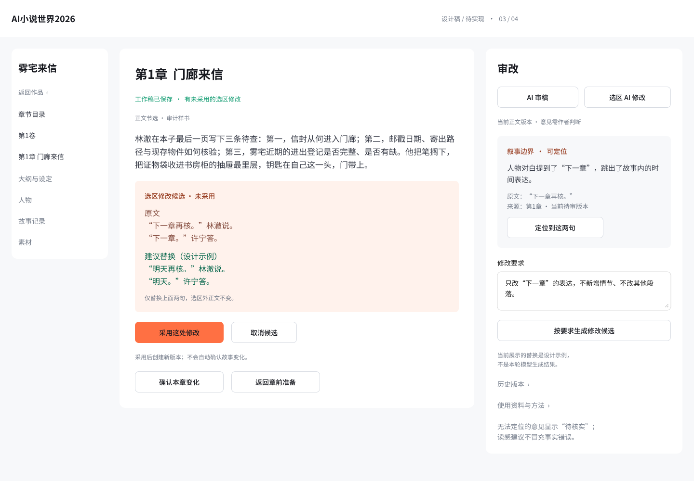
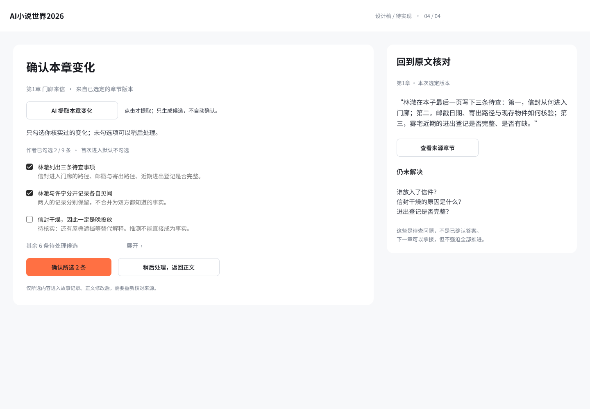

# Figma V1.1 替换现有写作流程复核

状态：设计与当前源码对照完成；有替换前缺口，不是新版产品验收通过。日期：2026-09-08。

## 结论

可以采用四视图的方向，但不能把当前静态稿当成完整交互直接替换上线。应精简强制步骤和隐式生成，不精简作者控制、版本保护、管理入口。无需重做一套框架，也不需要恢复已取消的长时间评测。

本次按产品流程审计方法重新取得并逐张检查线上四个桌面画板，结合当前源码核对接口含义；旧流程只复看用户要求比较的既有审计记录及截图26、56，没有重新操作旧产品或发起模型调用。工作区有其他未提交施工，源码只能证明当前工作区行为，不能单独证明部署态。

## 1. 建书与可选完善：方向合理，合同尚未对齐

已核实事实：基本信息集中；创意、背景、人物、大纲、简介均保留AI帮助，后四项也有自己填写入口。不应撤回这些按需功能。故事想法、受众、模板在图中标为可选。

当前源码：`backend/creative_services.py:324` 的完成建书合同仍要求受众、题材、创意、模板及作者名。空书创建后不自动建卷。可选不是隐藏字段即可实现，也不能用默认男频、虚构模板或占位创意绕过。

替换前补足：建书草稿保存/返回继续入口；可选模块生成后的候选预览、采用/取消；明确在书尚未创建时生成结果归属哪个草稿，创建后如何保留。沿用已有草稿与正式来源，不新增一套存储。

可访问性风险：浅灰说明文字偏小，实际字号/对比度、表单错误关联及键盘顺序尚未浏览器验证。

## 2. 单区章前准备：值得保留，仍有实质阻断

已核实事实：本章意图前置，章纲可选，AI生成与手写并列，比旧六步向导更直接。人物和资料仍可展开，不是删除资料能力。

当前源码：`backend/creative_services.py:4305` 的建章完成仍要求有效分卷及非空章纲；`frontend/src/workbench-studio.ts:2400` 的输入仍钳制2000—5000，`backend/creative_schemas.py:506` 亦限制该范围；该前端 `:2178` 仍以260—500字判断章纲。正文入口 `frontend/src/chapter-workflow.ts:1048` 附近仍有最多三轮尝试的长度重写逻辑。现稿的1000字与自由章纲，不能靠改文案兑现。

替换前补足：无分卷首章如何创建；章纲未填如何直接写；后续章节如何带入上章信息。相关资料展开区必须区分允许出场、必须出场和仅背景参考，不能把“装入上下文”变成“必须写到”。样例书名、人物、1000字、平静收束都不可成为全书通用硬编码。

可访问性风险：折叠资料必须可键盘展开并报告状态；静态稿不能验证这些行为。

## 3. 正文与审改：核心缺口最多，不能原样交付施工

已核实事实：正文、准确引文与局部替换对比同屏，AI审稿/选区修改/修改要求均可见，方向正确。但主画板展示的是“两句选区修改”，不是第一次整章生成的阅读与采用界面。六张状态卡虽有候选、失败、未保存、冲突等说明，仍不等于完整交互走通。

当前源码：`frontend/src/chapter-workflow.ts:1098` 收到正文候选即调用采用接口，随后提示同步；目标方案要求作者先阅读再明确采用。`frontend/src/workbench-v2.ts:2099` 的checkpoint在工作稿保存之外创建正式版本；`:2117` 起的章节保存另有继续写下一章分支。旧截图56可见保存按钮，现稿主画板只有工作稿状态、采用选区、确认变化与返回章前，没有明确的普通手改保存正式版本及继续下一章入口。

替换前补足：同一正文视图的空白/手写、整章候选、正常编辑三个状态；明确保存正式版本与工作稿自动保存的区别；提供不经事实确认也能继续下一章的路径。局部修改失败保留要求和原文，冲突不覆盖更新后的文字；这些复用已有候选、版本和CAS保护，不另造审批流程。

审稿定位仍是目标功能，不能画一个定位按钮就认定误报问题解决。须准确引文匹配并绑定待审版本，旧报告不能定位新稿；文学读感意见可以没有单句锚点。

可访问性风险：正文、候选、审稿三处焦点及长文滚动需实测；红绿之外已有“原文/建议替换”标签值得保留。宿主自有导航占用宽度，1440宽画板不能证明真实PawApp剩余区域能容下三栏。

## 4. 章后变化确认：保护方向正确，后续路径需补清楚

已核实事实：首次默认不勾选，示例为作者选2/9；只确认所选且可稍后处理，有原文核对和未解决事项，应该保留。推測反例明确标待核实，不是实际抽取结果。

当前源码：`frontend/src/chapter-workflow.ts:1273` 起的同步流程绑定正文revision，正文未变且已有对应提案时打开旧记录，不重复调用模型。新界面必须保留这一行为，不能因为按钮统一写“AI提取”就每次重新生成。

替换前补足：首次提取、查看已有记录、已确认/待处理、正文改后旧来源失效的区别。确认完成卡有下一章入口，但“稍后处理”返回正文后仍需正常继续入口。未确认资料不能悄悄当已确认事实，也不能强制全部勾完才允许写下一章。

可访问性风险：其余6条的展开、来源跳转后返回、确认后的状态通知需要键盘及实际浏览器验证。

## 替换边界与最小下一步

这四张图只覆盖写作主流程，不证明全产品功能已迁移。章节列表/分卷整理、作品设置、资料管理、复制导出、历史恢复和QwenPaw原生功能继续保留原入口；未画出的能力不等于获准删除。主屏可以少按钮，菜单里仍应找得到。

先在同一Figma补齐上述关键状态与连线，桌面正常编辑页至少明确“保存版本”“继续下一章”，并演示两条路径：

1. 少量信息建书 → 不生成章纲直接写 → 整章候选阅读/采用 → 保存 → 暂不确认变化 → 下一章。
2. 打开既有章节 → 局部修改 → 失败重试或成功采用 → 来源过期提示 → 返回正文。

之后才按方案60现有优先级分批修代码。图纸中的可选合同、长度处理、显式采用和准确定位必须对应前后端实现，不能只改UI。验证采用一部样书连续两章的窄闭环即可，不因此启动新框架或多模型长时评测。

## 本次验证范围

- 已取得并打开本次四张1440×1000线上Figma导出，文件非空、画板正确；审查对象是静态设计，不是可操作的新页面。
- 已对照方案60、设计交接、旧审计指定资料及上述当前源码。
- 未重新验证手机稿、键盘、焦点、屏幕阅读器、实际自适应、模型输出或新版运行行为，不作无障碍合规或写作增益声明。
- 未改Figma、产品代码、小说、数据库、模型配置、部署或Git历史；仅新增本子目录的审计截图和记录，不更改现有用户文件。
