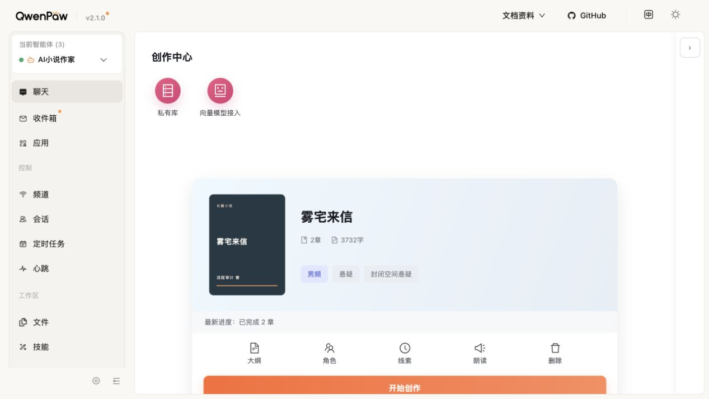
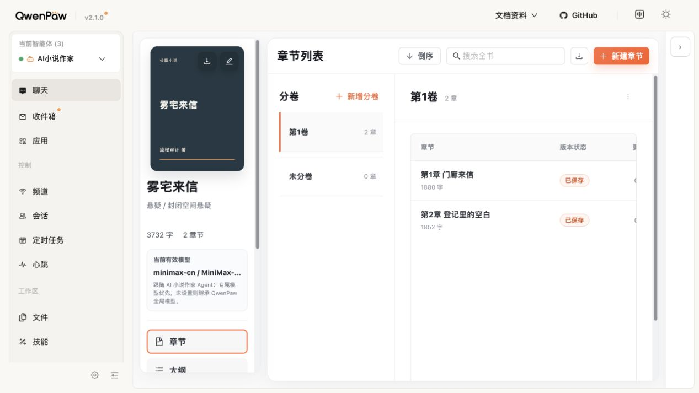
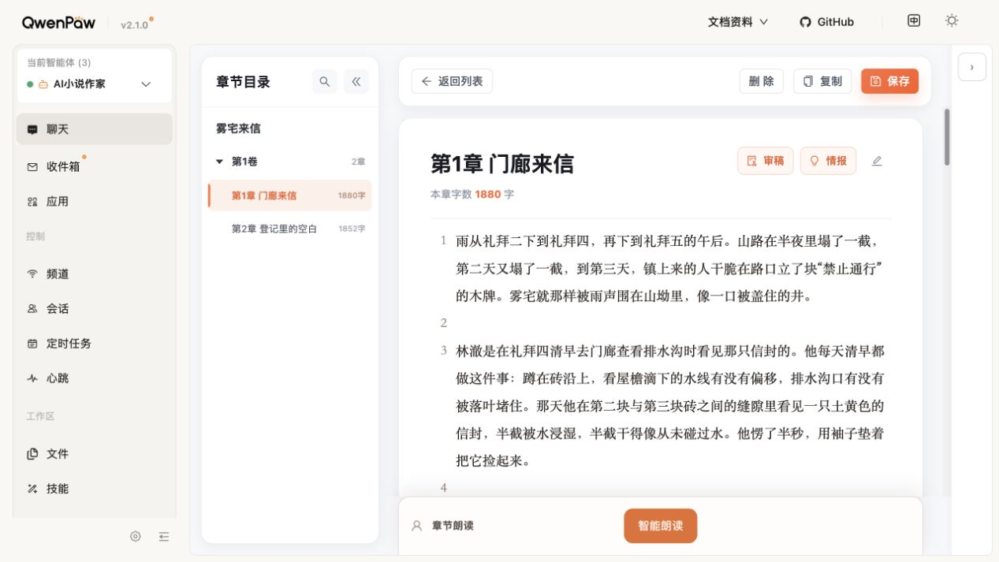
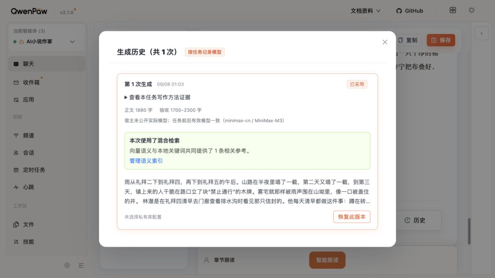
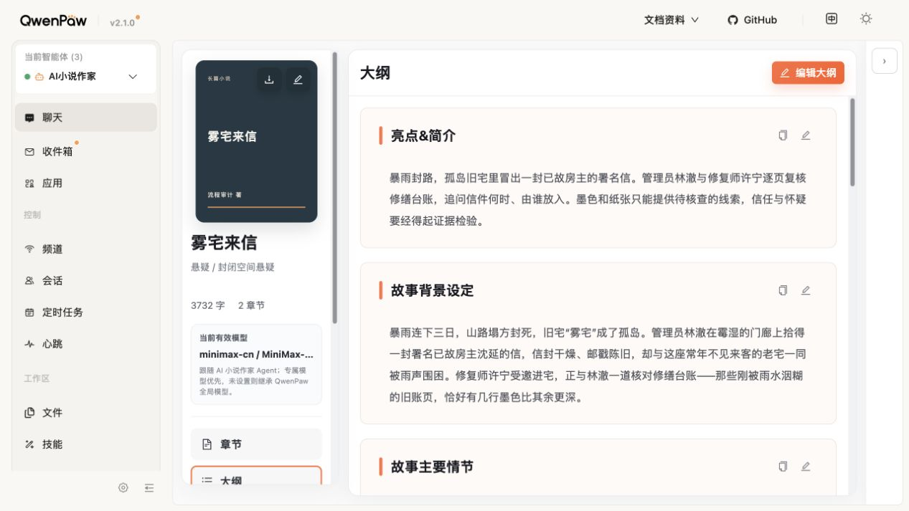
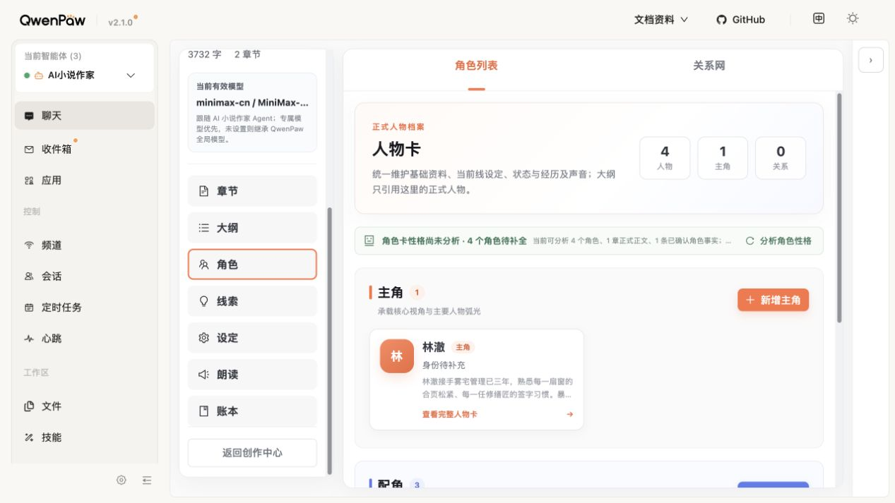
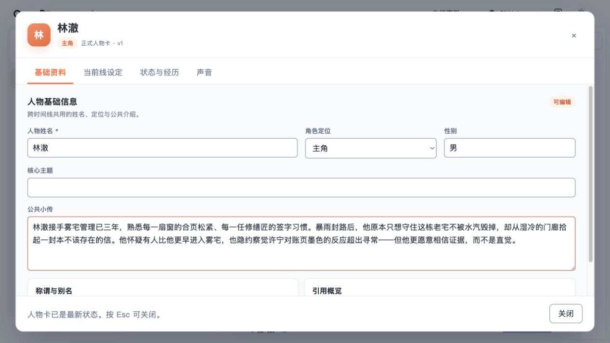
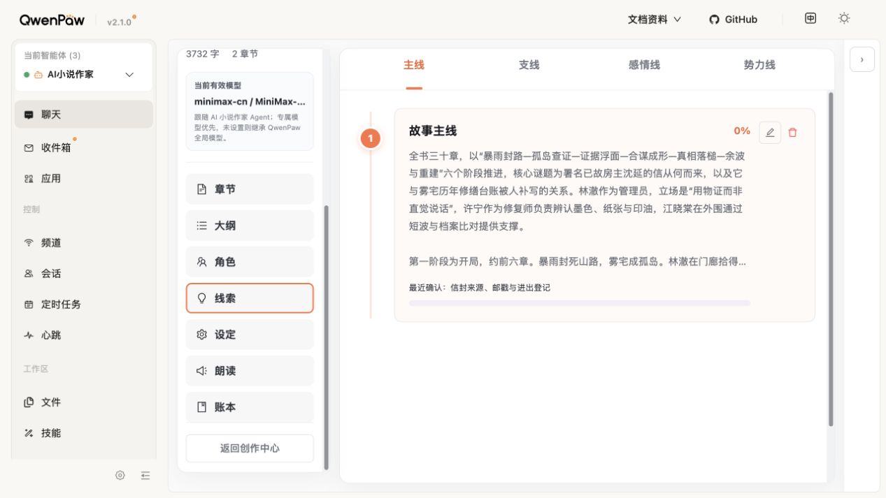
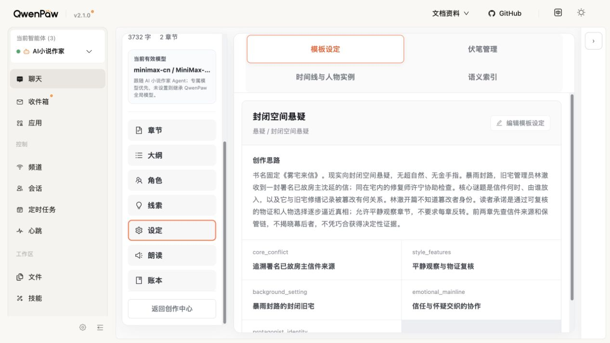
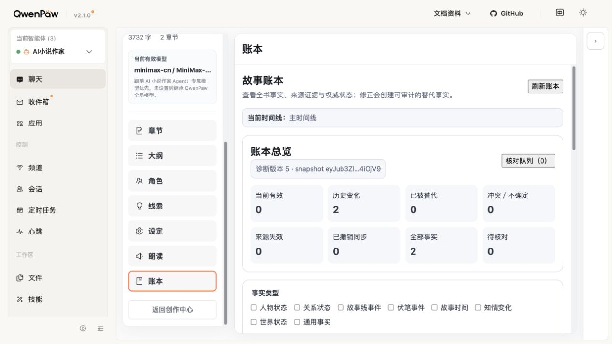

# 现有UI对照与重设计规划依据

日期：2026-09-08。状态：本轮真实网页只读巡查完成；规划已更新，不是新版UI验收。对应[方案60 V0.3](../../../docs/开发文档/60-写作主流程减重优化方案.md)。

## 范围和结论

使用内置浏览器打开长期`18088`，只操作《雾宅来信》的导航和查看入口：创作中心→章节列表→首章正文→生成历史→返回列表→大纲→人物列表→人物卡→线索→设定→账本。没有新建/保存/修改小说，没有点击生成、采用、恢复、导出、删除或TTS，没有在QwenPaw助手中对话。只读操作不验证这些写入动作成功。

本轮截图均来自本次浏览器访问，约1267×713视口，保存原始截图并查看；没有改变主题或视口设置。当前UI的能力比四视图表达的更完整，但存在空间占用、入口含义、信息密度问题。设计应重做主次结构，不是把能力删光，也不是把旧页面全部原样复制。

用户已明确否定V1.1写作页的可用性。因此之前“补几个按钮和状态就够”的建议收回，改为：先做正常编辑器，再做它的生成/审改状态及其他页面。此前Figma检查只证明排版，不证明可用。

## 编号步骤、实际体验与去向

| 步骤 | 页面/健康度 | 已观察到的操作和问题 | 新计划处理 |
| --- | --- | --- | --- |
| 1 | 创作中心：入口可用，空间偏散 | 可切6本作品、开始创作、大纲/人物等快捷入口；当前视口大量留白，主操作接近底部 | 保留切书/继续写/新建；紧凑呈现，不能只设计新建书而漏掉回到旧书 |
| 2 | 章节列表：能力完整度较好，内容被挤 | 搜索全书、新建章/卷、移章、卷序、下载全书可见；大封面和多列压缩章节表 | 保留管理能力，缩小作品标识，目录导航不能代替卷章管理 |
| 3 | 正文常态：真正可编辑，工具层次待改 | 整章编辑区、目录搜索/折叠、返回、保存、复制、改章名、审稿/情报；底部还有重新生成/修改章纲/同步/历史 | 新稿必须以此常态为基础重设计；工具可发现且长文不必滚到底找操作，审改按需展开 |
| 4 | 历史：可打开，名称过宽 | 点击“历史”打开“生成历史（共1次）”，不是所有手改版本；有恢复入口但本轮未执行 | 分清全部版本与生成记录，恢复先预览；不把普通作者引向模型证据才能找回稿件 |
| 5 | 大纲：内容可读，长文浏览待改 | 简介、背景、主要情节各有复制/编辑；整个大纲另有编辑入口，长文在多个大卡片下方 | 保留模块编辑/AI修改，增加清楚导航和正式/候选状态，不把完整编辑页缩成生成按钮集合 |
| 6 | 人物列表：可进入，有误导性催填 | 4个人物、角色性格分析入口，卡片出现“身份待补充”同时小传已有职业描述 | 保留查人和AI辅助；区分结构字段未填与人物尚未塑造，不能催作者重复编设定 |
| 7 | 人物卡：编辑空间较充足 | 基础资料/当前线设定/状态与经历/声音分栏，关闭可返回；本轮仅看基础资料，未改值 | 重设计继续保留正式人物来源、可读详情和保存边界；不把查人变为多层极小抽屉；声音不在本轮重设计范围 |
| 8 | 线索：当前进展含义不清 | 主/支/感情/势力线，主线0%却已有最近确认事件；长全书说明被截断 | 按计划、最近进展、未解决事项展示；无明确定义的百分比不代表故事好坏或停滞 |
| 9 | 设定：创作和技术内容混排 | 模板、伏笔、时间线人物实例、语义索引同组；模板露出英文键 | 创作内容和技术维护分层；保留高级入口，不顺带修改索引或授权 |
| 10 | 账本：可访问但首屏偏诊断 | 统计、snapshot、类型/ID/批次筛选在正文事实之前；AX中的首章来源仍为“第1000章” | 默认事实内容、人物/章节筛选及来源核对；高级诊断折叠，修章号；保留唯一账本与纠错 |

1. 创作中心：

2. 章节列表：

3. 正文常态：

4. 生成历史：

5. 大纲：

6. 人物列表：

7. 人物卡：

8. 线索：

9. 设定：

10. 故事账本：

## 影响写作的判断

- 预期正面：正文空间稳定、常用操作可达、完整内容容易查、生成/修改可控，减少作者中断。这里只是从交互推断，不是已测的文学增益。
- 可能负面：把工具统统隐藏会失去发现性；把所有资料默认折叠且不显示使用范围会使AI输入不透明；把审稿和事实确认变成必经步骤会继续加重流程；把候选卡作为正文默认态不适合长时间写作。
- 不该删除：正文版本、来源、事实确认、恢复、资料范围和权限。它们应易用而不侵占正常编辑区，不应因为技术展示复杂就把数据保护删掉。
- 当前“复制”在AX帮助及`frontend/src/workbench-v2.ts:3169`指向复制AI写作上下文；不能在新稿中把它默认为复制纯正文。应分别命名并核验输出。
- 字数钳制、长度重写、固定钩子/人数等仍按方案60既有硬编码清单处理；本轮没有发起生成，不能说本轮再次触发。角色未补提示、主线0%、原始英文字段属于展示/语义问题，不一概等同于生成提示硬编码。

## 可访问性和证据边界

当前视口可见多个独立滚动区、小字、无文本的编辑/复制图标；后续设计需验证键盘名称、焦点回位、对比度、长文滚动和容器窄化。人物卡关闭与历史关闭只验证鼠标返回，不能据此宣称Escape或完整焦点链通过。

没有重新走新建书、建章提交、私有库绑定、关系图/伏笔/多时间线高级分支、移动端、断网与冲突恢复；这些明确进入后续页面清单和验收，不以本轮10张截图代替全功能测试。旧审计证据只作用户要求的前后比较参考，不冒充新截图。

本轮只更新方案60、设计交接状态、开发索引本计划行和本目录；不改Figma及产品。设计新稿和可点击原型仍未完成，下一步先交付正常正文工作台，再扩展关联页面。
