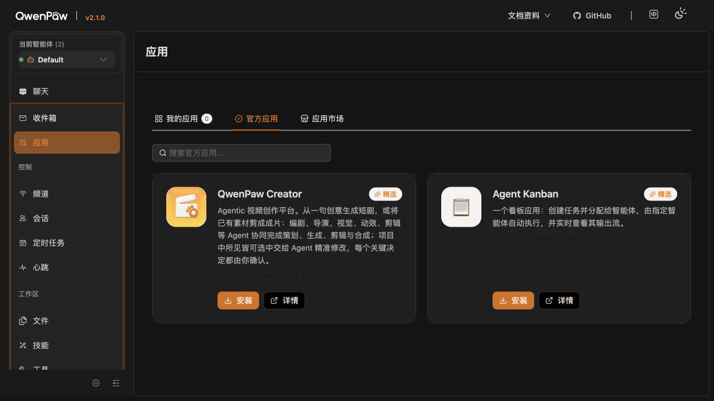
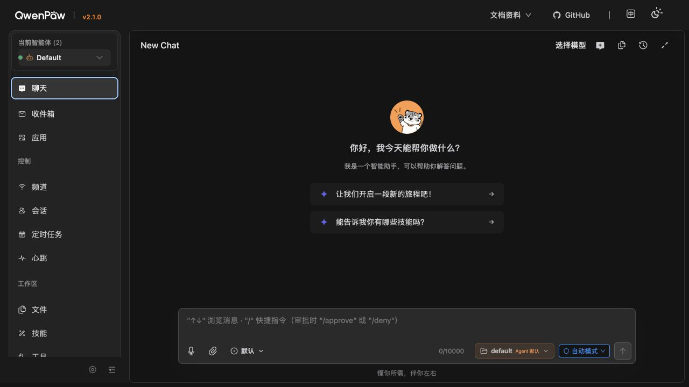
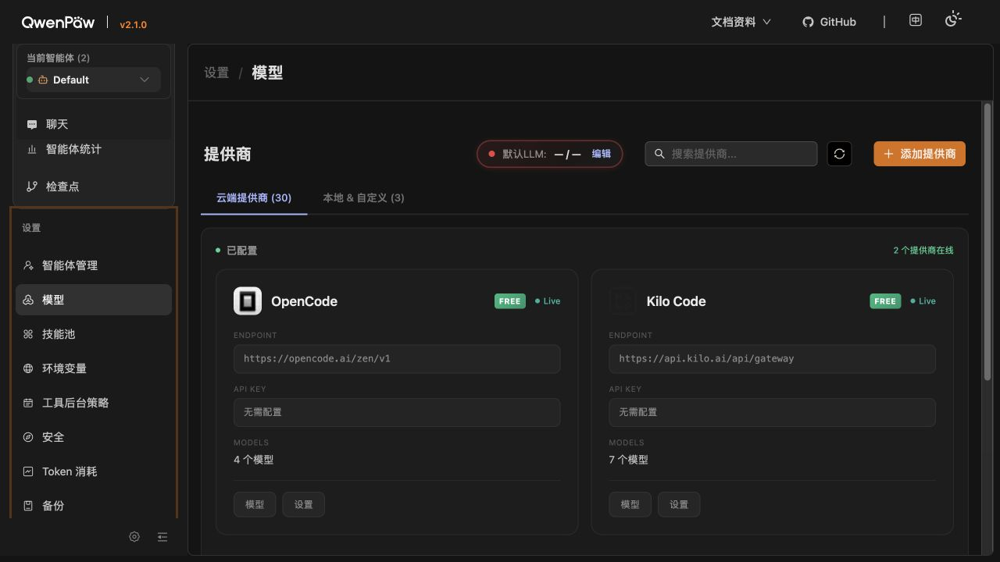
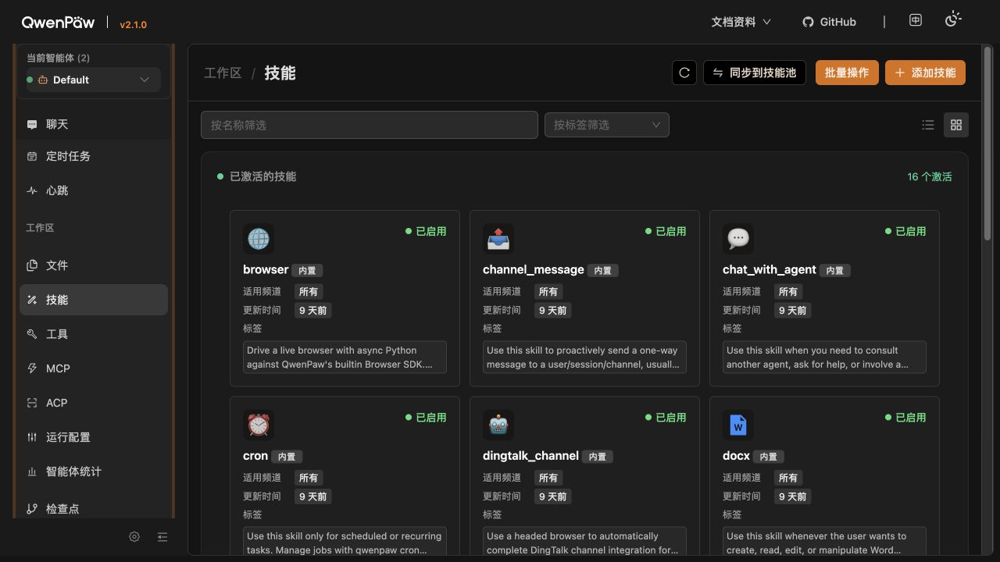
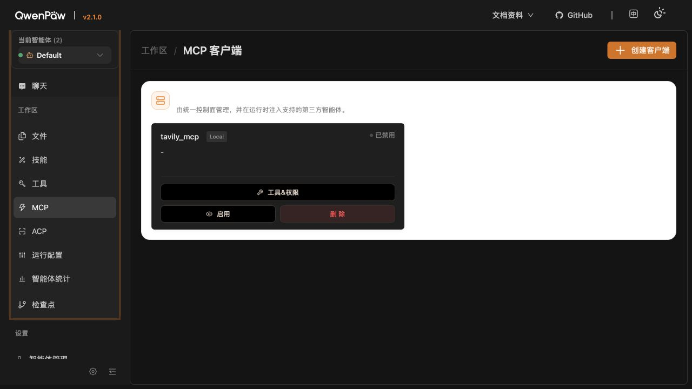
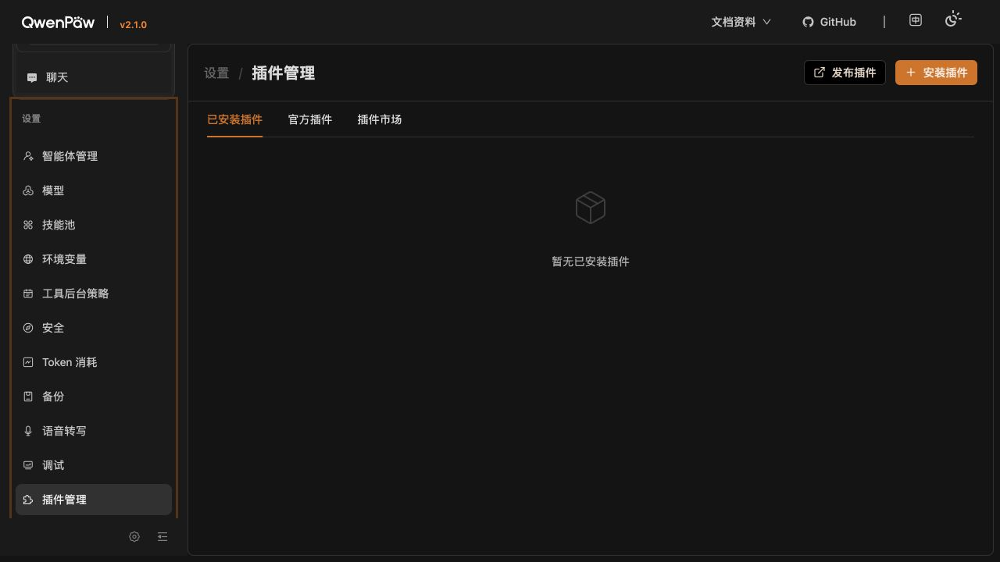

# QwenPaw 原生 UI 盘点与小说工作台 UI 基线

盘点日期：2026-08-23（Asia/Shanghai）。

状态：QwenPaw 2.1.0 本机 Docker 环境已完成只读 UI 盘点；本文冻结小说 PawApp 与宿主的页面关系、首期信息架构和状态表达，不冻结最终视觉稿。

## 1. 推荐结论

**项目建议**：AI小说世界2026 作为 QwenPaw“应用”中的独立 PawApp 共存。QwenPaw 顶部栏、左侧导航、原生聊天、模型、智能体、Skills、工具、MCP、安全、备份和插件管理全部保留，入口和路由不变。

用户关系如下：

```text
QwenPaw 原生控制台
├── 聊天                         # 通用聊天，保留
├── 应用
│   └── AI小说世界2026            # 新增应用卡和 PawApp 工作台
├── 工作区
│   ├── Skills / 工具 / MCP       # QwenPaw 原生治理入口，保留
│   └── 运行配置 / 检查点          # 保留
└── 设置
    ├── 智能体管理 / 模型 / 技能池  # 聊天模型与 Agent 能力治理，保留
    ├── 环境变量 / 安全 / 备份      # 保留
    └── 插件管理                   # 小说 PawApp 的安装与升级入口之一
```

小说应用内部不复制 QwenPaw 的 Provider、Skills、MCP 或安全管理页面，只在需要时显示当前状态和跳转入口。

## 2. 已核实的 QwenPaw UI 事实

| 区域 | 路由 | 本机状态 | 对小说应用的含义 |
| --- | --- | --- | --- |
| 原生聊天 | `/chat` | 可用；带模型选择、Agent/workspace、工具安全模式和输入区 | 保留通用聊天；小说工作台右栏是带小说上下文的专用助手界面，不替换原生聊天 |
| 应用中心 | `/apps` | “我的应用”当前为 0；另有“官方应用”和“应用市场” | 小说 PawApp 安装后应出现在“我的应用”，从这里进入 `/apps/ai-novel-world-2026` |
| 智能体管理 | `/agents` | Default 与内置 QA Agent 两个智能体 | 小说专用 Agent/workspace 的公开创建、选择和作用域仍需阶段二验证 |
| 模型 | `/models` | 30 个云端、3 个本地/自定义类别；当前默认 LLM 未选择；两个免 Key Provider 在线 | 聊天 LLM 继续使用 QwenPaw Provider；小说页面只提示当前选择或未配置状态 |
| 工作区 Skills | `/skills` | 16 个激活；支持添加、批量操作和同步到技能池 | 小说 Skills 可以持续修改和版本化；应在 QwenPaw 原生治理体系中管理 |
| 内置工具 | `/tools` | 24 个激活，另有可启用工具 | 小说 LLM 工具通过 PawApp 注册；UI 命令不能误注册为 LLM 工具 |
| MCP | `/mcp` | 一个 `tavily_mcp`，当前禁用 | 外部 MCP 仍由 QwenPaw 管理；小说内部能力不建设 MCP Server |
| 技能池 | `/skill-pool` | 内置 Skills 可更新、添加并广播到智能体 | 小说 Skills 的发行与 workspace 同步要复用此体系并验证作用域 |
| 安全 | `/security` | 有工具防护、文件防护、技能扫描器和多类命令规则 | 小说 PawApp 不能绕过宿主安全；领域写入还需自己的 revision/CAS 约束 |
| 语音转写 | `/voice-transcription` | 管理语音输入转文字，不是小说 TTS | 不能把语音转写误认为朗读服务；小说 TTS 仍走 PawApp `TTSAdapter` |
| 插件管理 | `/plugin-manager` | 当前没有已安装插件；有官方插件和插件市场 | 安装/升级与日常使用入口分离；阶段二验证本地 PawApp 安装后如何同时出现在应用中心 |

**已核实事实**：QwenPaw 侧栏采用“当前智能体范围”和“全局设置范围”两组菜单；应用、工作区能力和全局设置共存于同一原生外壳。

**技术推断**：开发版小说 PawApp 会先通过插件安装机制进入宿主，再在“我的应用”出现应用卡。具体 manifest、装卸和应用卡刷新行为必须用最小插件验证，不能仅凭 UI 推断为已通过。

## 3. QwenPaw 页面审查

审查目标：确认小说应用的入口、配置复用和工作台空间边界，而不是重新设计 QwenPaw 上游。

### 步骤 1：应用中心——健康，入口模式清楚



- 优点：应用与普通聊天明确分开；“我的应用 / 官方应用 / 应用市场”的安装和使用心智容易理解。
- 风险：用户可能分不清“应用中心”和“插件管理”。小说应用的文档应明确“插件管理负责安装升级，应用中心负责进入工作台”。
- 项目动作：只增加一张“AI小说世界2026”应用卡，不增加 QwenPaw 根级导航项。

### 步骤 2：原生聊天——健康，继续保留



- 优点：模型、Agent/workspace、工具执行安全模式集中在输入区，原生聊天能力完整。
- 风险：若小说工作台右栏长得和通用聊天完全一样，用户会不清楚当前 AI 是否绑定小说和章节。
- 项目动作：右栏必须显示小说名、当前章节、可见 revision 和上下文来源；通用聊天仍走 `/chat`。

### 步骤 3：模型设置——健康，但默认状态需要更清楚



- 优点：云端与本地/自定义 Provider 已分组，聊天模型入口无需在小说应用重做。
- 风险：Provider 在线不代表已选择默认 LLM；当前页面显示两个 Provider 在线，但默认 LLM 仍为 `— / —`。
- 项目动作：小说助手调用前检查聊天模型是否可用；未配置时显示阻塞提示并跳转 QwenPaw 模型页，绝不在小说页面索要或存储聊天 API Key。

### 步骤 4：工作区 Skills——功能健康，信息密度偏高



- 优点：Skill 有启用状态、来源、适用频道、更新时间和描述，支持增加与同步。
- 风险：大量英文长描述会降低扫读效率；“所有频道”也证明小说 Skills 的作用域不能靠命名约定解决。
- 项目动作：小说 Skills 使用清晰中文名称、短描述、版本和标签；阶段二验证只在专用小说 Agent/workspace 启用。

### 步骤 5：MCP 管理——功能可见，深色主题不一致



- 优点：客户端状态、工具权限和启停入口集中。
- 风险：当前深色主题中 MCP 内容区域出现大面积白色容器，视觉连续性和长时间使用舒适度较差。
- 项目动作：小说 PawApp 全部使用宿主 Ant Design 主题 token 和项目语义 token，不硬编码白色面板或只为一种主题设计。

### 步骤 6：插件管理——健康，空状态明确



- 优点：发布、安装、已安装、官方和市场边界清楚。
- 风险：安装完成后是否自动出现在“我的应用”尚未通过本地 PawApp 实测。
- 项目动作：把“安装/升级小说 PawApp”和“打开小说工作台”写成两条非回归验收，不假设它们天然同时成功。

### 总体 UX 与可访问性结论

- QwenPaw 原生信息架构足以承载小说 PawApp，不需要修改核心侧栏。
- 宿主侧栏较宽且菜单很长。三栏小说工作台必须允许折叠宿主侧栏、小说目录栏和 AI 栏，保证中央正文可写宽度。
- DOM 中主要导航、标签页、按钮、标题和输入框已有语义角色，这是可访问性的良好基础。
- 次要文字在深色主题下对比较弱，MCP 页还存在明显主题反差；小说应用需做实际对比度、键盘、焦点、缩放和屏幕阅读器测试。
- 本轮截图不能证明完整 WCAG 合规，也没有验证移动端、200% 缩放和全键盘流程。

## 4. 小说 PawApp 页面层级

首期只冻结四类页面：

| 页面 | 目的 | 首期范围 |
| --- | --- | --- |
| 应用首页 / 作品库 | 找到、创建和继续最近小说 | 私密作品卡、搜索、排序、继续写作、基础新建 |
| 基础建书 | 以最短路径创建可编辑小说 | 名称、类型、简介等最少字段；高级向导不阻塞 |
| 小说工作台 | 写作、保存、讨论、规划、Diff 与采用 | 核心 MVP |
| 小说应用设置 | 管理小说专属 Embedding、TTS、媒体和后续图片适配器 | 属于 QwenPaw 内的 PawApp 设置；不复制聊天 Provider |

完整私有库、高级建书、大纲分步生成、关系图、短篇和拆书已有规格，但不自动挤进核心 MVP 首屏。

## 5. 工作台文字线框图

```text
┌──────────────────────────── QwenPaw 原生顶部栏（保留） ────────────────────────────┐
│ QwenPaw / 文档 / 主题等                                                            │
├──────────── QwenPaw 原生侧栏 ────────────┬──────────────── PawApp 主区 ────────────┤
│ 聊天 / 应用 / 工作区 / 设置                 │ 小说栏：返回作品库｜书名｜保存状态｜字数｜历史 │
│                                            ├──────────┬────────────────┬───────────┤
│ 进入：应用 → AI小说世界2026                │ 小说目录栏 │ 中央写作区       │ AI 助手栏 │
│                                            │          │                │           │
│ 原生模型 / Skills / MCP 入口继续保留        │ 卷章树    │ 章节标题         │ 当前范围  │
│                                            │ 大纲      │ Markdown 源码    │ 讨论      │
│                                            │ 人物      │ 独立预览         │ 计划确认  │
│                                            │ 设定      │ 查找/历史/Diff   │ 候选 Diff │
│                                            │ 搜索      │                │ 接受/拒绝 │
│                                            ├──────────┴────────────────┴───────────┤
│                                            │ 状态栏：字数｜保存中/已保存/离线/冲突/失败    │
└────────────────────────────────────────────┴───────────────────────────────────────┘
```

### 5.1 宽度与折叠策略

- 桌面 Web 优先；不要求第一版完整移动端写作。
- 宿主侧栏必须继续存在，但用户进入长时间写作时应能使用 QwenPaw 已有折叠能力。
- 小说目录栏和 AI 栏分别可调整宽度、可折叠；中央编辑器永远是剩余空间的第一优先级。
- 宽度充足时显示目录、编辑器和 AI 三栏；空间不足时 AI 变为抽屉/覆盖层，目录栏可收起，不能把编辑器压到不可写。
- Markdown 预览默认使用切换或临时分屏，不永久占用第四栏。

### 5.2 工作台顶部栏

顶部栏只放高频且改变当前工作上下文的内容：

- 返回作品库。
- 当前小说与当前章节。
- 保存状态和最后同步时间。
- 可见正文的统一字数。
- 历史版本、专注模式和更多菜单。

Embedding、TTS、图片、Provider、Skills、MCP 等设置不塞进顶部栏；它们进入小说应用设置或 QwenPaw 原生设置。

### 5.3 左侧小说目录栏

首期默认展示卷/章树，并提供大纲、人物、设定和全书搜索入口。参考作家助手的章节树密度，但不复制其字体、图标、颜色、工具栏或客户端多标签结构。

目录必须显示：

- 当前选中章节。
- 章节标题和统一口径字数。
- 新建章节与基础分卷。
- 有未同步草稿、冲突或生成候选时的状态标记。
- 键盘可达、稳定排序和刷新后恢复当前章节。

### 5.4 中央写作区

- MVP 使用 Monaco 编辑 Markdown 源文本，不使用 TipTap。
- 章节标题是独立字段，不写入正文 Markdown。
- 正文支持自动换行、查找、历史、独立 Markdown 预览和清晰的保存状态。
- IndexedDB 只保留尚未同步的崩溃恢复草稿；PostgreSQL 是权威数据源。
- AI 候选不得直接混进正式编辑器。Diff 可以并排或行内展示，但必须标明 base revision、候选和当前正式版本。

### 5.5 右侧 AI 助手栏

右栏不是普通聊天窗口的复制品，必须让用户始终知道 AI 正在看什么：

```text
小说：当前小说
章节：当前章节
正文基线：revision N
上下文：故事事实 / 前文 / 检索片段
状态：讨论 → 计划待确认 → 生成中 → 候选 Diff → 接受/拒绝/冲突
```

- 一般讨论可以直接进行。
- 生成正文前先展示计划和上下文来源，用户确认后再生成。
- 修改已有章节只能产生候选和 Diff。
- 接受后才创建正式 revision；拒绝不改变正式正文和正式故事事实。
- 正文有未保存更改时，AI 栏明确说明使用的是当前草稿还是上次确认 revision；不能假装已读取最新正文。
- 模型不可用时显示“前往 QwenPaw 模型设置”，不展示 API Key 输入框。

## 6. 配置入口分工

| 配置 | 页面归属 | 理由 |
| --- | --- | --- |
| 聊天 Provider、默认 LLM、模型列表 | QwenPaw `/models` | 上游已经提供完整配置和选择能力 |
| 智能体、workspace | QwenPaw `/agents` 与公开接口 | 避免第二套 Agent Runtime |
| Skills 池、同步与启用 | QwenPaw `/skills`、`/skill-pool` | Skills 可持续优化，不固定死在小说 UI |
| 外部 MCP | QwenPaw `/mcp` | 小说内部能力使用 PawApp 类型化工具，不建内部 MCP Server |
| 小说 Embedding profile | 小说 PawApp 设置 | QwenPaw 当前没有供任意 PawApp 调用的通用 Embedding API |
| 小说 TTS、声音和缓存 | 小说 PawApp 设置 | QwenPaw“语音转写”是 STT，不是 TTS |
| 图片模型与媒体存储 | 小说 PawApp 设置，后续启用 | 图片不阻塞首版；结果必须持久化 |

这里的“小说 PawApp 设置”仍然运行在 QwenPaw 内，并随应用安装，不是独立站外控制台。

## 7. 必须设计的状态

首期不能只画正常页面，至少要有以下可辨状态：

| 对象 | 状态 |
| --- | --- |
| 自动保存 | 未修改、保存中、已保存、离线草稿、保存失败、版本冲突 |
| AI 讨论 | 空闲、读取上下文、模型未配置、模型失败、可重试 |
| 生成提案 | 计划待确认、生成中、候选就绪、base revision 过期、已接受、已拒绝 |
| 向量派生 | 未配置、排队、处理中、成功、失败、已过期可重建 |
| TTS | 未配置、生成中、缓存命中、播放、失败、正文 revision 已变化 |

颜色不能是唯一信号；同时使用图标、短文案和必要的可访问状态文本。

## 8. 参考产品取舍

### 参考作家助手

- 章节树、中央大写作区、低干扰深色界面、字数和保存状态的位置关系。
- 不复制阅文品牌、富文本工具栏、投稿/社区/商业入口和客户端多标签行为。

### 参考妙笔神书

- 作品库到建书、结构化大纲、章纲、正文、人物、关系、线路和伏笔的创作链。
- 候选生成、历史和知识回写中的真实断点作为反例：本项目必须补上正文版本、草稿恢复、冲突、来源 revision 和拒绝零副作用。
- 不复制其文案、系统封面、额度/会员、模板内容或页面视觉。

### 继承 QwenPaw

- 宿主导航、主题、Provider、Agent、Skills、工具、MCP、安全、插件与备份入口。
- React、ReactDOM 和 Ant Design 宿主实例与主题 token。
- 不复制 QwenPaw 页面进 PawApp，也不覆盖其路由和组件。

## 9. 阶段二 UI 技术尖峰验收

在开始大规模 UI 前，最小 PawApp 必须证明：

1. 安装后出现在“我的应用”，入口名称为“AI小说世界2026”。
2. 打开 `/apps/ai-novel-world-2026` 后，QwenPaw 顶部栏、侧栏和原生设置仍可用。
3. 应用内部路由刷新可恢复，且不注册 `/novels` 等全局路径。
4. React/ReactDOM/Ant Design 只使用宿主实例。
5. 深色和浅色主题 token 能正确传递到 PawApp。
6. 宿主侧栏、小说目录栏和 AI 栏折叠后，编辑器仍可正常输入与滚动。
7. Monaco Worker 在 PawApp 动态 bundle 中加载成功；失败时显示可恢复错误，不出现空白工作台。
8. “前往模型设置”“前往 Skills”“前往 MCP”使用公开宿主导航方式；若没有公开跳转 API，则使用普通链接，不读取私有 Router 实例。
9. 禁用/卸载小说 PawApp 后，原生聊天、模型、Skills、MCP、插件管理全部正常。

## 10. 尚未冻结与下一步

当前已经冻结的是页面关系、信息架构、三栏折叠原则、配置归属和关键状态；以下内容仍需视觉方案比较后决定：

- 浅色优先、深色优先还是严格跟随宿主。
- 作品卡片密度和封面占比。
- 小说目录栏的图标与层级细节。
- AI 栏中上下文来源、计划和 Diff 的具体卡片样式。
- 正文排版宽度、字号、行高和专注模式。

推荐下一步基于 QwenPaw 原生外壳、作家助手写作区和妙笔神书流程，制作三套低保真视觉方向：`宿主一致型`、`沉浸写作型`、`资料工作台型`。用户选择方向后，再细化作品库和章节工作台，不直接进入生产代码。
