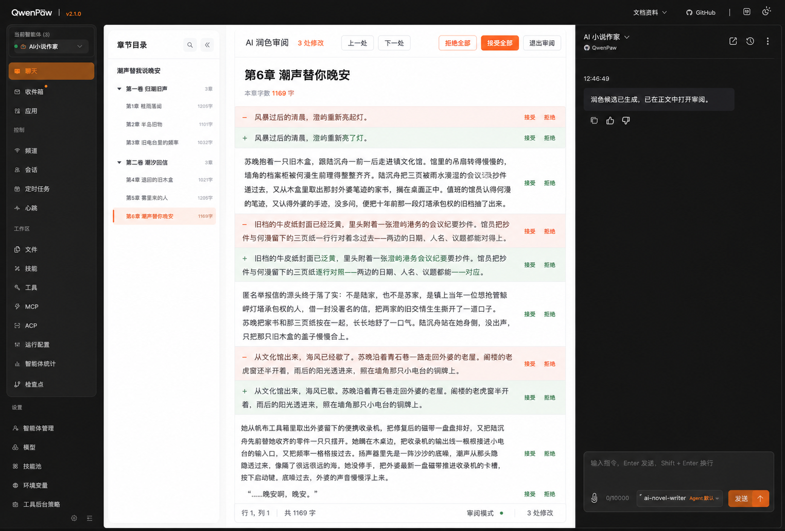

# 选区 AI 中央统一 Diff 审阅设计基线

状态：**✅ 方案 1 已于 2026-08-25 获用户确认；这是待施工的视觉与交互基线，尚未实现、尚未验收。**

适用范围：QwenPaw 2.1.0 中 AI小说世界2026 的桌面章节编辑器；正式验收尺寸为 1920×1080 与 2560×1440，当前不验收手机版。

关联资料：

- [选区 AI 改写与审阅体验审计](../../../../audit/ai-assistant-selection-ux-2026-08-25/README.md)
- [专项施工计划](../../21-选区AI中央统一Diff审阅施工计划.md)
- [ADR-0004：选区 AI 编辑任务与中央统一 Diff 审阅](../../ADR/ADR-0004-选区AI编辑任务与中央统一Diff审阅.md)
- [历史 V2 计划](../../20-QwenPaw原生助手与创作上下文联动施工计划.md)

## 1. 获选方案

- 文件：`01-方案1-中央统一Diff审阅.png`
- 像素：1525×1031。
- SHA-256：`0886ef8b05356e228d77aa5a7887b4b0a7c67c20c889fe693a9b668336cf52ab`。
- 来源：2026-08-25 在“中央统一 Diff / 左右对照 / 行内修订”三种独立方向中，由用户选择方案 1。

## 2. 冻结的视觉层级

1. 左侧继续显示可折叠章节树，不因进入审阅模式丢失卷章定位与快捷跳转。
2. 中央编辑区是唯一主审阅面；标题、正文、差异和审阅控制属于同一阅读窗口。
3. 顶部出现独立审阅工具栏，至少包含修改数量、上一处、下一处、拒绝全部、接受全部/应用已接受修改和退出审阅。
4. 删除内容使用浅红背景、`−` 标记和“删除”语义；新增内容使用浅绿背景、`+` 标记和“新增”语义。颜色不是唯一信息。
5. 每个变更块提供“接受 / 拒绝”，正文未改变的上下文保持普通阅读样式。
6. 底部状态栏显示当前审阅状态、变更总数、已处理数和正文字符数。
7. 右侧保持 QwenPaw 原生助手；不再把完整候选正文或第二层审阅卡片嵌入聊天消息流。
8. 1920×1080 和 2560×1440 都默认使用统一 Diff。左右对照方案只保留为未来独立立项的 2K 可选模式，不属于本轮施工。

## 3. 图片之外冻结的交互语义

图片只能表达布局，以下行为以本节和专项计划为准：

- 作者选中文字后点击“润色、改写、扩写、缩写、增强对白、检查问题”应立即启动 PawApp 编辑任务，不再要求复制 slash 命令、切换到右栏、粘贴和再次发送。
- “自定义”先在选区附近打开一个轻量输入层；作者提交要求后才启动任务。关闭输入层不会丢失正文或改动剪贴板。
- 生成期间中央编辑器保留原文并进入只读的生成状态；失败、取消和超时都退出生成状态，原文不变。
- 候选完成后建立独立的 `reviewDraft`。逐处“接受 / 拒绝”只更新审阅决定和预览，不立即写入受控字段，也不触发多次自动保存。
- 尚未逐处决定时，“接受全部”会接受所有剩余变更并以一次字段事务应用；已经逐处决定后，该主按钮变为“应用已接受修改（N处）”。
- “拒绝全部”放弃候选并退出审阅，不写正文；“退出审阅”在存在未应用接受项时要求确认。
- 最终应用只发生一次，必须复用字段 Adapter、完整字段 SHA-256、UTF-16 选区、CAS、正文恢复草稿、自动保存和 `AIEditTransaction`。任一基线不匹配即进入冲突态，不覆盖作者新输入。
- 应用后可以撤销整次审阅事务；撤销继续走同一 Adapter 和正文自动保存链路。
- 右侧助手只保留正常对话与既有页面上下文能力。PawApp 可以在助手外壳的轻量状态区显示“候选已在正文中打开”，但不得伪造聊天消息或操作 QwenPaw 私有 DOM/store。
- 当前聊天内结构化工具卡片降级为兼容入口和历史结果展示，不再充当默认主审阅面。

## 4. 无障碍与桌面适配底线

- 每个变更块除颜色外必须有 `+ / −`、文字标签和可读说明。
- 审阅工具栏使用 `role="toolbar"`；当前变更通过 `aria-current` 或等价语义标记，生成和冲突状态通过克制的 `aria-live="polite"` 播报。
- 键盘至少支持上一处、下一处、接受、拒绝、退出审阅；快捷键不得劫持正文输入法组合键。
- 进入审阅后焦点落到工具栏标题或首个变更；退出、失败或应用后回到原选区所在编辑器。
- 统一 Diff 只保留一个纵向主滚动面；章节树和原生助手可以各自滚动，但中央区不得再嵌套候选文本滚动框。
- 在 200% 等效缩放下，接受、拒绝和退出操作仍可达；空间不足时优先折叠章节树或助手，不隐藏核心审阅按钮。

## 5. 明确非目标

- 不实现手机版审阅。
- 不实现方案 2 的左右同步滚动对照。
- 不建设富文本编辑器、多人协作或自动接受 AI 修改。
- 不复制 QwenPaw 品牌素材、源码、私有接口或聊天实现。
- 不改变“AI 小说作家”是模型权威来源的既有决策，也不新增第二套模型选择器或静默模型回退。
