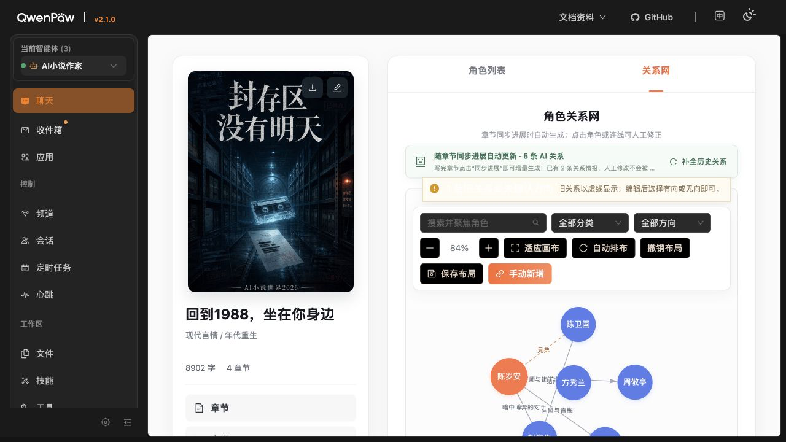
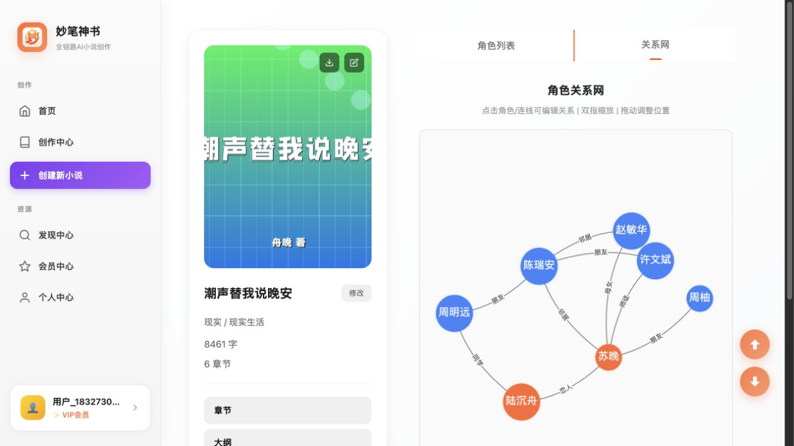

# 关系网拖拽与联动审计

日期：2026-08-24

## 审计范围

- 本项目：《回到1988，坐在你身边》关系网。
- 对照产品：妙笔神书小说 `110972` 的关系网。
- 用户目标：确认是否使用同一图谱插件，并定位本项目缺少拖拽动画和邻接联动的原因。

## Step 1 · 本项目关系网

状态：可用但运动体验不合格。

- 节点可拖动，连线会随被拖节点重绘。
- 已保存布局或首次稳定后，物理模拟被完全关闭。
- `dragEnd` 仅标记布局未保存，没有重新启动模拟，因此邻接节点不会受弹簧力带动，也没有松手后的回弹与收敛动画。

## Step 2 · 妙笔神书关系网

状态：交互基线健康。

- 页面加载 `vis-network.min.js`，文件头版本为 `10.0.2`。
- `RelationshipNetwork.js?v=1.125.1` 使用 `new vis.Network(...)`。
- 物理模拟始终保持启用，使用 `forceAtlas2Based`；稳定结束只关闭加载状态，不停止模拟。
- 保留 `hideEdgesOnDrag: false`、`hideNodesOnDrag: false`、`hoverConnectedEdges: true` 和 `selectConnectedEdges: true`。

## 核心差异

| 项目 | 本项目 | 妙笔神书 |
|---|---|---|
| 图引擎 | `vis-network 10.1.2` | `vis-network 10.0.2` |
| 稳定后 physics | 强制关闭 | 继续开启 |
| 保存布局加载 | 节点 `physics: false` | 仍由力导向约束 |
| 拖动结束 | 只标记 dirty | 物理引擎继续收敛 |
| 邻接联动 | 无 | 有 |
| 节点规格 | 主角 31、配角 28 | 主角 50、配角 40 |
| 边宽 | 1.45 | 2 |

## 根因

本项目和妙笔神书使用的是同一个图谱库家族，版本仅有小版本差异。体验差异不是插件缺失，而是本项目在 `stabilizationIterationsDone` 后执行了 `stopSimulation()`，随后把全部节点设为 `physics: false`，再把全局 physics 关闭。保存过布局后，初始化阶段也不会启用 physics。

## 建议

1. 保留全局物理引擎，但在静止状态使用低速、低扰动参数。
2. `dragStart` 时固定当前拖动节点并提高局部求解强度；`dragEnd` 时释放该节点，让一阶邻居短时联动，约 450—700ms 后自然收敛。
3. 仅对用户明确“双击固定”的节点持久化 pinned；不要把所有保存坐标都等同于关闭 physics。
4. 保留边和节点在拖动中的显示，并对相邻节点与连线增加轻量高亮。
5. 节点、边和关系标签尺寸对齐妙笔神书基线，再根据高密度图做自适应缩放。

## 证据限制

两边关系图均为 Canvas。当前浏览器检查接口无法保存真实鼠标按住期间的中间帧，因此运动结论由两边实际加载的 `vis-network` 配置与事件处理代码交叉确认；审计过程没有保存或修改任一产品的图谱布局。

final result: failed interaction parity
