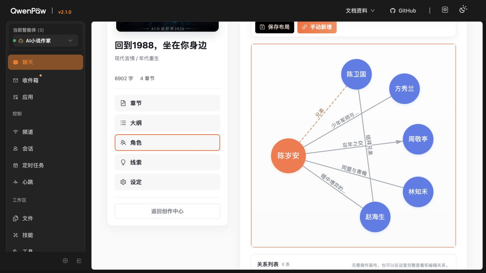

# 关系网页面设计审计

日期：2026-08-25
范围：《回到1988，坐在你身边》的关系网页面；只评估布局、筛选栏配色和连线形态，不修改实现。

## 用户目标

在不牺牲自动生成、人工编辑和布局保存能力的前提下，让关系网更轻、更清晰，并接近妙笔神书关系图的自然感。

## Step 1 · 页面层级与工具区

健康度：需要优化，但不需要推倒重做。

- 优点：标题、自动同步状态、旧关系提醒、筛选、画布和关系列表的功能层次完整；工具栏已经移出 Canvas，不再遮挡图谱。
- [P2] 自动同步状态、旧关系提醒和工具栏连续占据三层垂直空间；在 1280×720 下无法同时看到完整工具栏和完整图谱。
- [P2] 当前工具栏依靠自然换行形成两排，搜索/筛选、视图操作、保存操作和新增关系混在一个视觉容器内，主次不够明确。
- 建议：保留页面骨架；把自动同步压成单行状态条，把旧关系提醒改成可点击的小型警告标签；工具栏明确分成“搜索筛选”“视图控制”“编辑操作”三组，并让筛选条在滚动图谱时保持 sticky。
- 更优的桌面形态：顶部只保留搜索、分类、方向和“新增关系”；缩放、适应、自动排布变成画布右侧的小型竖向控件；保存/撤销仅在布局变动时出现。

## Step 2 · 筛选栏展开态

健康度：不健康，需要优先修复。

- 实测弹层背景为 `rgb(31,31,31)`，普通选项文字为 `rgb(52,56,63)`；文字与背景接近，未选选项几乎不可读。
- 这是可用性和对比度问题，不只是风格问题。截图无法替代完整 WCAG 测试，但该状态明显达不到正文可读性要求。
- 页面主体是白色、浅灰和橙色，三个黑色 Select 和黑色操作按钮视觉重量过大，也削弱了橙色主操作的识别度。
- 推荐令牌：默认背景 `#FFFFFF/#F7F8FA`，边框 `#E2E5EA`，正文 `#3F4650`，占位 `#969CA5`；焦点边框 `#FF9A73`，焦点环 `rgba(255,117,72,.16)`；下拉背景 `#FFFFFF`，悬停 `#FFF7F3`，选中 `#FFF0E9`＋`#E86E45`。
- 不建议给每个关系分类都使用高饱和颜色。筛选控件保持中性，只用橙色表达当前选择；关系类型色可在图中悬浮或选中时出现。

## Step 3 · 图谱主体与连线

健康度：可用，仍有一处明显的视觉提升空间。

- 当前实现并非“插件只能画直线”。`vis-network` 支持 `curvedCW`、`curvedCCW`、`continuous`、`dynamic` 和 cubic Bézier 等多种曲线。
- 当前代码只在同一对角色存在多条关系时启用曲线；本书现有六条关系都是单关系对，所以画面上全部为直线，形成较硬的放射状星形。
- 推荐采用“确定性轻曲线”，而不是把所有边切换成 `dynamic`：单关系边使用交替的 `curvedCW/curvedCCW`，`roundness` 约 `0.08–0.14`；同人物对的并行边使用 `0.22–0.36`；方向箭头沿曲线；选中时只提高线宽和颜色。
- 曲线方向应由关系 ID 或节点对稳定计算，保存/刷新后不能随机翻边。高连接度人物的边交替向上/向下弯，可减少标签重叠并让构图更自然。
- 不建议全部使用 `dynamic` 曲线：它会引入额外控制点参与物理计算，拖拽时更“软”，但更容易抖动、改变已保存构图，并增加高密度图的开销。
- 现有虚线代表“方向待确认”、箭头代表有向关系的语义应保留；曲线只改善路径，不改变关系含义。

## 优先级结论

1. [P1] 修复筛选下拉的深色背景/深色文字对比度。
2. [P2] 重新分组并瘦身工具区，让图谱成为页面主角。
3. [P2] 将单关系直线升级为稳定、轻微、交替方向的曲线；并行边使用更强曲率。
4. [P3] 仅在布局变动时展示保存/撤销，并将旧关系提醒收成标签。

## 已确认的可访问性优点

- 筛选控件具有 combobox 名称，工具区有 toolbar 语义。
- Canvas 有操作说明，并提供完整关系列表作为非画布查看/编辑路径。
- 缩放、适应、自动排布、新增关系均为真实按钮。

## 证据边界

- 本轮妙笔神书实时页面在当前浏览器中返回黑屏，截图被拒绝，没有作为审计证据；关于妙笔神书曲线更自然的比较仅作为用户提供的观察背景。
- 截图不能验证键盘完整顺序、读屏输出、动画眩晕风险或真实拖拽中间帧；本轮只对当前可见状态和本地实现策略作结论。

final result: changes recommended
